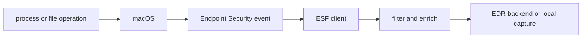
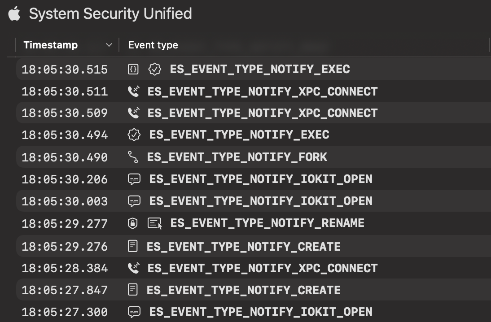
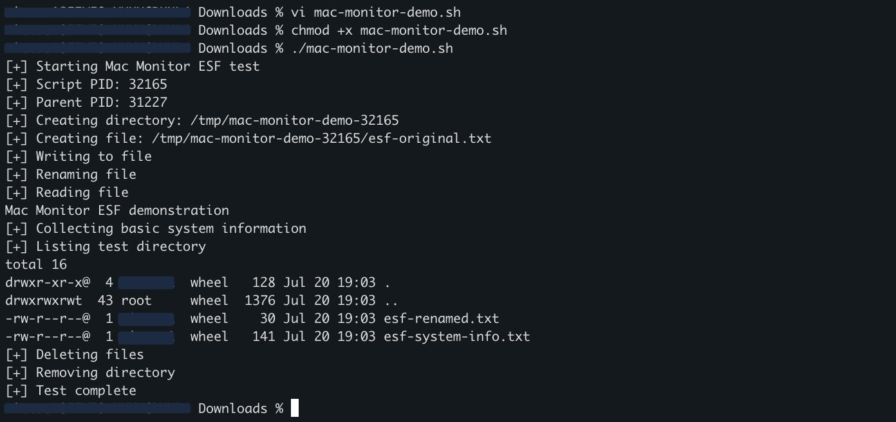
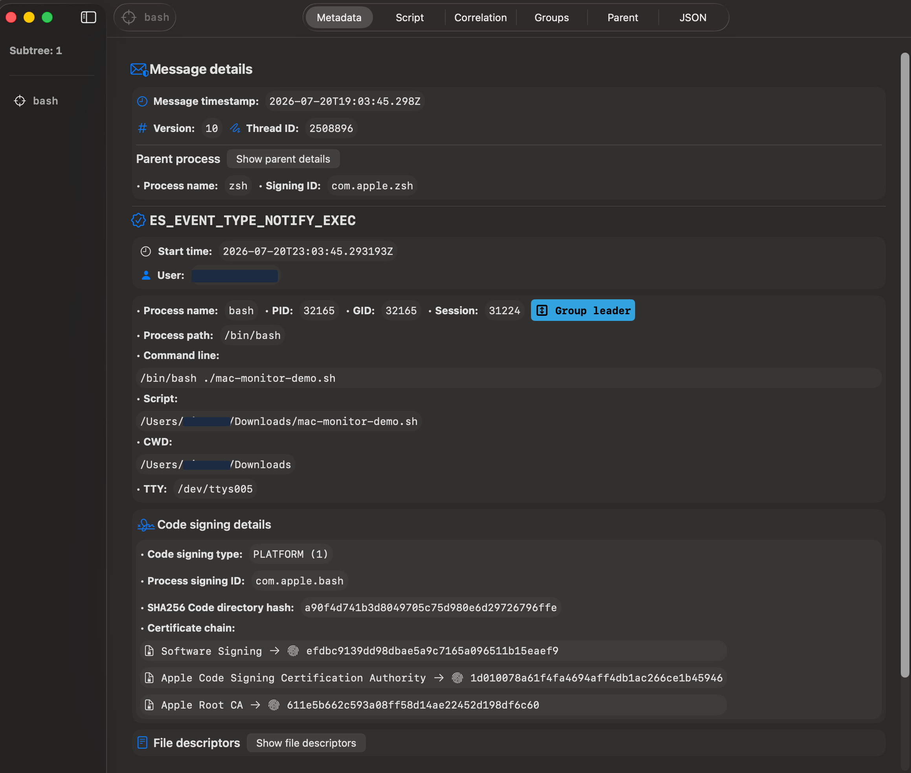
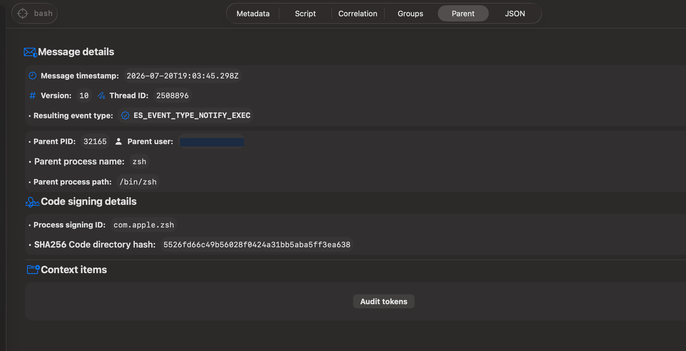
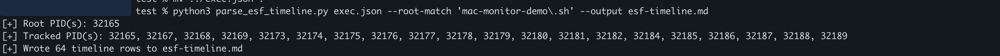
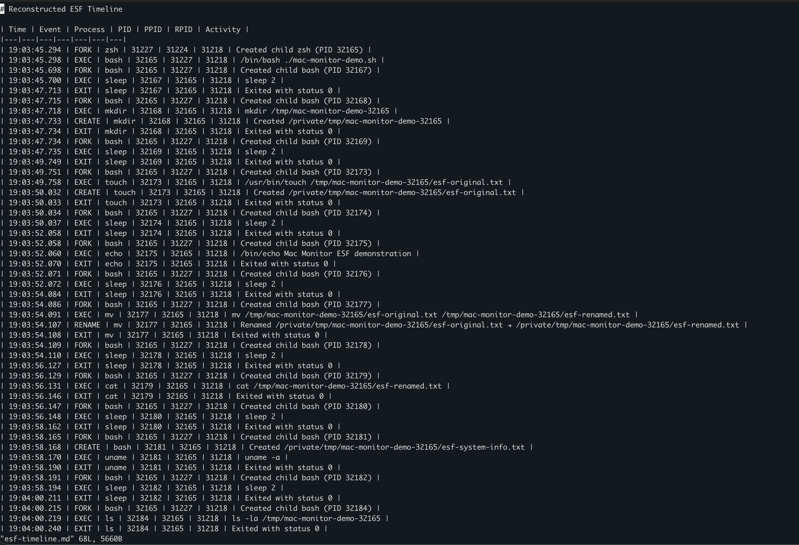

# macOS ESF capture lab

This lab traces a controlled shell script through Apple's Endpoint Security Framework
(ESF), showing how process and filesystem activity becomes telemetry an endpoint sensor can
collect. It was captured and validated on Apple hardware in July 2026.

> Contributed by [Enleak](https://enleak.dev). Adapted from
> [*Where Does macOS EDR Telemetry Come From?*](https://enleak.dev/writing/where-does-macos-telemetry-come-from).

## From operating-system activity to EDR telemetry

Apple introduced ESF with macOS Catalina 10.15 as the supported interface through which
authorized security clients receive security-relevant system events. Clients subscribe to
the event types they need. `AUTH` events arrive before an operation and allow an authorized
client to permit or deny it. `NOTIFY` events report activity. Apple's
[Endpoint Security event type reference](https://developer.apple.com/documentation/endpointsecurity/es_event_type_t)
defines the complete event vocabulary, while its
[WWDC20 client walkthrough](https://developer.apple.com/videos/play/wwdc2020/10159/)
demonstrates the subscription and authorization model.



ESF is a live event interface, not a historical database. A client must receive and retain
events if an investigator needs them later. An EDR sensor can subscribe, enrich selected
events, and forward them to its backend. A local tool such as Mac Monitor can retain a trace
for analysis.

## Event vocabulary used in this lab

| Action | ESF event constant | What it records |
|---|---|---|
| Execute | `ES_EVENT_TYPE_NOTIFY_EXEC` | A process executing an image. |
| Fork | `ES_EVENT_TYPE_NOTIFY_FORK` | A process creating a child process. |
| Exit | `ES_EVENT_TYPE_NOTIFY_EXIT` | A process exiting. |
| Create | `ES_EVENT_TYPE_NOTIFY_CREATE` | A process creating a file or directory. |
| Rename | `ES_EVENT_TYPE_NOTIFY_RENAME` | A process renaming an object. |
| Unlink | `ES_EVENT_TYPE_NOTIFY_UNLINK` | A process removing a file. |
| Open | `ES_EVENT_TYPE_NOTIFY_OPEN` | A process opening a file. |
| Write | `ES_EVENT_TYPE_NOTIFY_WRITE` | A process writing to a file. |
| Close | `ES_EVENT_TYPE_NOTIFY_CLOSE` | A process closing a file. |

Mac Monitor displays these full constants in its event stream.



## Generate predictable activity

The lab uses
[`labs/macos/mac-monitor-demo.sh`](https://github.com/iimp0ster/os-internals-de-guide/blob/main/labs/macos/mac-monitor-demo.sh)
to
create a temporary directory, create and write a file, rename and read it, collect basic
system information, and clean up. Short pauses make the event sequence easier to follow in
the live stream.

```bash
chmod +x labs/macos/mac-monitor-demo.sh
./labs/macos/mac-monitor-demo.sh
```



Mac Monitor was started before the script so the initial execution event was included. Even
this short sequence generated `FORK`, `EXEC`, filesystem, and `EXIT` events as the shell
launched `mkdir`, `touch`, `echo`, `mv`, `cat`, `uname`, `ls`, `rm`, and `rmdir`.

## Inspect execution context

The initial `EXEC` event identifies `/bin/bash`, PID 32165, its command line, resolved script
path, working directory, terminal, audit-token values, and code-signing information.



The parent view links Bash to the `zsh` process that launched it.



## Reconstruct the timeline

The Mac Monitor JSON export also contained background activity recorded during the test. To
produce a readable timeline, Enleak asked an LLM to write a Python parser that found
`mac-monitor-demo.sh`, selected its root PID, followed descendant PIDs, retained the event
types relevant to the lab, and sorted them into a Markdown table. The resulting timeline was
reviewed against the raw capture before publication.

```bash
python3 parse_esf_timeline.py exec.json \
  --root-match 'mac-monitor-demo\.sh' \
  --output esf-timeline.md
```



The filtered result contained 64 rows across the root process and 19 descendants. It shows
the shell forking children, each utility executing, related filesystem events occurring, and
each process exiting.



## Capture the same event classes with eslogger

Apple includes `eslogger` with macOS Ventura and later. It can subscribe to notification
events and emit one JSON object per line:

```bash
sudo eslogger exec fork create rename unlink exit > esf-events.jsonl
```

Start the command before the test and stop it with `Control-C` afterward. `eslogger` runs as
root, and the responsible process, such as Terminal, needs Full Disk Access. Apple presents
it as an analysis and prototyping utility, not an API for production applications. The
[WWDC22 Endpoint Security session](https://developer.apple.com/videos/play/wwdc2022/110345/?time=488)
demonstrates this workflow.

The repository's broader
[`eslogger` capture specification](https://github.com/iimp0ster/os-internals-de-guide/blob/main/labs/macos/eslogger-cmds.sh)
lists event sets used by the detection graphs and records their version and validation
requirements.

## What this capture establishes

The live capture confirms that an ESF client can connect a simple shell script to its child
process executions, filesystem operations, exit events, command-line context, and signing
metadata. Which fields ultimately reach an analyst still depends on what a product subscribes
to, retains, enriches, and sends to its backend.
