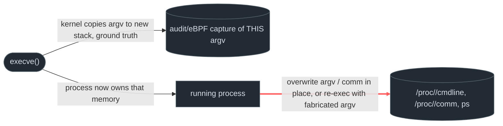

# Process argument masquerading

<div class="chapter-meta"><div class="attack-techniques"><span class="chapter-meta-label">ATT&amp;CK</span><a class="attack-badge" href="https://attack.mitre.org/techniques/T1036/011/"><span>Process arguments</span><code>T1036.011</code></a><a class="attack-badge" href="https://attack.mitre.org/techniques/T1036/009/"><span>Process trees</span><code>T1036.009</code></a></div><div class="chapter-meta-details"><span><b>Tactic</b> Defense evasion</span><span><b>Chokepoint</b> gap between <code>execve()</code> and later <code>/proc</code> output</span></div></div>

Baseline process monitoring assumes `ps`/`/proc/<pid>/cmdline` tell you what a process *is*.
On Linux, both read the same thing: the argument vector the kernel copied onto the new
process's stack at `execve()` time. That vector lives in the process's own address space, readable, and on Linux, **writable by the process itself**. A process that controls its own
memory controls what every downstream tool believes about its identity.

## 1. The baseline, then the gap

Reading process arguments is routine detection-engineering work, confirming what a process
was actually launched with, not just its name, matters because attackers frequently spoof
names and arguments to blend in:

```sh
ps uax
cat /proc/1/cmdline | sed -e "s/\x00/ /g"; echo
# /usr/lib/systemd/systemd --switched-root --system --deserialize 22
```

`ps` and the `/proc/<pid>/cmdline` read are the two easiest ways to get this, and they agree
because they're reading the same kernel-exposed copy of the argv the process was `execve`'d
with. That agreement is exactly the assumption the technique below breaks.

> **Invariant:** whatever telemetry captures argv **at the `execve()` syscall itself**
> (`auditd` EXECVE records, an eBPF `sched_process_exec` tracepoint) is immutable, it's a copy
> the kernel made *before* the process ran a single instruction. Whatever reads argv **from the
> live process afterward** (`ps`, `/proc/<pid>/cmdline`, `/proc/<pid>/comm`) is reading
> user-writable memory the process itself can, and, if compromised, will, rewrite. Two readers
> of "the same" data, one trustworthy, one not, and nothing about either read tells you which.

## 2. Threats that use it

<div class="threat-use-grid">
<article class="threat-use-card os-linux"><span class="threat-use-chip">LINUX</span><h3>BPFDoor</h3><p><strong>What happens:</strong> The backdoor overwrites its displayed arguments to resemble a system daemon, then combines that disguise with other hiding methods.</p><p><strong>Detect here:</strong> Preserve command-line arguments at <code>execve()</code>. Later reads from <code>/proc</code> can report the forged name.</p><p class="threat-use-source"><a href="https://attack.mitre.org/software/S1161/">Source</a></p></article>
<article class="threat-use-card os-linux"><span class="threat-use-chip">LINUX</span><h3>Self re-exec disguise</h3><p><strong>What happens:</strong> A process re-executes itself with a fabricated <code>argv[0]</code>, often shaped like a kernel worker name.</p><p><strong>Detect here:</strong> The execution path and the displayed name disagree. Keep the original executable path with the argument capture.</p><p class="threat-use-source"><a href="https://github.com/jay16/psf">Source</a></p></article>
</div>

## 3. The behavioral graph & the cut



The red edge is the cut: **the process rewriting the argv/comm memory that later reads trust.**
Both known mechanisms cross it, BPFDoor's in-place overwrite of already-running argv memory,
and the self-re-exec variant's fabricated `argv[0]` baked into a fresh `execve()` call, because
there is no other way to make `/proc` lie about a process's identity. The kernel doesn't hold a
second, tamper-proof copy of "what this process really is" to compare against; the copy it made
at `execve()` only survives in telemetry that captured it *then*.

## 4. Two mechanisms, two different tells

The two mechanisms diverge right where they're easiest to catch.

**In-place overwrite (BPFDoor-style):** no new `execve()` happens. The process is already
running under its true identity and rewrites its own argv/comm in memory. `auditd`'s original
EXECVE record for that PID is correct and stays correct, the lie only exists in `/proc` from
that point on. Detection is a **correlation problem**: does a later read of
`/proc/<pid>/cmdline` for a given PID+start-time match the argv `auditd` logged when that PID
was created? MITRE's detection strategy for T1036.011 (DET0164) describes exactly this:
correlating "unexpected null byte sequences, discrepancies between `/proc/<pid>/cmdline` and
process ancestry, and suspicious memory writes shortly after process initialization." Plain
`auditd`/Sigma can't express this alone, it needs a host-side poller (EDR, or a scheduled
`/proc` scan) diffing live cmdline against the audit trail, keyed by PID **and** start-time
(`/proc/<pid>/stat` field 22) to survive PID reuse.

**Self-re-exec (the PoC below):** a *new* `execve()` does happen, targeting `/proc/self/exe`
with the fabricated `argv[0]` already in place. That means `auditd`'s EXECVE record for the
*new* exec captures the spoofed name directly, no correlation needed, no gap in time. This
variant is more detectable, not less, provided you know what to filter on: a bracket-syntax
`argv[0]` (`[kworker/1:4]`) arriving through a traceable `execve()` is a structural
contradiction. Real kernel worker threads are spawned in-kernel by `kthreadd` (PID 2), they
never go through a user-observable `execve()`, never have a resolvable `/proc/<pid>/exe`, and
never appear in an `auditd` EXECVE record at all. A bracket-named process **that does** have all
three is definitionally not a kernel thread.

```admonish example title="Reference PoC: argv spoofing via self re-exec"
~~~c
// argv.c, rewrites argv[0] to a kernel-thread-style name, then re-execs itself so
// /proc/<pid>/cmdline and ps report the fabricated identity instead of the real binary.
// Reproduced for detection-engineering purposes: this is the mechanism BPFDoor's argv rewrite
// achieves via in-place memory write; this variant achieves the same end via a traceable execve.
#include <stdio.h>
#include <string.h>
#include <unistd.h>
#define PROC_NAME "[kworker/1:4]"

int main(int argc, char **argv) {
    if (strcmp(argv[0], PROC_NAME)) {
        argv[0] = PROC_NAME;
        execv("/proc/self/exe", argv);   // <-- the traceable event: auditd sees THIS argv
        fputs("exec failed", stderr);
        return 1;
    }
    sleep(5);
}
~~~
~~~sh
gcc argv.c -o argv
./argv &
ps uax | grep <pid>
# vadmin12  14563  0.0  0.0   4212   352 pts/1  S  16:17  0:00 [kworker/1:4]
~~~
`ps` now shows a process that looks identical, at a glance, to a kernel worker thread, except
it has a PPID that isn't 2, a resolvable `/proc/<pid>/exe`, a non-empty `/proc/<pid>/maps`, and
(the point of this chapter) an `auditd` EXECVE record that never lies about what was actually
passed to `execve()`.
```

## 5. Visibility delta

| Graph element | Linux: EDR / SIEM |
|---|---|
| original `execve()` (true identity) | `auditd` EXECVE ✅ / eBPF ✅, always correct, captured before any rewrite |
| in-place argv/comm overwrite (BPFDoor-style) | **no direct event**, invisible without a `/proc`-polling agent; inferred only via correlation against the original EXECVE record |
| self-re-exec with fabricated argv (PoC-style) | `auditd` EXECVE ✅ / eBPF ✅, the fabricated argv **is** the logged argv; the tell is the bracket-syntax name plus `exe=/proc/self/exe`, not absence of logging |
| kernel-thread ground truth (real `[kworker/*]`) | PPID 2, no `/proc/<pid>/exe` target, empty `/proc/<pid>/maps`, **no EXECVE record ever exists**, the negative space is the check |

The asymmetry: the mechanism that's *harder to see* (in-place overwrite, no new syscall) is also
the one used by the more sophisticated, real-world threat (BPFDoor). The mechanism that's *easier
to see* (self re-exec) still works operationally because most environments aren't running
`auditd` with an EXECVE rule at all, or aren't filtering EXECVE records for kernel-thread-style
names in the first place, the visibility exists but nobody queries it.

## 6. Detect the cut

### Linux, self re-exec into a kernel-thread-style name

```yaml
title: Linux Process Argument Spoofing (self re-exec masquerading as kernel thread)
status: experimental
logsource: { product: linux, service: auditd }   # needs an auditd EXECVE watch (key=exec)
detection:
  selection:
    type: EXECVE
    a0|re: '^\[.*\]$'                # argv0 wearing the ps kernel-thread bracket convention
  filter_systemd_reexec:
    # systemd's own `systemctl daemon-reexec` legitimately re-execs via /proc/self/exe, but
    # renames argv0 to "@systemd" or similar service-manager convention, never bracket syntax, # so this filter narrows on the exec target, not a blanket allow for all self-reexec
    exe: '/usr/lib/systemd/systemd'
  condition: selection and not filter_systemd_reexec
falsepositives:
  - extremely rare; no common legitimate userspace idiom names itself with kernel-thread
    bracket syntax. Watch for privilege-dropping daemons that self-re-exec via
    /proc/self/exe for unrelated reasons (rare outside systemd) and adjust the filter to their
    real argv0, not to bracket syntax generally.
level: high
# Ground truth independent of the exact spoofed string chosen: auditd logs the argv actually
# passed to execve(), so ANY bracket-syntax a0 arriving this way is the tell, not a specific
# IOC like "[kworker/1:4]", which the attacker can trivially change.
```

### Linux, in-place overwrite (BPFDoor-style; correlation, not a single event)

```yaml
title: Linux Process Argument Overwrite (cmdline diverges from its own EXECVE record)
status: experimental
logsource: { product: linux, category: process_correlation }  # requires a stateful host agent, # not expressible as a single
                                                                # auditd/Sigma rule
detection:
  # pseudocode: this is a correlation, not a selection, no single auditd event carries both
  # sides of the comparison
  baseline:
    source: auditd EXECVE record at process start
    key: [pid, proc_start_time]   # /proc/<pid>/stat field 22, required to survive PID reuse
  observation:
    source: periodic read of /proc/<pid>/cmdline for the same key
  condition: baseline.argv != observation.cmdline AND no intervening EXECVE record for that pid
falsepositives:
  - legitimate argv-rewriting idioms (setproctitle() in postgres/nginx workers, some Python/Ruby
    frameworks) change cmdline for cosmetic reasons, not evasion, allowlist by the *binary's*
    known-legitimate use of setproctitle(), not by absence of a match
level: medium
# This is the DET0164 shape MITRE describes for T1036.011: correlate unexpected null-byte
# padding, cmdline-vs-ancestry discrepancies, and memory writes shortly after process start.
# Requires an EDR/eBPF-backed process monitor, not bare auditd.
```

```admonish tip title="The kernel-thread negative-space check"
Independent of either rule above: any process whose `/proc/<pid>/comm` or `cmdline` uses
bracket syntax should have **PPID == 2** (`kthreadd`), **no resolvable `/proc/<pid>/exe`** (real
kernel threads have no backing ELF), and **empty `/proc/<pid>/maps`**. A bracket-named process
failing any one of those three checks is not a kernel thread, full stop, this holds regardless
of which spoofing mechanism produced it, and regardless of whether `auditd` is even running.
```

## 7. Reproduce it yourself

No Atomic Red Team test exists yet for T1036.011 as of this writing (checked
`atomics/T1036.011`, not present; the sub-technique is recent enough that ART hasn't caught up).
Manual repro is the only path currently:

```admonish example title="Manual repro (lab only)"
~~~sh
# Self re-exec variant (fires the §6 rule above), build and run the PoC from §4:
gcc argv.c -o argv && ./argv &
ps uax | grep "\[kworker"
readlink /proc/$!/exe        # real kworker threads: no such file; here: resolves to the PoC binary
cat /proc/$!/status | grep PPid   # real kworker threads: PPid 2; here: your shell's PID

# In-place overwrite variant (BPFDoor-style), no public safe repro tool; the mechanism is a
# direct write to the argv memory region of an already-running process (commonly via
# /proc/<pid>/mem or a wrapper around it) plus prctl(PR_SET_NAME) for /proc/<pid>/comm.
~~~
```

## 8. False positives & pitfalls

`setproctitle()`-style cmdline rewriting is a real, benign idiom, PostgreSQL, nginx, and
several Python/Ruby app servers deliberately rewrite their own argv so `ps` shows worker status
(`postgres: checkpointer`, `nginx: worker process`) instead of the literal invocation. None of
that legitimate use adopts kernel-thread bracket syntax, and none of it involves a `/proc/self/exe`
self-re-exec, so the §6 rules don't false-positive on it, but a cruder "cmdline changed after
start" heuristic would drown in it immediately.

```admonish tip title="Noise → signal"
Don't alert on "cmdline changed" alone, `setproctitle()` makes that common and benign. Alert on
the **bracket-syntax identity claim** (a userspace-observable process claiming to be a kernel
thread) and verify it against the negative-space check in §6: real kernel threads have no PPID
other than 2, no `/proc/<pid>/exe`, and no memory maps. That combination is what's actually rare.
```
