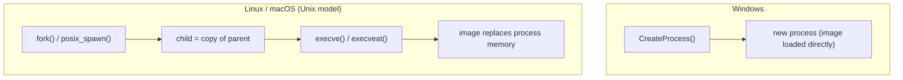

# Part I · Execution

Execution is where the guide starts, on purpose. It is the tactic that drags the OS
*foundations* in with it — to talk about how code runs, you have to talk about the
process model and the binary format — so the chapters here double as the primer the rest
of the book builds on.

## The one diagram to hold in your head

The process-creation models genuinely diverge across the three OSes, and that divergence
shapes every execution graph that follows:

Windows creates a process and loads an image in one call. Unix **splits it**: `fork()`
duplicates the calling process, then `execve()` replaces that duplicate's memory with a
new program; macOS adds `posix_spawn()` (a single-call fork+exec used heavily by
`launchd`). This split is why Unix telemetry distinguishes *fork* events from *exec*
events — and why a fork with no following exec (a server pre-forking workers, or a process
hollowing itself) is its own signal that has no direct Windows equivalent.

## Chapters

| Chapter | Behavior | Example threats |
|---|---|---|
| [Script & interpreted execution](01-script-exec.md) | run code via an interpreter (inline / shebang / piped) | download cradles, macOS osascript stealers, web-shell RCE |
| [Native execution & the loader](02-native-exec-loader.md) | run a compiled binary; the dynamic loader | LOLBins, loader-hijack via `LD_PRELOAD`/`DYLD_INSERT_LIBRARIES` |
| [In-memory / fileless execution](03-in-memory-exec.md) | execute without an on-disk image | reflective loaders, `memfd_create` exec, injection |

The invariant that ties the part together: **code execution is an `exec`-family event**,
and the attacker's job is to make that event look ordinary. The defender's job is to know
which sensor tier — on which OS — still sees through it.
