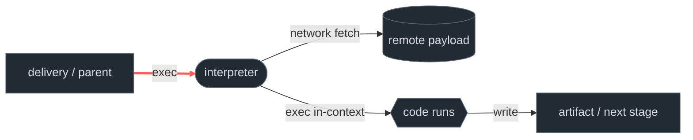
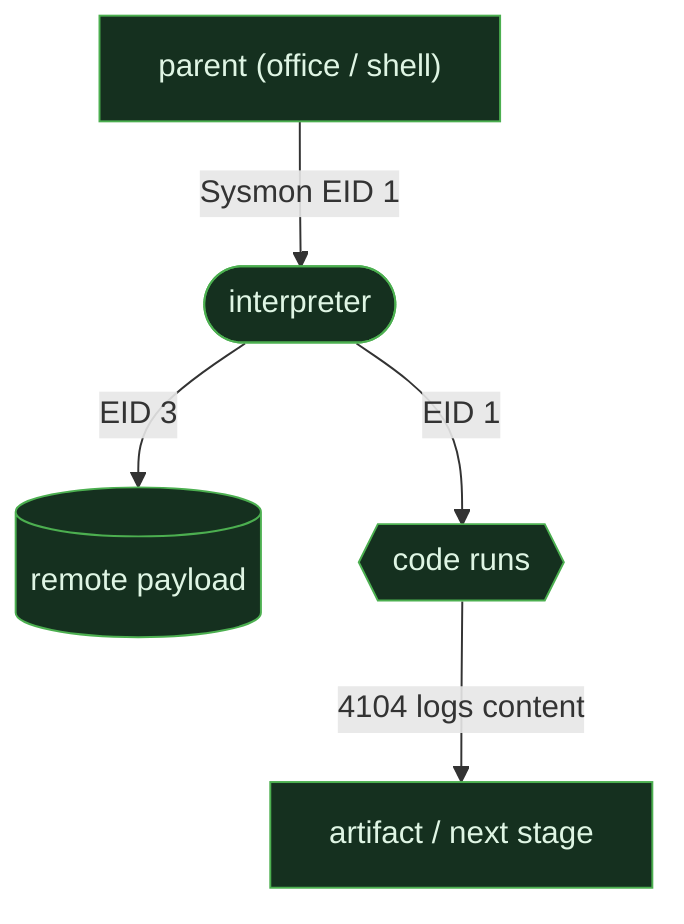
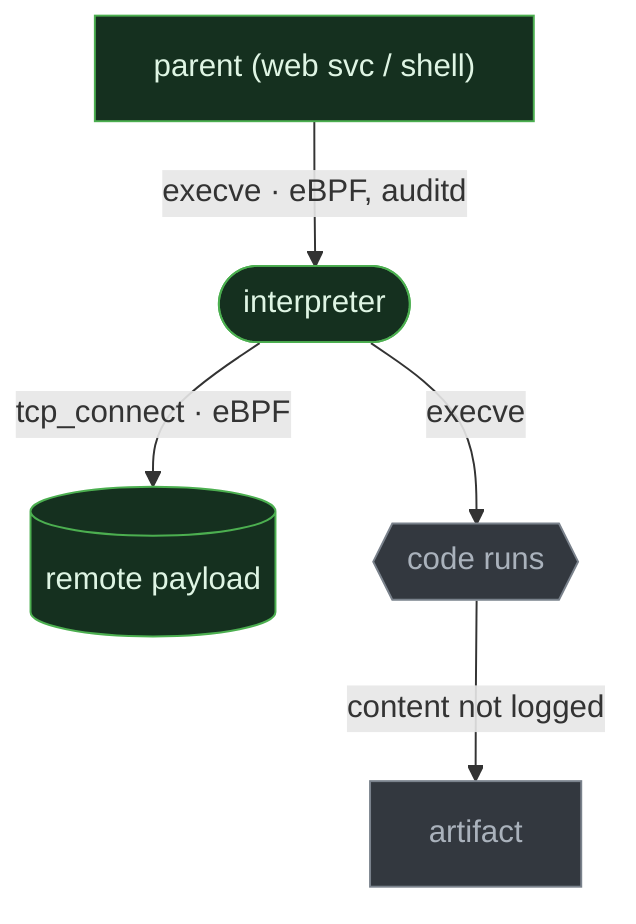
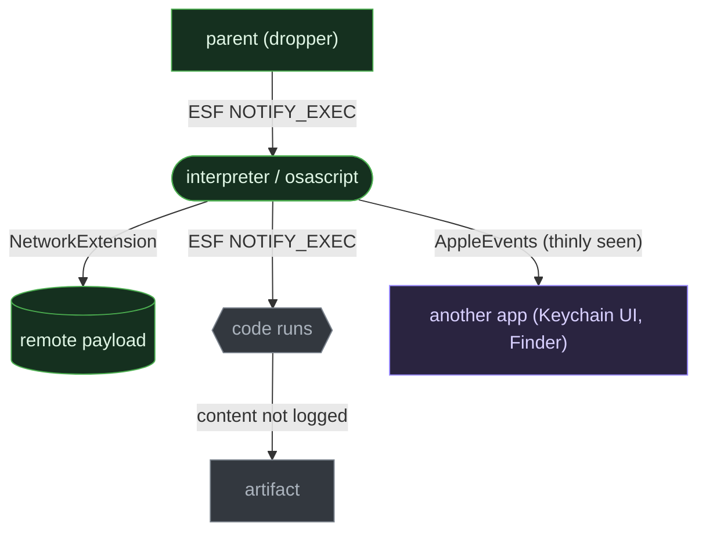

# Script & interpreted execution

<div class="chapter-meta"><div class="attack-techniques"><span class="chapter-meta-label">ATT&amp;CK</span><a class="attack-badge" href="https://attack.mitre.org/techniques/T1059/004/"><span>Unix shell</span><code>T1059.004</code></a><a class="attack-badge" href="https://attack.mitre.org/techniques/T1059/006/"><span>Python</span><code>T1059.006</code></a><a class="attack-badge" href="https://attack.mitre.org/techniques/T1059/002/"><span>AppleScript</span><code>T1059.002</code></a></div><div class="chapter-meta-details"><span><b>Tactic</b> Execution</span><span><b>Chokepoint</b> the interpreter <code>exec</code> edge</span></div></div>

```admonish note title="Threat-specific route: ClickFix"
If the evidence is a browser/clipboard lure followed by user-driven execution, start with
the [ClickFix attack flow, telemetry, and detection page](../threats/clickfix/01-execution-and-detection.md).
It keeps the ClickFix sequence and its Windows/Linux/macOS Sigma examples together. This
chapter is the reusable internals reference for the interpreter-exec edge once that threat
branch is established.
```

Code delivered as *text* and interpreted at runtime, with no compiled artifact. The
behavior is identical everywhere; how it is *realized* and how much of it you can *see*
is not. That gap, same threat, three different shadows in telemetry, is the chapter.

## 1. The behavior & invariant

An attacker runs arbitrary logic by handing source text to an interpreter rather than
shipping a binary. The text may be inline (`-c`/`-e`), a file with a shebang, or piped
from the network.

> **Invariant:** to run interpreted code, the interpreter must be `exec`'d, which emits
> an exec event on every OS. Obfuscation changes the *content*; it cannot remove the
> *exec*.

## 2. Threats that use it

<div class="threat-use-grid">
<article class="threat-use-card os-cross"><span class="threat-use-chip">ALL OS</span><h3>Download cradles</h3><p><strong>What happens:</strong> A shell or PowerShell fetches and immediately runs the next stage.</p><p><strong>Detect here:</strong> An interpreter with a network fetch, especially when its parent is a document, browser, or remote service.</p><p class="threat-use-source"><a href="https://attack.mitre.org/techniques/T1059/">Source</a></p></article>
<article class="threat-use-card os-macos"><span class="threat-use-chip">MACOS</span><h3>AMOS fake prompts</h3><p><strong>What happens:</strong> Atomic Stealer uses <code>osascript</code> to show a fake password dialog.</p><p><strong>Detect here:</strong> A browser, mounted app, or unfamiliar process spawning <code>osascript</code>. The prompt itself has no useful OS event.</p><p class="threat-use-source"><a href="https://attack.mitre.org/techniques/T1059/002/">Source</a></p></article>
<article class="threat-use-card os-cross"><span class="threat-use-chip">WEB RCE</span><h3>Web-shell command runs</h3><p><strong>What happens:</strong> A compromised web app starts <code>python -c</code> or <code>bash -c</code>.</p><p><strong>Detect here:</strong> The parent is the clue. Web-server processes rarely need to launch an interactive interpreter.</p><p class="threat-use-source"><a href="https://media.defense.gov/2020/Jun/09/2002313081/-1/-1/0/CSI-DETECT-AND-PREVENT-WEB-SHELL-MALWARE-20200422.PDF">Source</a></p></article>
</div>

## 3. The behavioral graph & the cut



The red edge, `parent → interpreter (exec)`, is the **cut**: an articulation point
every path from "attacker intent" to "code executes" must cross. Vary the URL, the
encoding, the payload; you cannot reach execution without exec-ing an interpreter. That
necessity is why it is the detection anchor: it is the graph's min-cut, not a signature
you can route around.

## 4. Per-OS realization & telemetry overlay

The cut is the same on all three OSes. Everything *downstream* of it diverges, in
mechanism and, more importantly, in what each OS's sensors can populate.

### Windows

Hosts: `cmd`, `powershell`, `wscript`/`cscript` (WSH), `mshta`. Windows is the only one
of the three that can observe the **content** of piped/downloaded script, via PowerShell
Script Block Logging (4104).



### Linux

Hosts: shells (`sh`→`dash`, `bash`, `zsh`) and runtimes (`python3`, `perl`). Code arrives
inline (`bash -c`), via shebang (kernel `binfmt_script` re-execs the interpreter), or over
a pipe. The exec is fully visible at the EDR tier (eBPF, Sysmon-for-Linux); auditd
`EXECVE` records **split/hex-encode long argument vectors**, so a big inline payload can
be lost at the SIEM tier. The **content** node is dark, a piped payload never reaches
`argv`.



### macOS

Hosts: `zsh`/`python3` as on Linux, **plus `osascript`** (AppleScript and JXA), an
Apple-signed platform binary with no Windows/Linux analog. The exec is visible via ESF
`NOTIFY_EXEC`, which uniquely carries the signer identity inline (`team_id`,
`is_platform_binary`). Two divergences from the others:

1. The **content** node is dark (as on Linux), and the **unified log has no reliable
   exec event at all**, without an ESF sensor, macOS is blind to the cut itself.
2. `osascript` opens an **AppleEvents** branch, driving other apps (fake Keychain
   prompts, Finder automation), a subgraph that simply does not exist on Windows or
   Linux, and which ESF observes only thinly.



```admonish abstract title="Safeguard pressure: why osascript, not a dropped binary"
macOS Gatekeeper + notarization + the quarantine attribute suppress the obvious path
(download and run an unsigned binary), so attackers are **displaced** to ClickFix:
socially engineering the user into pasting `curl … | osascript` into Terminal, which is
fileless and never carries a quarantine flag. The interpreter exec is the same cut, the
*delivery* moved because a safeguard closed the easy door. See
[safeguard pressure](../appendix/safeguard-pressure.md).
```

## 5. Visibility delta

| Graph element |  Windows |  Linux: EDR / SIEM |  macOS: EDR / SIEM |
|---|---|---|---|
| **exec edge** (the cut) | Sysmon EID 1 ✅ | eBPF ✅ / auditd ✅\* | ESF ✅ / unified log ❌ |
| fetch edge (→ remote) | EID 3 ✅ | eBPF ✅ / auditd noisy | NetworkExtension ✅ / ESF thin |
| signer identity on interpreter | ❌ separate lookup | ❌ ELF unsigned | ✅ ESF inline |
| **"code runs" node** (content) | ✅ 4104 (off by default, Script Block Logging GPO) | ❌ missing | ❌ missing |
| inter-app scripting (AppleEvents) | n/a | n/a | ⚠️ macOS-only, thinly seen |

\* auditd `EXECVE` splits/hex-encodes long argument vectors, the EDR tier keeps full `argv`. Verified vs man7 / LKML, Jun 2026.

The lesson is the asymmetry: two of three OSes leave the content node unpopulated (here
Windows is uniquely *ahead*), macOS adds a whole branch the others lack, and the SIEM
tier is weaker everywhere, sharpest on macOS, where the unified log is blind to the cut
itself.

## 6. Detect the cut

### macOS, osascript inline script (T1059.002)

```yaml
title: macOS osascript Inline AppleScript/JXA Execution
status: experimental
logsource:
  product: macos
  category: process_creation
detection:
  selection:
    Image|endswith: '/osascript'
    CommandLine|contains: [' -e ', ' -l JavaScript', 'do shell script']
  filter_interactive:
    ParentImage|endswith: ['/Terminal', '/osascript']
  condition: selection and not filter_interactive
falsepositives: [admin automation, AppleScript installers/MDM]
level: medium
```

### Linux, download cradle piped to a shell (T1059.004)

```yaml
title: Linux Download-and-Execute Cradle (curl/wget piped to a shell)
status: test                        # reconciled vs capture: fired on the sh -c wrapper argv, baseline clean
logsource:
  product: linux
  category: process_creation        # Sysmon-for-Linux EID 1, or map from eBPF/auditd
detection:
  # reconciled vs capture: the matched string lives on the wrapper's exec argv
  # (comm=bash, argv = "sh -c curl -s http://…/benign.sh | bash"); curl/bash children never carry it.
  fetch:         { CommandLine|contains: ['curl ', 'wget '] }
  pipe_to_shell: { CommandLine|contains: ['| bash', '| sh', '|bash', '|sh'] }
  condition: fetch and pipe_to_shell
falsepositives: [rustup, nvm, get.docker.com, Homebrew one-liners]
level: medium
# Anchor caveat: the joined "curl … | bash" string lives on the SHELL WRAPPER process
# (sh -c '…' / an interactive shell), NOT on the two pipeline children, curl's argv is just
# "curl -s URL" and bash's payload arrives on stdin (argv is bare "bash"). So this rule fires on
# the wrapper's CommandLine; a fully two-process pipe with no wrapper needs a lineage rule instead:
# curl/wget process immediately feeding a shell child (eBPF parent→child + the network-fetch edge).
# Tier caveat: this is eBPF-tier, auditd EXECVE splits/hex-encodes the long inline argv, so the
# joined "curl … | bash" string can truncate at the SIEM; keep full argv from the EDR tier (exec-trace.bt).
```

```admonish success title="Confirmed emulation: event excerpt and rule match"
~~~
# exec-trace.bt (eBPF), the sh -c wrapper carrying the curl|bash pipeline
EXEC comm=bash pid=… ppid=…
  argv = sh -c curl -s http://127.0.0.1:18000/benign.sh | bash
  → fetch ('curl ') and pipe_to_shell ('| bash') both match on the wrapper argv

# baseline (did NOT fire): comm=sh  argv = sh -c echo de-guide-benign
~~~

**Rule match:** the wrapper's `argv` contains both the download utility and the pipe into the shell. The standalone `bash` child does not.

Observed on Debian 12 with auditd and bpftrace. The benign baseline did not trigger the rule.
```

### Linux, interpreter inline code from a service parent (T1059.004/.006)

```yaml
title: Linux Interpreter Inline Code from a Web/Service Parent
status: test                        # reconciled vs capture: fired on the renamed web-parent comm exec'ing sh -c
logsource:
  product: linux
  category: process_creation
detection:
  # reconciled vs capture: add /sh and /bash, the captured interpreter was sh, not python/perl
  # (argv = "/bin/sh -c sh -c 'echo de-guide-webparent'"); the original runtimes stay for the .006 case.
  interp:  { Image|endswith: ['/sh','/bash','/python3','/python','/perl','/ruby','/php'], CommandLine|contains: [' -c ', ' -e '] }
  # reconciled vs capture: the anomalous web/service parent surfaces as the EXEC LINE comm,
  # a renamed stub (comm=webparent-stub), match it on the exec'ing process's own Image/comm.
  # The ParentImage list is kept as the complementary lineage path when ppid resolves to a daemon.
  parent_comm:  { Image|endswith: ['-stub'], Image|contains: ['webparent','nginx','apache','httpd','php-fpm','node'] }
  parent_image: { ParentImage|endswith: ['/nginx','/apache2','/httpd','/php-fpm','/node'] }
  condition: interp and (parent_comm or parent_image)
falsepositives: [app servers that legitimately shell out, baseline first]
level: high
# Tier caveat: parent-lineage / renamed-comm resolution is eBPF-tier, the exec-line comm and
# full argv come from exec-trace.bt; auditd EXECVE can truncate the inline 'sh -c' argv at the SIEM.
```

```admonish success title="Confirmed emulation: event excerpt and rule match"
~~~
# exec-trace.bt (eBPF), anomalous web/service parent comm exec'ing an inline sh -c
EXEC comm=webparent-stub pid=…
  argv = /bin/sh -c sh -c 'echo de-guide-webparent'
  → interp ('/sh' + ' -c ') and parent_comm (comm=webparent-stub) match on the exec line

# baseline (did NOT fire): plain `echo`, a shell builtin, no execve emitted
~~~

**Rule match:** the captured execution combines an inline interpreter with the anomalous web-service parent identity.

Observed on Debian 12 with auditd and bpftrace. The benign baseline did not trigger the rule.
```

## 7. Reproduce it yourself

Drive with [Atomic Red Team](https://atomicredteam.io) (`Invoke-AtomicTest`); verify test
numbers against each technique's atomics folder. Manual equivalents (ground truth):

```admonish example title="Manual repro (lab only)"
~~~sh
# Linux, inline interpreter (T1059.004 / .006)
bash -c 'id; uname -a'
python3 -c 'import os; os.system("id")'
# Linux, download cradle (serve a benign script locally first)
curl -s http://127.0.0.1:8000/benign.sh | bash
# macOS, osascript (T1059.002)
osascript -e 'do shell script "id"'
~~~
```

Capture across the full stack with the lab configs:
[`labs/linux/audit.rules`](https://github.com/iimp0ster/os-internals-de-guide/blob/main/labs/linux/audit.rules),
[`labs/linux/bpftrace/exec-trace.bt`](https://github.com/iimp0ster/os-internals-de-guide/blob/main/labs/linux/bpftrace/exec-trace.bt),
[`labs/macos/eslogger-cmds.sh`](https://github.com/iimp0ster/os-internals-de-guide/blob/main/labs/macos/eslogger-cmds.sh).

## 8. False positives & pitfalls

Interpreters are spawned constantly, cron, systemd `ExecStart` wrappers, CI runners,
package post-install scripts, `cloud-init`, config management. `curl | bash` is a
*legitimate* install idiom (rustup, nvm, Docker, Homebrew); `osascript` is used by apps,
installers, and MDM.

```admonish tip title="Noise → signal"
The exec (the cut) is necessary but not sufficient. Gate on context: parent-process
allowlists, user context (service vs interactive vs root), URL/destination reputation,
and rarity (first-seen parent→child pairs). The high-confidence rule above adds an
anomalous-parent constraint; the others need per-environment baselining before they alert.
```
