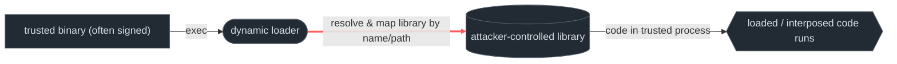
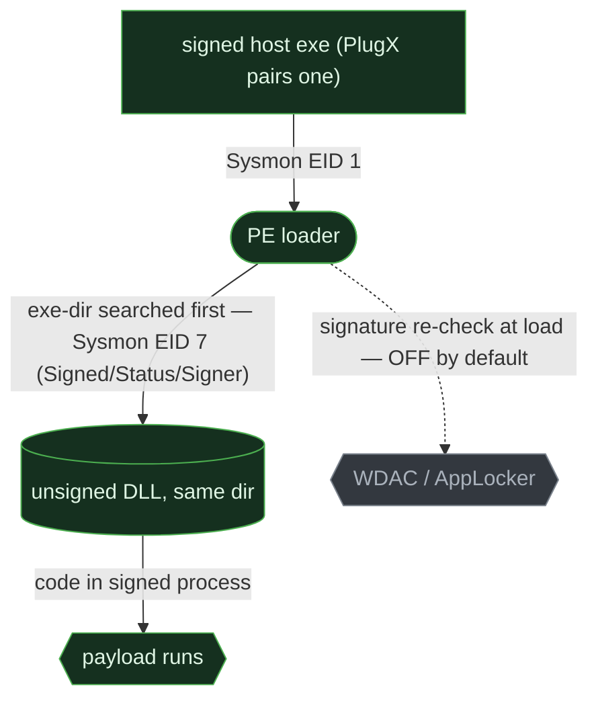
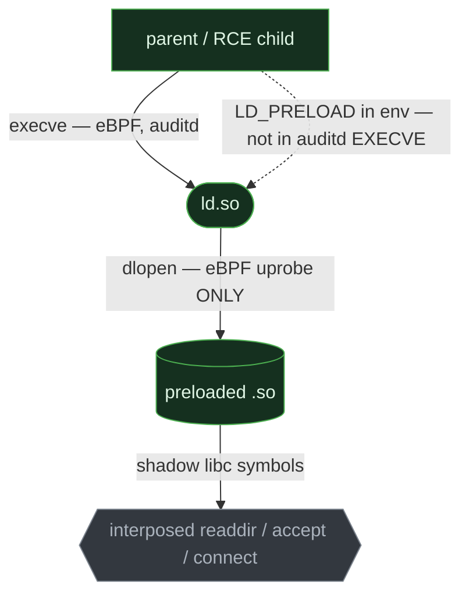
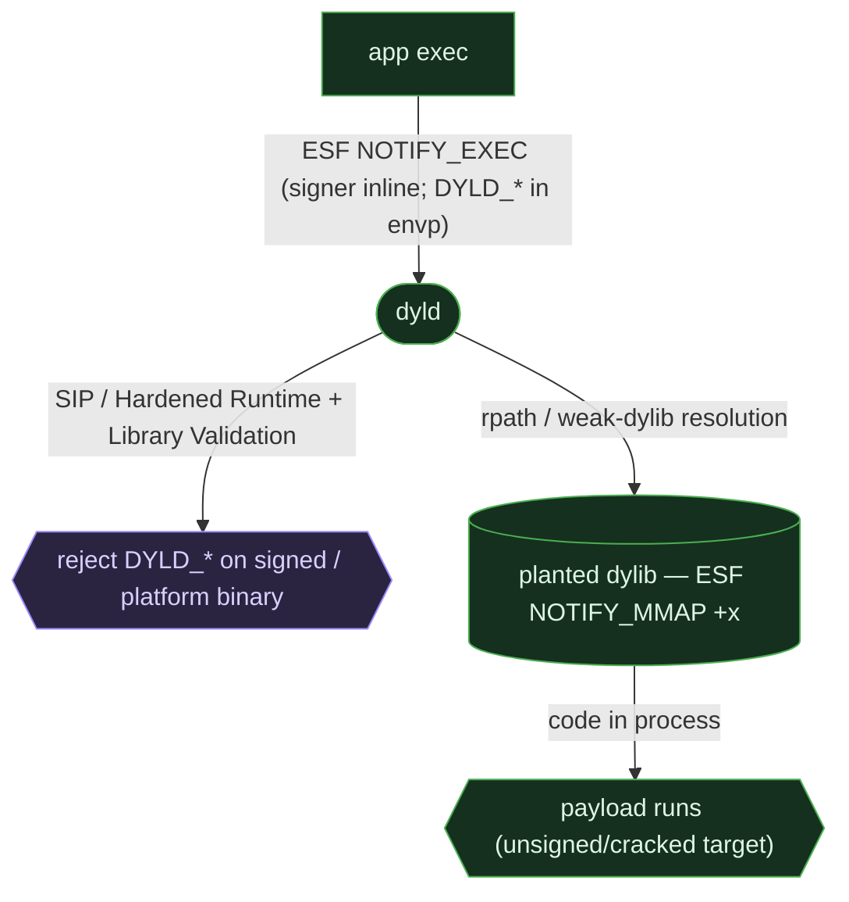

# Native execution & the loader

> **ATT&CK:** T1129 (Shared Modules) · T1574.001 (DLL Search-Order Hijack) · T1574.002 (DLL Side-Loading) · T1574.004 (Dylib Hijacking) · T1574.006 (Dynamic Linker Hijacking)  ·  **Tactic:** Execution  ·  **Chokepoint:** the loader resolving & mapping a library by name/path  ·  **Status:** draft — §6 Linux detections fired on live capture (caplab Wave-1, 2026-06-26); Windows + macOS detections `unverified:` pending their own captures

A compiled binary is not self-contained: it defers most of its code to shared libraries the
**dynamic loader** resolves and maps at (or after) exec. That resolution is *path/name-based*,
and the loader does not, by default, prove the library it found is the one the author meant.
Whoever controls the inputs to resolution gets their code mapped into a trusted — often
*signed* — process. Same behavior on all three OSes; three very different amounts of it you
can see.

## 1. The behavior & invariant

An attacker runs code by making a legitimate program load an attacker-controlled library,
rather than by executing an obviously-malicious binary of their own. The lever is whatever
feeds library resolution: the **search order** (Windows), an **environment variable**
(`LD_PRELOAD`, `DYLD_INSERT_LIBRARIES`) or **preload file** (`/etc/ld.so.preload`), or the
binary's own **load commands** (`RPATH`/`RUNPATH`, weak/`@rpath` dylib references).

> **Invariant:** a dynamically-linked program must resolve and map its libraries through the
> loader, and resolution is by name/path. Control the resolved path and you control the code
> that lands in a trusted address space. Static linking avoids the loader entirely — but
> real-world software is dynamically linked, so the loader edge is always present.

## 2. Threats that use it

- **Windows DLL side-loading (T1574.002)** — **PlugX** (APT27/APT41) ships a signed
  `iexplore.exe`/`winword.exe` beside a malicious `ieproxy.dll`/`mscoree.dll`; the loader takes
  the unsigned DLL from the exe's own directory. **ShadowPad** (APT41), **Qakbot**, and
  **Carbanak** use the same pattern. ([Elastic](https://www.elastic.co/security-labs/dll-sideloading-supply-chain-attacks), [Mandiant](https://www.mandiant.com), [Kaspersky](https://securelist.com/shadowpad/))
- **Linux `LD_PRELOAD` / `ld.so.preload` (T1574.006)** — **libprocesshider** hooks
  `readdir`/`getdents64` to hide processes; **Symbiote** (Intezer/BlackBerry, June 2022) and
  **HiddenWasp** preload a `.so` to interpose socket/`readdir` calls and hide C2 and mining.
  ([Intezer/BlackBerry](https://www.intezer.com/blog/research/new-linux-threat-symbiote/), [HiddenWasp](https://www.intezer.com/blog/hiddenwasp-malware-targeting-linux-systems/))
- **macOS dylib hijacking (T1574.004) + `DYLD_INSERT_LIBRARIES` (T1574.006)** — **AMOS /
  Atomic Stealer** injects a dylib into browsers (cookies/credentials) on *unsigned or cracked*
  apps; the classic weak-/`@rpath`-dylib hijack (Wardle) plants a missing dylib an app's load
  commands resolve to a writable path. ([Objective-See](https://objective-see.org/blog.html), Wardle, *The Art of Mac Malware* Vol. 1 ch. 6; [Red Canary](https://redcanary.com/threat-detection-report/))

## 3. The behavioral graph & the cut



The red edge — **resolve & map by name/path** — is the cut. Every variant (search-order
hijack, side-load, preload, rpath hijack) is just a different way to bend that one resolution.
The loader is an articulation point: there is no path from "attacker's library on disk/in env"
to "code in the trusted process" that does not cross it. That necessity, not any one filename,
is the detection anchor.

## 4. Per-OS realization & telemetry overlay

The cut is identical; the *gate on it* and the *visibility of it* diverge hard. The
load-time **signature check** is the node to watch: enforced by default only on macOS, optional
and off-by-default on Windows, absent on Linux.

### Windows

The PE loader searches a fixed order — exe directory, `System32`/`SysWOW64`, Windows dir, then
CWD and `PATH`. `SafeDllSearchMode` (on since XP SP2) **demotes** CWD from second position to
after the system/Windows directories, so legitimate system DLLs resolve before CWD is reached —
suppressing the classic CWD-relative search-order hijack (T1574.001) and **displacing attackers
to side-loading** (T1574.002): the exe's own directory is still searched first, and **a signed
exe can load an unsigned DLL because the signature is not re-verified at load**.



```admonish abstract title="Safeguard pressure — Windows"
**Enabled.** `SafeDllSearchMode` reshapes the technique (phantom → side-load) rather than
killing it; **AppLocker/WDAC** can enforce signed-DLL loads but are **off by default** on the
overwhelming majority of estates. The SIEM tier is the sharp gap: **Windows event log has no
DLL-load event at all** — the only native signal is **Sysmon EID 7 (ImageLoad)**, an EDR-tier
sensor carrying `Signed`/`SignatureStatus`/`Signer`. EID 7 is itself **off by default**: it needs an
explicit `<ImageLoad>` rule in the Sysmon config (high-volume without path filters). No Sysmon — or
Sysmon without that rule — no visibility into the cut.
```

### Linux

`ld.so` (the `PT_INTERP`) resolves symbols at exec. The levers are `LD_PRELOAD` (per-process
env), `/etc/ld.so.preload` (system-wide, root-writable), and the binary's `RPATH`/`RUNPATH`. A
preloaded `.so` doesn't just *add* code — it **interposes symbols**, shadowing libc functions
(`readdir` → process hiding, `accept`/`connect` → C2 hiding). That symbol-interposition branch
has no direct Windows side-loading analog.



```admonish abstract title="Safeguard pressure — Linux"
**Enabled, with a structural visibility gap.** No default guard on `LD_PRELOAD` or
`/etc/ld.so.preload`; **SELinux-enforcing** (RHEL/Fedora, ~part of the estate) can gate
unprivileged preload writes, but Ubuntu/Debian don't enforce by default, and Yama
`ptrace_scope` gates ptrace — not preload. Observation bias: `auditd` is **typically not
installed-and-running by default** on Ubuntu/Debian/cloud AMIs, so `ld.so.preload` writes and
`LD_PRELOAD` execs go unrecorded; and **`auditd` has no library-load event at all** — `dlopen`
is visible only via an **eBPF uprobe**. `LD_PRELOAD` inherited from the environment never
reaches the `EXECVE` `argv` record.
```

### macOS

`dyld` resolves via `DYLD_*` env vars and the Mach-O load commands (`LC_LOAD_DYLIB`, `LC_RPATH`,
weak/`@rpath` references). macOS is the one OS that **refuses the env-var path by default**:

1. **SIP** ignores `DYLD_*` environment variables when executing Apple/SIP-protected platform
   binaries — system-wide, not per-app.
2. **Hardened Runtime + Library Validation** block `DYLD_INSERT_LIBRARIES` against *third-party*
   signed/notarized binaries unless the `com.apple.security.cs.allow-dyld-environment-variables`
   entitlement is present (rare). Library Validation additionally requires loaded dylibs to be
   signed by the same team.

So attackers are **displaced** to dylib hijacking (T1574.004 — plant the missing weak/`@rpath`
dylib, no env var needed) and to *unsigned/old/cracked* apps. ESF is unusually rich here:
`NOTIFY_EXEC` carries the signer identity **inline** and exposes `DYLD_*` in the exec/fork
`envp`; `NOTIFY_MMAP` reports the `+x` dylib mapping and its path.



```admonish abstract title="Safeguard pressure — macOS"
**Suppressed — the standout column.** SIP + Hardened Runtime + Library Validation make the
`DYLD_INSERT_LIBRARIES` path a dead end against signed/platform binaries; this is *suppression*,
not mere observation gap. **Displaced to:** dylib hijacking on apps with writable `@rpath`/weak
references, **unsigned/old third-party apps**, **cracked apps** with the quarantine xattr
stripped, the rare entitled app, and ClickFix-style delivery (see
[script execution](01-script-exec.md)). As elsewhere on macOS, the **unified log has no
reliable dyld event** — without ESF the cut is invisible.
```

## 5. Visibility delta

| Graph element | Windows | Linux — EDR / SIEM | macOS — EDR / SIEM |
|---|---|---|---|
| exec of host binary | Sysmon 1 ✅ / 4688 ✅ | eBPF ✅ / auditd ⚠️ off-by-default | ESF ✅ / unified ❌ |
| **library resolve & map** (the cut) | Sysmon 7 ✅ (off by default — needs `<ImageLoad>`) / event-log ❌ | eBPF `dlopen` uprobe ✅ / auditd ❌ **no lib-load event** | ESF `NOTIFY_MMAP` ✅ / unified ❌ |
| signer on the loaded library | Sysmon 7 `Signed`/`Status` ✅ (EDR-only, off by default) / ❌ SIEM | ❌ ELF unsigned | ✅ ESF inline + SIP/HR **gate enforced** |
| hijack input | search-order/side-load — Sysmon 7 *path* ⚠️ | `LD_PRELOAD`: eBPF env ✅ / auditd ❌ (not in `EXECVE`); `ld.so.preload` write — auditd `-w` ⚠️ | `DYLD_*` in ESF `envp` ✅ / unified ❌ |
| planted-library file write | Sysmon 11 ✅ / event-log ❌ | eBPF ✅ / auditd `-w` ⚠️ | ESF `NOTIFY_CREATE` ✅ / FSEvents coarse |

The asymmetry: the **signature gate** is the inverse of execution telemetry. macOS, weakest at
seeing *exec*, is strongest at *gating the load* — its loader refuses the obvious path. Windows
*can* see the load richly (EID 7 with signer) but only at the EDR tier and only if Sysmon is
deployed; its SIEM tier is fully blind. Linux can gate nothing by default and can see the load
only through an eBPF `dlopen` uprobe — the SIEM tier has no library-load event to populate at all.

## 6. Detect the cut

```admonish warning title="CAPTURE PENDING (Windows + macOS)"
The **Linux** rule is **captured & validated** (caplab Wave-1, 2026-06-26): it fired on the live
auditd events shown inline below its block and stayed silent on a benign baseline, so it is marked
`status: test`. The **Windows** and **macOS** rules remain **`unverified:`** — drafted from
documented event schemas, not yet fired on a real captured event or cleared against a benign
baseline, pending their own OS captures. Per [methodology](../methodology.md), a rule is done only
when it fires on a real event (shown inline) **and not** on a benign run. The Windows/macOS schema
blocks below are illustrations, replaced with redacted live events after lab capture.
```

### Windows — DLL side-loading (signed host loads unsigned DLL from a user path)

```yaml
title: Windows DLL Side-Loading (unsigned module from non-system path)
status: experimental
logsource: { product: windows, service: sysmon }     # EID 7 ImageLoad — no SIEM-tier equivalent
detection:
  load:
    EventID: 7
    Signed: 'false'
  user_path:
    ImageLoaded|contains: ['\\Users\\', '\\Temp\\', '\\ProgramData\\', '\\AppData\\', '\\Downloads\\']
  condition: load and user_path
falsepositives: [Python/Node/Java/Electron apps shipping unsigned DLLs from user dirs]
level: medium
# Higher fidelity: also require the loading Image to be a signed binary whose basename is a known
# side-load target (winword.exe, iexplore.exe, regsvr32.exe), or a basename collision with a
# System32 DLL loaded from outside System32 (phantom indicator). Needs EID 7 + EID 1 lineage.
```

### Linux — `/etc/ld.so.preload` write + `LD_PRELOAD` on the command line

```yaml
title: Linux Dynamic-Linker Hijack (ld.so.preload write or env-wrapped LD_PRELOAD)
status: test                                           # validated in caplab Wave-1 (2026-06-26); fired on the captured events below
logsource: { product: linux, service: auditd }       # needs an auditd watch; usually not running by default
detection:
  preload_write:
    type: PATH
    name: '/etc/ld.so.preload'
    nametype: ['CREATE', 'NORMAL']   # capture: nametype=CREATE on first write
  ld_preload_env_wrapper:
    type: EXECVE
    a0|re: '(^|/)env$'               # reconciled vs capture: argv[0] is the literal name the caller used — basename `env` (a0=env) OR full path `/usr/bin/env`; the old `/env`-only endswith MISSED the captured basename invocation
    a1|startswith: 'LD_PRELOAD='
  condition: preload_write or ld_preload_env_wrapper
falsepositives: [jemalloc/tcmalloc shims, fakeroot, profilers, snap/flatpak wrappers]
level: high
# Coverage caveat: the common shell-prefix form (`LD_PRELOAD=x cmd`) and any LD_PRELOAD inherited
# from the environment are NOT in the EXECVE argv record at all — only the explicit `env`-wrapper
# is. The inherited path needs an eBPF dlopen / execve-env sensor (Tetragon/Falco); the
# `ld.so.preload` write is the durable SIEM-tier signal.
```

```admonish success title="FIRED — captured live event"
~~~text
# preload_write arm — auditd, key=ld_preload (-w /etc/ld.so.preload -p wa)
type=PATH msg=audit(…:7516): item=1 name="/etc/ld.so.preload" nametype=CREATE
    mode=file,644 ouid=root ogid=root
# ld_preload_env_wrapper arm — auditd, key=exec
type=EXECVE msg=audit(…:7538): argc=3 a0="env" a1="LD_PRELOAD=/tmp/…/benign_interposer.so" a2="/bin/true"
~~~
Note `a0="env"` (basename, no slash) — the shell invoked `env` by basename, so the original
`a0|endswith: '/env'` selection would have **missed its own captured event**; the reconciled
`a0|re: '(^|/)env$'` matches both `env` and `/usr/bin/env`.

Captured 2026-06-26 · Debian 12 (bookworm), kernel 6.1.0-40-amd64 · auditd 3.0.9 + bpftrace ·
caplab Wave-1 (`labs/linux/run-captures.sh`) · benign baseline ran clean (rule did NOT fire on it).
```

### macOS — `DYLD_INSERT_LIBRARIES` in the exec environment

```yaml
title: macOS DYLD_INSERT_LIBRARIES Injection (T1574.006)
status: experimental
logsource: { product: macos, category: process_creation }   # ESF NOTIFY_EXEC, envp inspected
detection:
  selection:
    Environment|contains: 'DYLD_INSERT_LIBRARIES='
  filter_platform:
    # drops only Apple PLATFORM binaries (SIP ignores DYLD_* for them); third-party signed
    # binaries are separately protected by Hardened Runtime + Library Validation, so the alert
    # focuses on unsigned targets or apps with the allow-dyld-environment-variables entitlement
    CodeSigningFlags|contains: 'platform_binary'
  condition: selection and not filter_platform
falsepositives: [developer/instrumentation tooling, some Homebrew formulae]
level: medium
# Anchor semantics: this fires on the injection ATTEMPT (DYLD_INSERT_LIBRARIES present in envp at
# exec) — NOT on a successful load. Against a signed/notarized non-entitled target the env var still
# appears in NOTIFY_EXEC while Library Validation rejects the dylib. To evidence actual landing, pair
# with ESF NOTIFY_MMAP of the +x dylib: present on the entitled/unsigned target, ABSENT when blocked.
# Complement (catches the env-less dylib hijack, T1574.004): ESF NOTIFY_MMAP of a +x dylib
# resolved from a writable @rpath/weak path (e.g. ~/Library, /tmp) not signed by the app's team.
```

## 7. Reproduce it yourself

Drive with [Atomic Red Team](https://atomicredteam.io): T1574.001/.002 (Windows), T1574.006
(Linux `LD_PRELOAD`), T1574.004/.006 (macOS). Verify test numbers against each technique's
atomics folder. Manual equivalents (ground truth):

```admonish example title="Manual repro (lab only)"
~~~sh
# Linux — LD_PRELOAD interposition (T1574.006); build a benign .so that hooks a libc symbol.
# shell-prefix form — NOT in the auditd EXECVE record (needs eBPF to see):
LD_PRELOAD=/tmp/benign_hook.so id
# env-wrapper form — lands in EXECVE argv, fires the section-6 rule:
env LD_PRELOAD=/tmp/benign_hook.so id
# Linux — system-wide preload (root; lab VM only)
echo /tmp/benign_hook.so | sudo tee /etc/ld.so.preload   # remove the file after capture
# macOS — env-var injection (T1574.006). Works against an UNSIGNED target; the lesson is that it
# is BLOCKED against a signed/platform binary (SIP/Hardened Runtime) — capture both outcomes.
DYLD_INSERT_LIBRARIES=/tmp/benign.dylib ./unsigned_test_target
DYLD_INSERT_LIBRARIES=/tmp/benign.dylib /bin/ls   # expected: ignored (platform binary)
~~~
~~~powershell
# Windows — side-load: drop a benign test DLL beside a signed exe that imports it by basename,
# then launch the exe from that directory and watch Sysmon EID 7 for the unsigned load.
~~~
```

Capture across the stack with the lab configs:
[`labs/linux/audit.rules`](https://github.com/iimp0ster/os-internals-de-guide/blob/main/labs/linux/audit.rules)
(add a `-w /etc/ld.so.preload -p wa` watch),
[`labs/linux/bpftrace/`](https://github.com/iimp0ster/os-internals-de-guide/tree/main/labs/linux/bpftrace)
(a `dlopen`/`uprobe` trace for the lib-load edge),
[`labs/linux/sysmon-config.xml`](https://github.com/iimp0ster/os-internals-de-guide/blob/main/labs/linux/sysmon-config.xml),
[`labs/macos/eslogger-cmds.sh`](https://github.com/iimp0ster/os-internals-de-guide/blob/main/labs/macos/eslogger-cmds.sh)
(stream `exec` + `mmap`). On Windows use a Sysmon config that logs EID 7 (ImageLoad) with the
signature fields enabled.

## 8. False positives & pitfalls

Loader hijacking *looks like normal software loading software*. Legitimate apps ship unsigned
DLLs from user directories (Python wheels, Node modules, Java/Electron); `LD_PRELOAD` is a real
idiom (`jemalloc`/`tcmalloc`, `fakeroot`, profilers, sandbox wrappers); `DYLD_INSERT_LIBRARIES`
appears in dev and instrumentation tooling; and `@rpath` legitimately points apps at their own
bundled Frameworks.

```admonish tip title="Noise → signal"
The load (the cut) is necessary but not sufficient. Gate on context: **signer mismatch**
(unsigned/ad-hoc DLL in a signed process; dylib not signed by the app's team), **path** (library
in a user-writable/temp location, or a basename that collides with a system library loaded from
outside the system dir), **host-binary identity** (a known side-load target, or any binary
loading a library it has no business loading), and **rarity** (first-seen host→library pairs).
Pure "unsigned + non-system path" will drown you without process-context filtering.
```
