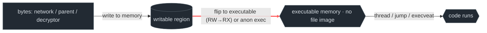
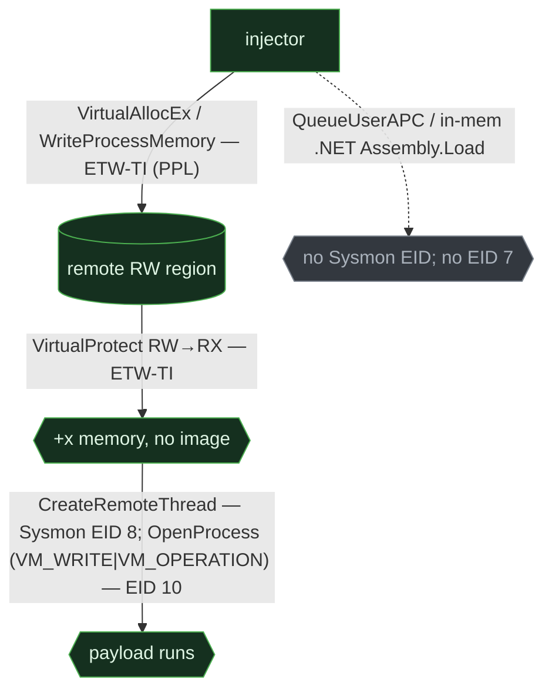
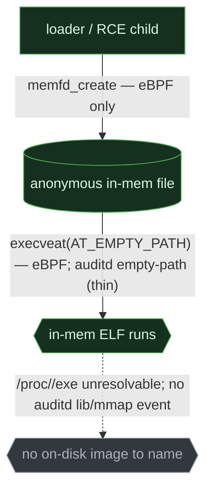
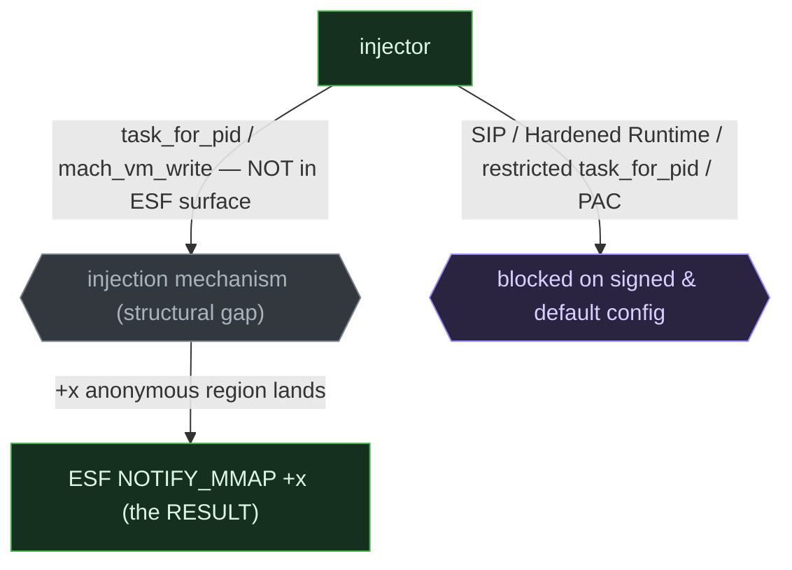

# In-memory / fileless execution

> **ATT&CK:** T1620 (Reflective Code Loading) · T1055 (Process Injection) · T1055.012 (Process Hollowing)  ·  **Tactic:** Execution / Defense Evasion  ·  **Chokepoint:** executable memory with no on-disk image backing it  ·  **Status:** draft — §6 Linux detections fired on live capture (2026-06-26, caplab Wave-1; `status: test`); Windows/macOS detections `unverified:` pending their own captures

Every earlier chapter still leaves a *file* to name. This one doesn't: the attacker runs code
from a region of memory that no on-disk image backs. That removes the artifact most detection
is built on — the executable path — and makes this the **widest EDR↔SIEM visibility delta in
the guide**, and the place safeguard pressure peaks. The same behavior is richly instrumented on
Windows, nearly invisible on Linux, and largely *blocked* on macOS.

## 1. The behavior & invariant

The attacker executes code that was never written to disk as a program: bytes arrive over the
network or from a decryptor, land in a process's memory, and run there. Realizations:
reflective DLL/PE loading, process injection, hollowing, in-memory .NET on Windows; anonymous
in-memory files (`memfd_create` + `execveat`) and ptrace injection on Linux; Mach/`task_for_pid`
injection and in-memory `dlopen` on macOS.

> **Invariant:** to run code from memory you must obtain a region of **executable memory with no
> file image behind it** — either by flipping a writable region to executable (the RW→RX
> transition) or by exec'ing an anonymous in-memory file. There is no on-disk path to name, so
> process-creation logging alone cannot see it. That executable-memory edge is the cut.

## 2. Threats that use it

- **Cobalt Strike Beacon** — reflective DLL loading (T1620) + injection (T1055.001) into
  `explorer.exe`/`rundll32.exe`; no `LoadLibrary`, no on-disk beacon. ([Mandiant M-Trends](https://www.mandiant.com/m-trends))
- **TrickBot / Emotet** — process hollowing (T1055.012): spawn `svchost.exe` suspended,
  `ZwUnmapViewOfSection` the original image, write a malicious PE, resume. ([NCC Group](https://www.nccgroup.com/us/research-blog/), [CISA](https://www.cisa.gov))
- **Qakbot** — full PE injection (T1055.002) into `explorer.exe`. ([CISA AA22-265A](https://www.cisa.gov/news-events/cybersecurity-advisories/aa22-265a), [Proofpoint](https://www.proofpoint.com/us/blog/threat-insight))
- **Linux `memfd` loaders** (Mirai variants) — `memfd_create` + `execveat(AT_EMPTY_PATH)` to run
  an in-memory ELF, bypassing on-disk scanning. **BPFDoor** / **Diamorphine** use eBPF/ptrace
  in-memory paths. ([Elastic](https://www.elastic.co/security-labs/a-deep-dive-into-linux-rootkits), [Uptycs](https://www.uptycs.com))
- **macOS** — injection is *attempted but largely blocked* (see §4); capable actors (some
  Lazarus tooling) target **unsigned** binaries. Commodity macOS malware mostly **avoids**
  injection, stealing userland data instead (AMOS). ([Objective-See](https://objective-see.org/blog.html), [Unit 42](https://unit42.paloaltonetworks.com))

## 3. The behavioral graph & the cut



The red edge — **making memory executable with no file behind it** — is the cut. Obfuscation,
encryption, and staging vary the *bytes*; they cannot remove the moment a region becomes
executable. There is no on-disk image node in this graph, and that absence is the whole point:
detection has to move from "what file ran" to "what memory turned executable, in which process."

## 4. Per-OS realization & telemetry overlay

This is where the three OSes diverge the most. Windows has the **richest injection telemetry**
yet injection thrives; Linux is **enabled and nearly blind**; macOS is **the most suppressed**.

### Windows

The usermode injection chain is `VirtualAllocEx → WriteProcessMemory → VirtualProtect (RW→RX) →
CreateRemoteThread`; hollowing adds `ZwUnmapViewOfSection`; reflective loaders run
position-independent code with no `LoadLibrary`. Windows instruments this better than anywhere
else, all at the **EDR tier**.



```admonish abstract title="Safeguard pressure — Windows"
**Suppressed-on-paper, prevalent-in-fact.** **HVCI / Memory Integrity** enforces *kernel-mode*
code integrity (W^X for kernel pages, driver signing) — default-on on eligible Win11 22H2+
hardware. It blocks BYOVD/kernel RWX, which is exactly **why attackers are displaced to
usermode injection**; the usermode RW→RX pressure here comes from **CFG / ACG (Arbitrary Code
Guard)** and EDR heuristics, *not* HVCI. **AMSI** scans in-memory .NET but is widely bypassed.
The richest signal, the **ETW Microsoft-Windows-Threat-Intelligence** provider
(`VirtualAllocEx`/`WriteProcessMemory`/`ZwUnmapViewOfSection`), is **PPL-gated** — in practice
EDR-only — and **Sysmon EID 25 (ProcessTampering)** only arrived in **Sysmon 13 (Jan 2021)**.
The SIEM tier (event log 4688) is blind to every memory operation — "low prevalence" in
event-log-only shops is a *measurement artifact*.
```

### Linux

The cleanest path is two syscalls: **`memfd_create(2)`** makes an anonymous in-memory file, then
**`execveat(fd, AT_EMPTY_PATH)`** (or `fexecve`) executes it — `MFD_EXEC` governs this on kernel
**6.3+** (absent in 6.2). ptrace injection (`PTRACE_POKETEXT`, `process_vm_writev`) is gated by
Yama `ptrace_scope` but **bypassed by 2025 seccomp-notify / io_uring** techniques. The exec'd
code has **no resolvable `/proc/<pid>/exe`** — the structural blind spot.



```admonish abstract title="Safeguard pressure — Linux"
**Enabled and largely invisible — the worst-case column.** `memfd_create`/`execveat` have **no
default guard**; `unprivileged_bpf_disabled=2` (Ubuntu 21.10+/RHEL) stops *unprivileged* eBPF but
**privileged (post-root) eBPF rootkits stay viable** (BPFDoor, Diamorphine); Yama gates ptrace
until the 2025 seccomp-notify/io_uring bypass. Severe observation bias: **`auditd` is typically
not installed-and-running by default**, so the `execveat`/anonymous-mmap events are never
generated on most hosts; anonymous `+x` mmap isn't audited without an explicit rule; and **eBPF
rootkits filter the eBPF tools watching them** — a structural blindness no rule fixes.
```

### macOS

In-memory execution is the *most constrained* of the three. `NSCreateObjectFileImageFromMemory`
is restricted by Hardened Runtime (introduced macOS 10.14; a notarization requirement since
Jan 2020); Mach injection (`task_for_pid` +
`mach_vm_write` + `thread_create_running`) needs an entitlement or an *unsigned* target plus
root; `DYLD_INSERT_LIBRARIES` is blocked by SIP / Library Validation; and Apple-Silicon **pointer
authentication (PAC)** destabilizes ROP/JOP in injected code. ESF sees the **result** (`+x`
anonymous mapping) but **not the mechanism** — `task_for_pid`/`mach_vm_*` are not in the ESF event
surface.



```admonish abstract title="Safeguard pressure — macOS"
**Peak suppression.** SIP + Hardened Runtime + restricted `task_for_pid` + Apple-Silicon PAC make
cross-process injection hard on a default Mac — genuine suppression. **Displaced to** userland
data theft (infostealers reading Keychain/browser/SSH via legitimate APIs — ~the majority of new
macOS malware) and `osascript` social engineering (see [script execution](01-script-exec.md)).
Two caveats keep this honest: ESF has only **indirect** visibility (the `NOTIFY_MMAP` result, not
the `task_for_pid` mechanism — a *structural* gap), and "rare" is **not** "gone" — capable actors
target unsigned/old binaries, and macOS injection sophistication is rising. Don't read the empty
cell as safety.
```

## 5. Visibility delta

| Graph element | Windows | Linux — EDR / SIEM | macOS — EDR / SIEM |
|---|---|---|---|
| bytes → memory (write) | ETW-TI `WriteProcessMemory` ✅ (PPL) / event-log ❌ | eBPF `process_vm_writev`/ptrace ✅ / auditd ❌ | ESF ❌ (`mach_vm_write` not in ESF) / unified ❌ |
| **RW→RX / anon-exec** (the cut) | ETW-TI `VirtualProtect` ✅ noisy / event-log ❌ | eBPF `mprotect`/`execveat` ✅ / auditd ⚠️ empty-path | ESF `NOTIFY_MMAP` `+x` ✅ / unified ❌ |
| exec start / thread | Sysmon 8 `CreateRemoteThread` ✅ / event-log ❌ | eBPF ✅ / auditd ⚠️ | ESF `NOTIFY_EXEC` ✅ / unified ❌ |
| anonymous in-memory file | — (PE-in-memory, not a file) | `memfd_create` — eBPF ✅ / auditd ❌ default | — (Mach-O in-mem, HR-restricted) |
| on-disk image to name | ❌ none — the point | ❌ none (`/proc/<pid>/exe` unresolvable) | ❌ none |
| injection **mechanism** | EID 8/10/25 + ETW-TI ✅ (richest) | eBPF ptrace ✅ / auditd ❌ | ❌ **structural gap** (`task_for_pid` not in ESF) |

The delta is at its maximum here: the *defining* artifact — an on-disk image — is **absent on
every OS**, so detection lives entirely on the memory edge, where the SIEM tier is blind across
the board and the EDR tier ranges from richest (Windows) through nearly-blind (Linux, sensor
usually absent) to *can't-see-the-mechanism-by-design* (macOS).

> **Version/default provenance (as-of Jun 2026):** Sysmon 13 / EID 25 — Sysinternals changelog;
> `MFD_EXEC` kernel 6.3+ — kernel.org `memfd_create(2)`; macOS Hardened Runtime 10.14 +
> notarization enforcement (Jan 2020) — Apple developer docs; HVCI default-on (eligible
> Win11 22H2+) — see [safeguard pressure](../appendix/safeguard-pressure.md); 2025
> seccomp-notify / io_uring `ptrace_scope` bypass — LWN / kernel commit. Re-verify against the
> build in front of you.

## 6. Detect the cut

```admonish warning title="CAPTURE PENDING — Windows & macOS only"
**Linux is captured & validated** (2026-06-26): the `memfd`+`execveat(AT_EMPTY_PATH)` rule fired on
a real event (shown inline below it, `status: test`) and stayed silent on a benign baseline.
**Windows and macOS rules remain `unverified:`** — drafted from documented event schemas, not yet
fired on a real captured event or cleared against a benign baseline. Per [methodology](../methodology.md),
a rule is done only when it fires on a real event (shown inline) **and not** on a benign run (here:
a JIT engine doing the *same* RW→RX). The Windows/macOS schema blocks below are still illustrations.
```

### Windows — cross-process thread injection (EID 8 + EID 10)

```yaml
title: Windows Remote Thread Injection (CreateRemoteThread into another process)
status: experimental
logsource: { product: windows, service: sysmon }     # EID 8/10 — no SIEM-tier equivalent
detection:
  remote_thread:
    EventID: 8
  cross_process:
    SourceProcessId|exists: true
    # alert when source != target image family (self-injection is common and benign)
  condition: remote_thread and cross_process
falsepositives: [debuggers, some installers/AV doing legitimate cross-process work]
level: medium
# Complement: EID 10 (ProcessAccess) — the inject-vs-dump tell is PROCESS_CREATE_THREAD (0x0002), not
# the write bit: an injector opens the target with at least PROCESS_VM_WRITE|PROCESS_CREATE_THREAD =
# 0x0022 (often + PROCESS_VM_OPERATION 0x0008 → 0x002A). Bit-test for 0x0002, don't match an exact value.
# NB the LSASS credential-DUMP masks (ProcDump/Mimikatz) — 0x1438/0x143A, which DO carry PROCESS_VM_WRITE
# (0x0020), and 0x1410 (read-only) — are NOT injection: none set 0x0002. So keying on the write bit alone
# fires on cred-dumpers (0x1438), and an exact-0x1438 rule misses simple injectors. For hollowing: EID 25.
# This rule keys on CreateRemoteThread (EID 8) as the nearest Sysmon-tier PROXY for the cut: the
# actual RW→RX transition is observable only via ETW-TI (VirtualAllocEx/WriteProcessMemory/
# VirtualProtect), which is PPL-gated and reaches EDR pipelines only — not Sigma-against-Sysmon.
```

### Linux — anonymous in-memory exec (`memfd` + `execveat`)

```yaml
title: Linux Fileless Exec via memfd_create + execveat(AT_EMPTY_PATH)
status: test                                                # reconciled vs capture 2026-06-26 (caplab Wave-1)
logsource: { product: linux, category: process_creation }   # eBPF (Tetragon/Falco); auditd thin
detection:
  # EDR tier (authoritative): the captured bpftrace tell is execveat carrying AT_EMPTY_PATH
  # (flags=0x1000) — exec of a file descriptor, not a path. This is the direct fileless signal.
  ebpf_anon_exec:
    syscall: 'execveat'
    flags|contains: '0x1000'          # reconciled vs capture: AT_EMPTY_PATH (=0x1000) was the firing field, not an Image string
  # SIEM tier (corroboration only): auditd surfaces no "fileless" semantic. The memfd_create
  # syscall fires under key=memfd; the paired execve/execveat resolves to 'memfd:… (deleted)'.
  auditd_memfd:
    key: 'memfd'                      # reconciled vs capture: memfd_create record (audit.rules -k memfd), not argc==0
  auditd_anon_path:                   # resolved image name on the execve/execveat record (eBPF-resolved or auditd name=)
    Image|startswith: 'memfd:'
    Image|contains: '(deleted)'
  condition: ebpf_anon_exec or auditd_memfd or auditd_anon_path
falsepositives: [language runtimes / packers that legitimately exec from memfd — baseline first]
level: high
# Visibility delta (the §5 blind spot this chapter argues): bpftrace sees the AT_EMPTY_PATH fileless
# exec DIRECTLY (execveat fd + flags=0x1000); auditd only CORROBORATES via the memfd_create syscall
# (key=memfd) plus a generic execve — it has no clean fileless/anonymous semantic, and the empty-path/
# argc tell is fragile at that tier. eBPF is authoritative; auditd is usually not running by default.
```

```admonish success title="FIRED — captured live event"
~~~text
# EDR tier — bpftrace (labs/linux/bpftrace/memfd-exec.bt) — the authoritative fileless tell:
TIME(ms)   PID    COMM             EVENT
…          8668   memfd_exec_help  memfd_create name=x flags=0x1
…          8668   memfd_exec_help  execveat fd=3 flags=0x1000 path=<AT_EMPTY_PATH: fileless>

# SIEM tier — auditd corroboration only (no clean "fileless" semantic):
type=SYSCALL  syscall=memfd_create  success=yes  comm="memfd_exec_help"  key="memfd"
type=SYSCALL  syscall=execveat  success=yes  comm="memfd_exec_help"  key="exec"
type=PATH     name="memfd:x (deleted)"  nametype=NORMAL
~~~

bpftrace sees the `AT_EMPTY_PATH` fileless exec directly (`execveat fd=3 flags=0x1000`); auditd
only corroborates via `memfd_create` (`key=memfd`) + a generic `execveat`, never the fileless nature.

Captured 2026-06-26 · Debian 12 (bookworm), kernel 6.1.0-40-amd64 · auditd 3.0.9 + bpftrace · caplab Wave-1 (labs/linux/run-captures.sh) · benign baseline ran clean (rule did NOT fire on it).
```

### macOS — executable anonymous memory in a non-JIT process

```yaml
title: macOS Executable Anonymous Mapping (in-memory code landing)
status: experimental
logsource: { product: macos, category: image_load }   # ESF NOTIFY_MMAP (executable mapping)
detection:
  selection:
    EventType: 'mmap'
    Protection|contains: 'VM_PROT_EXECUTE'
    Flags|contains: 'MAP_ANON'
  filter_jit:
    # browsers, .NET, JVM, JS engines legitimately map +x anonymous memory — allowlist them
    ProcessPath|contains: ['/Safari', '/Google Chrome', '/dotnet', '/java', '/node']
  condition: selection and not filter_jit
falsepositives: [JIT engines — this is the dominant benign source; allowlisting is mandatory]
level: low
# Honest caveat: this catches the RESULT (the +x mapping), not the injection MECHANISM
# (task_for_pid/mach_vm_*), which ESF does not expose. Treat as a lead, correlate with NOTIFY_EXEC.
```

## 7. Reproduce it yourself

Drive with [Atomic Red Team](https://atomicredteam.io): T1055.001/.012 (Windows), T1620 (Linux
reflective/`memfd`). Verify test numbers against the atomics folder. Manual equivalents (ground
truth):

```admonish example title="Manual repro (lab only)"
~~~sh
# Linux — anonymous in-memory exec (T1620). Runnable path = the ART atomic; manual ground-truth
# is the syscall sequence (conceptual outline, not copy-paste):
#   fd = memfd_create("x", MFD_CLOEXEC); write a benign ELF to fd;
#   execveat(fd, "", argv, envp, AT_EMPTY_PATH);
# then confirm /proc/<pid>/exe reads 'memfd:x (deleted)' — no on-disk image to name.
~~~
~~~sh
# macOS — capture the SUPPRESSION as the finding. Ignored against a signed/platform binary
# (SIP/Hardened Runtime strip DYLD_*) — that no-op IS the lesson; record it plus a JIT NOTIFY_MMAP baseline:
DYLD_INSERT_LIBRARIES=/tmp/benign.dylib /bin/ls
~~~
~~~powershell
# Windows — benign cross-process thread (T1055.001 family), conceptual: allocate in a test target,
# write a do-nothing stub, CreateRemoteThread. Watch Sysmon EID 8/10 (EID 25 if hollowing).
# Use the ART T1055.001 / T1055.012 atomics for the runnable path.
~~~
```

Capture with the lab configs:
[`labs/linux/bpftrace/`](https://github.com/iimp0ster/os-internals-de-guide/tree/main/labs/linux/bpftrace)
(add a `memfd_create`/`execveat` trace — the EDR-tier signal),
[`labs/linux/audit.rules`](https://github.com/iimp0ster/os-internals-de-guide/blob/main/labs/linux/audit.rules)
(an `execveat` syscall rule, to see how thin the SIEM tier is),
[`labs/macos/eslogger-cmds.sh`](https://github.com/iimp0ster/os-internals-de-guide/blob/main/labs/macos/eslogger-cmds.sh)
(stream `mmap` + `exec`). On Windows, a Sysmon config logging EID 8/10/25 plus an ETW-TI–subscribed
EDR.

## 8. False positives & pitfalls

The cut's benign twin is **JIT compilation**: browsers (V8/JavaScriptCore), .NET, the JVM, and
LuaJIT all allocate writable memory and flip it to executable — the exact RW→RX transition the
rule keys on — constantly and legitimately. Legitimate `CreateRemoteThread` exists (debuggers,
AV, some installers); `memfd_create` is used by `systemd`, container runtimes, and some package
tooling.

```admonish tip title="Noise → signal"
Executable anonymous memory, by itself, is *not* malicious — on a normal desktop it is mostly
JITs. Gate on context: **process identity** (a JIT-less process — `svchost`, an Office child, a
shell — flipping memory executable is the signal; a browser doing it is noise), **cross-process**
(injection into a *different* process, especially a sensitive one, vs self-modification),
**lineage** (an anomalous parent of the injected/hollowed process), and **co-signals** (no
`ImageLoad`/`NOTIFY_MMAP` of a file-backed module paired with a remote thread = reflective
loading). On Linux the strongest single pivot is the `memfd:`/`(deleted)` image name; on macOS,
treat the `+x` mapping as a lead and correlate, never as a standalone alert.
```
