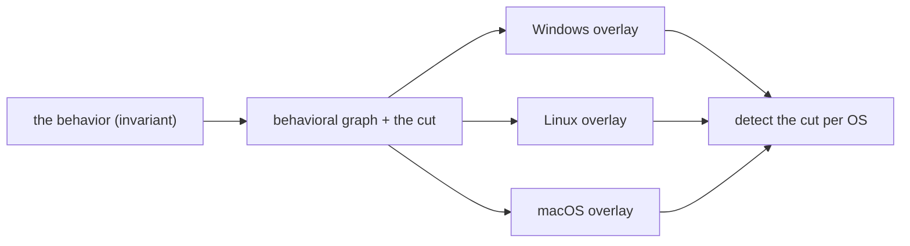

# Introduction

You are fluent in one operating system's detection surface — maybe Windows Sysmon and
ETW, maybe Linux eBPF and auditd, maybe macOS ESF. You need the other two. Most material
makes you start over from zero, one OS at a time, with no bridge from what you already
know.

This guide bridges from the one thing every detection engineer already shares: **the
threat**. Each chapter takes an attacker behavior, draws it once as a graph, and then
shows how that single behavior casts a *different shadow* in each OS's telemetry. The
behavior is the constant; the OS is just which sensors can see it.

## The model

Three moving parts, the same in every chapter:

- **The graph is the invariant.** A behavior is a small graph: processes, files, sockets
  as nodes; exec, open, connect, write as edges.
- **The chokepoint is a cut in that graph** — the node or edge every variant of the
  threat *must* cross. Graph-theoretically, an articulation point. You can't obfuscate
  around a necessary edge, which is exactly why it's the detection anchor. (Yes, this is
  why "detection chokepoint" is a graph-theory term, not a metaphor.)
- **Each OS is an overlay.** The same graph, re-labeled with the sensor that observes
  each edge — and greyed where no sensor can. A dark node *is* the blind spot.

## Same threat, different shadows

The crucial part — and the reason a single comparison table isn't enough — is that the
behavior does **not** look the same on every OS. Two ways it diverges:

1. **Mechanism.** The same behavior is realized differently — and sometimes a branch
   exists on one OS and nowhere else (macOS `osascript` driving other apps via
   AppleEvents has no Windows or Linux analog).
2. **Visibility.** A node observable on one OS is dark on another. A Linux interpreter's
   command line is in `argv`; the same payload piped over `curl | bash` is invisible to
   process telemetry on all three — but on Windows, Script Block Logging still captures
   the content. The telemetry, not the threat, dictates what you can detect.

Whichever OS you already know, you'll find its overlay familiar and read the other two
against it — but the spine is the threat, so no OS is privileged and every direction works.

## Who this is for

Detection engineers, threat hunters, and incident responders fluent on one OS who need
working competence — author and validate detections — on the others. The lens is
**detection authoring**: internals appear only as far as they surface in telemetry. Not a
kernel-development or malware-RE text.

## How to read a chapter

The eight sections run: the behavior & invariant → real threats that use it → the
behavioral graph & the cut → per-OS realization & telemetry overlay (the divergence) →
visibility delta → detect the cut → reproduce it (Atomic Red Team) → false positives.
Jump to any behavior; chapters are self-contained.

## A note on rigor

This is a public resource, held to a strict standard: every factual claim names its
source and an as-of date, and anything unconfirmed against a live system is marked
`unverified:`. A detection that hasn't fired on a real captured event is labeled as such.
The [methodology](methodology.md) chapter covers the lab, the capture loop, and the
citation standard.
