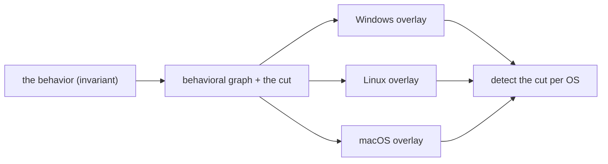

# Introduction

Start with the threat you are investigating. Then check what that threat leaves behind on
Windows, Linux, or macOS. You can use the OS you know as your reference point without
having to learn the other two from scratch.

[Threat walkthroughs](threats/00-overview.md) are the front door. They show the OS-specific
telemetry path, say when a path does not apply, and link to the graph that explains the
behavior. If you already have a signal, use the [detection graph library](detection-graphs.md).
If you need a route, open [Start here](start-here.md).

## The model

Three moving parts, the same in every chapter:

- **Graph:** processes, files, and sockets are nodes. `exec`, `open`, `connect`, and
  `write` are edges.
- **Chokepoint:** the node or edge every variant must cross. It is the detection anchor.
- **OS overlay:** the same graph, mapped to the collector that sees each edge. A missing
  event is a blind spot, not proof that the behavior did not happen.

## Same threat, different shadows

The behavior changes in two ways:

1. **Mechanism:** macOS `osascript` can drive other apps through AppleEvents. Windows and
   Linux have no equivalent branch.
2. **Visibility:** a Linux interpreter's command line is in `argv`. A `curl | bash`
   payload can evade process telemetry on every OS, while Windows Script Block Logging
   may still capture its content.

Start with the OS you know. The threat keeps the comparison honest.

## Who this is for

Detection engineers, hunters, and responders who know one OS and need to write or validate
detections on the others. This is a detection guide, not a kernel-development or malware
reverse-engineering text.

## How to read the guide

Start with a [threat walkthrough](threats/00-overview.md). It labels every OS as Applicable,
Constrained, No native analogue, Telemetry blind, or Unknown. Then it gives the telemetry
path and links to the graph chapters you need.

## How to read a graph chapter

Graph chapters cover the behavior, examples, the chokepoint, each OS's telemetry, sensor
limits, detection logic, lab reproduction, and false positives. Use them when your evidence
already points to an edge.

## A note on rigor

Each factual claim has a source and date. Anything not confirmed on a live system is marked
`unverified:`. The [methodology](methodology.md) explains the evidence labels, validation
standard, and telemetry boundaries.
