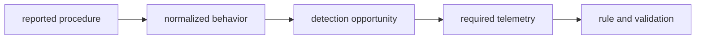

# Methodology

Use this page to judge what a detection in this guide proves, what data it needs, and
where the evidence stops.

## From threat report to detection

A report provides the starting point, not the rule. The guide keeps the reported procedure
close to the behavior it supports, then maps that behavior to an OS-native event or state
change. A rule should target that observable effect, not a campaign name or a disposable
indicator.

## Evidence states

| Label | Meaning |
|---|---|
| `source-backed` | A cited report supports the procedure or behavior. |
| `experimental` | The detection logic is a candidate and needs local testing before deployment. |
| `unverified:` | The claim has not been confirmed against a live system or captured event. |
| `Telemetry blind` | The available collector cannot establish the stated behavior. |

An unavailable event is not evidence that the behavior did not happen. The walkthrough should
say whether the gap comes from the operating system, the collector, or the environment.

## Validate the detection opportunity

Before deploying a rule, verify four things:

- It fires on a captured event for the behavior it describes.
- The retained fields match the rule logic and the triage path.
- A normal use of the same interpreter, binary, or service does not immediately trigger it.
- The OS-specific limitation is written down when the same proof is unavailable elsewhere.

The [minimal data-source tables](threats/00-overview.md) state the smallest collection set
needed to make each claim. Add enrichment only when it changes the analyst's decision.

## Rules and portability

Sigma expresses the event logic. It does not make different collectors equivalent. Map the
rule to your backend's schema and confirm the fields it actually retains. This matters most
for Linux eBPF-derived events and macOS Endpoint Security events, where collection is richer
than the portable Sigma taxonomy.

## Sources and safe reproduction

Every factual claim should name a source. Defanged procedure excerpts keep the sequence,
tool names, and artifacts needed to understand a rule while excluding runnable payloads,
credentials, and raw captures. Reproduce a behavior only in an isolated test environment.
