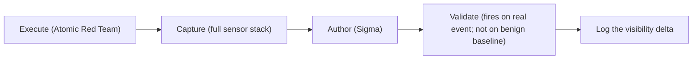

# Methodology

How chapters are produced, so a reader can trust the detections and reproduce or extend
them. The loop is the same every time:



## The lab

Three peers. Whichever OS you already know is your reference point, but the capture loop
runs on all three — the divergence between them only shows up when you capture the same
behavior everywhere.

### Linux

A current Ubuntu LTS VM or container is enough. Install and enable the full sensor stack
so each behavior is observed at every tier at once:

- **auditd** — SIEM tier. Syscall rules in [`labs/linux/audit.rules`](https://github.com/iimp0ster/os-internals-de-guide/blob/main/labs/linux/audit.rules).
- **eBPF** — EDR tier. `bpftrace` one-liners in [`labs/linux/bpftrace/`](https://github.com/iimp0ster/os-internals-de-guide/tree/main/labs/linux/bpftrace); optionally Cilium Tetragon or Falco for production-shaped events.
- **Sysmon for Linux** — bridge tier. Config in [`labs/linux/sysmon-config.xml`](https://github.com/iimp0ster/os-internals-de-guide/blob/main/labs/linux/sysmon-config.xml); emits Windows-shaped EventIDs.
- **journald** — for auth/PAM/sshd context.

### macOS

```admonish danger title="Hard prerequisite"
The macOS arm requires **real Apple hardware**. macOS does not run in a casual VM, and
the Endpoint Security Framework needs a properly entitled host. Without it, the entire
macOS half of every chapter is blocked. Stand this up before starting, not midway.
```

- **ESF** — EDR tier and the primary macOS source. Observe with `eslogger` (built into
  macOS 13+; streams ES events as JSON) and [Red Canary Mac Monitor](https://github.com/Brandon7CC/mac-monitor)
  (free GUI). Commands in [`labs/macos/eslogger-cmds.sh`](https://github.com/iimp0ster/os-internals-de-guide/blob/main/labs/macos/eslogger-cmds.sh).
- **Unified Logging** — secondary/enrichment only. `log stream` / `log show` with
  predicates. **Do not rely on it for execution telemetry** — it has no reliable exec
  event, and much of the richest data carries private entitlements that third-party
  agents can't read.

## How the Linux EDR tier works (eBPF)

Every chapter's Linux overlay calls eBPF the *EDR tier* and `auditd` the *SIEM tier*.
That split is worth grounding, because it decides both what a rule can see and how
durable the rule is.

eBPF is a kernel execution environment: user space compiles a small program to eBPF
bytecode, the kernel **verifier** statically proves it is memory- and termination-safe
(bounded loops allowed since [Linux 5.3](https://lwn.net/Articles/794934/)), and a **JIT**
compiles it to native code. It is the substrate modern Linux sensors converge on —
[Tetragon](https://tetragon.io/docs/), Falco (eBPF by default, optional kernel-module
driver), [Tracee](https://github.com/aquasecurity/tracee), Elastic Defend (eBPF on ≥5.10
kernels, `tracefs`/kprobe fallback otherwise), Microsoft Defender for Endpoint on Linux
(its eBPF provider replaced the legacy auditd one; Netlink fallback) — and the reason the
industry moved off loadable kernel modules, which break on every kernel release. It is
kernel-gated: CO-RE/BTF-dependent sensors want a reasonably current kernel (~5.x+); on
older fleets the predecessors (kernel modules, the kernel audit subsystem, `fanotify`,
Netlink) are still the substrate.

**How it sees.** eBPF programs attach at kernel hook points and either copy fields into
**maps** (keyed state, pulled from user space with `BPF_MAP_LOOKUP_ELEM`) or stream events
over the **ring buffer** ([`BPF_MAP_TYPE_RINGBUF`, Linux 5.8](https://github.com/torvalds/linux/commit/457f44363a8894135c85b7a9afd2bd8196db24ab):
ordered across CPUs, drained by `epoll`) — or the older per-CPU **perf buffer** on pre-5.8
kernels. These are not interchangeable: you stream high-rate events over the ring buffer,
you do not poll a map key for them. The hooks that matter for detection:

| Hook | Example | Detection note |
|---|---|---|
| Raw tracepoint | `sched_process_exec` | fires on **successful** exec, post-credential-commit; stable ABI |
| kprobe / kretprobe | any non-blacklisted symbol | **dynamic — can silently break on kernel upgrade / inlining** |
| fentry / fexit | BTF-typed, trampoline-based (≥5.5) | faster + typed; `fexit` sees args and return together; needs BTF |
| BPF-LSM | `bprm_check_security` | can also **enforce**; needs 5.7 + `bpf` in the active `lsm=` |
| uprobe | `dlopen` in libc | easily bypassed (static linking, direct `mmap`/`openat`) |
| XDP / TC | packet inspect/drop | no process/credential context on its own |

```admonish warning title="Anchor on success-side state, not the execve entry"
The intuitive "hook a kprobe on `sys_execve`" is the *weakest* execution anchor, and three
things break it. The bare `sys_execve` symbol has not existed on x86-64 since Linux 4.17 —
the kprobe-able entry is `__x64_sys_execve`, taking a single `struct pt_regs *`. Entry-side
arguments (`filename`/`argv`) are **user-space pointers**: a sibling thread can rewrite them
after the hook reads them and before the kernel copies them (TOCTOU), so you log a benign
path while a malicious one executes. And `execve` is not the only exec path — `execveat(2)`
with `AT_EMPTY_PATH` / `fexecve` on a file descriptor defeats path-based logic, and the
entry fires even for execs that ultimately fail (`ENOENT`/`EACCES`). Anchor instead on the
`sched_process_exec` **tracepoint** (successful, kernel-side, all exec variants) or the
`bprm_check_security` **LSM hook**. Switching a kprobe to `fentry` buys speed and type
safety, not evasion resistance — it is still entry-side.
```

**How it acts.** Response splits into two primitives a detection engineer must not
conflate:

- `bpf_send_signal()` ([Linux 5.3](https://man7.org/linux/man-pages/man7/bpf-helpers.7.html);
  `bpf_send_signal_thread` in 5.5) queues a signal (e.g. `SIGKILL`) delivered on the
  process's return to user space. It is **post-hoc** — asynchronous, and it does not stop
  the in-flight operation, so a short-lived or fork-then-exec payload can complete before
  the kill lands. Treating it as prevention is an error.
- A **BPF-LSM** program on `bprm_check_security` returning a negative errno (`-EPERM`) is
  **synchronous** prevention — the LSM framework aborts the operation
  ([KRSI, Linux 5.7](https://docs.kernel.org/bpf/prog_lsm.html)). A plain kprobe cannot
  block: its return value does not gate the probed function. (The only kprobe path that can
  alter a function, `bpf_override_return`, requires the `ALLOW_ERROR_INJECTION` allowlist,
  and `execve` is not on it — so the widely repeated "kprobe on `sys_execve` returns
  `-EPERM` to block execution" is simply wrong.)

```admonish bug title="BPF-LSM silently no-ops unless bpf is in the active LSM stack"
`CONFIG_BPF_LSM=y` is necessary but not sufficient. `bpf` must also appear in the active LSM
list — compiled into `CONFIG_LSM` or appended at boot via `lsm=lockdown,integrity,apparmor,bpf`.
Many distro and managed-Kubernetes kernels ship `CONFIG_BPF_LSM=y` but omit `bpf` from
`lsm=`, so an enforcement program loads and then never blocks. Verify
`/sys/kernel/security/lsm` at runtime, not just the config.
```

This is also why eBPF is the EDR tier but **not a standardized Sigma logsource** (below):
it is a *collection substrate*, not a log format, and each engine on top of it emits its
own schema.

```admonish note title="The same substrate is dual-use"
Worth a footnote wherever the guide leans on eBPF telemetry: the primitives EDRs use are
also offensive. BPFDoor's magic-packet trigger ([Sandfly](https://sandflysecurity.com/blog/bpfdoor-an-evasive-linux-backdoor-technical-analysis),
Elastic) is a **classic-BPF socket filter** (`SO_ATTACH_FILTER` on an `AF_PACKET` socket,
T1205.002) — *not* an eBPF program loaded via `bpf()`, so watching `BPF_PROG_LOAD` will not
catch it; enumerate attached filters with `ss -0pb` instead. The eBPF-*rootkit* class
(TripleCross, ebpfkit — research PoCs, not in-the-wild) *does* call `bpf(BPF_PROG_LOAD)`,
which is observable, gated by `CAP_BPF` (Linux 5.8, paired with `CAP_PERFMON`/`CAP_NET_ADMIN`;
root already has it).
```

## The driver: Atomic Red Team

Behaviors are executed with [Atomic Red Team](https://atomicredteam.io) so they map to
MITRE technique IDs and are reproducible by readers. Tests are organized by technique
(`atomics/T####/`); the `supported_platforms` field gates which run on Linux/macOS.
Execute via `Invoke-AtomicRedTeam` (PowerShell Core runs on Linux and macOS). Each
chapter's section 7 names the exact test IDs and commands used.

## Authoring detections: Sigma, with caveats

Detections are written in Sigma for portability, then mapped to the reader's backend.
Two caveats, surfaced during research, that shape every rule:

```admonish bug title="Sigma logsource gaps"
- **eBPF is not a standardized Sigma `logsource`.** Author Linux rules against the
  `auditd` service or the `linux` `process_creation` category (Sysmon-for-Linux). Sigma
  doesn't forbid a custom `product: falco`/`tetragon` logsource, but there is no standard
  eBPF field taxonomy — each engine emits its own schema, so normalize eBPF-derived events
  into the generic Linux categories (e.g. via ECS) before authoring. Treat eBPF as the
  richer *"what is possible to see"* reference that justifies the chokepoint (see [How the
  Linux EDR tier works](#how-the-linux-edr-tier-works-ebpf)), even when the shipped rule
  targets a thinner logsource.
- **Sigma's macOS logsource coverage is thin.** Author against ESF fields and document
  the mapping to your target backend rather than assuming a canonical macOS logsource
  exists.
```

## Validation

A rule is not done until it has both: (1) **fired on a real captured event** (shown
inline in section 6), and (2) **not fired on a benign baseline** run of the same
interpreter/binary doing legitimate work. The benign run is the cheapest false-positive
check available; skipping it is how plausible-but-wrong rules ship.

## Verification & citation standard

Per a strict provenance rule: every factual claim names its **source**, the exact
**command or filter** used, and the **as-of date**. Behavior is never inferred from a
man page when a capture can confirm it — the captured event *is* the verification.
Anything unconfirmed against a live system is prefixed `unverified:`.

## Definition of Done (per chapter)

A chapter ships only when all seven hold:

1. All 8 template sections present.
2. Section 3's behavioral graph identifies the **cut** (chokepoint); section 4's per-OS
   overlays make **divergence and blind spots explicit** — a node is greyed wherever no
   sensor on that OS can populate it — and note **safeguard pressure** (why the behavior is
   hot/cold here; where a suppressed attacker is displaced to).
3. Section 5's visibility-delta table names a **concrete** blind spot per OS / tier.
4. Section 6 contains a per-OS Sigma rule **validated against a real captured event shown inline**.
5. Section 7's Atomic Red Team repro is **runnable as written**.
6. Every factual claim carries a source (and `unverified:` where unconfirmed).
7. `mdbook build` + linkcheck pass in CI.

## Data hygiene

Raw captures (full event dumps, pcaps, EVTX) **stay out of git** — only the curated,
redacted event excerpts that ship inside a chapter are committed. Never commit
hostnames, usernames, internal IPs, tokens, or any live-environment artifact. The
`.gitignore` enforces the raw-capture exclusion; redaction is a manual discipline.
