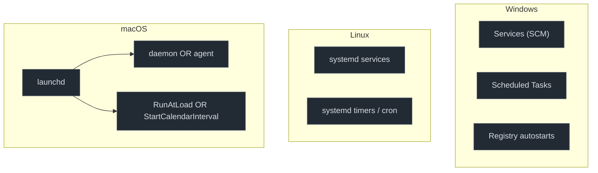

# Persistence graphs

Persistence is the attacker ensuring their code runs again, after a reboot, a logout, or
a shell restart, without re-exploiting. Every OS provides legitimate auto-start machinery
for exactly this, and that machinery is what attackers borrow.

<strong>THREAT ROUTES</strong> Return to the outcome: <a href="../threats/01-cryptomining.md">Cryptomining</a> · <a href="../threats/02-ransomware.md">Ransomware</a> · <a href="../threats/03-infostealers.md">Infostealers</a>.

## The one divergence to hold in your head

The cut is the same everywhere, **register an auto-start execution unit with the OS's
init/service manager**, but the OSes carve up that space differently:

Windows and Linux keep **services** and **scheduled jobs** as separate subsystems. macOS
**unifies** them in `launchd`: one plist can be a boot-time daemon *or* a calendar-scheduled
job, depending on its keys. So a chapter that's two distinct things on Windows/Linux can be
one mechanism on macOS, a structural divergence, not just a naming difference.

## The telemetry throughline for this part

Persistence is where the per-OS *observability* gap is starkest, because the key question
is "was an auto-start unit registered?", and each OS answers it very differently:

- **Windows** emits an explicit **"service installed" event** (System 7045) and logs registry
  autostart writes, registration is a first-class, loggable act.
- **Linux** has **no native "service installed" event**. Registration is just files written to
  a directory plus a `systemctl` exec, invisible unless you watch those paths, and `auditd`
  is off by default on much of the estate.
- **macOS** gained **Background Task Management (BTM)** in macOS 13: the ESF
  `NOTIFY_BTM_LAUNCH_ITEM_ADD` event fires when a launch item or login item is registered, a
  unified persistence-registration signal that didn't exist a few years ago.

That three-way asymmetry, explicit event / no event / new unified event, is the
persistence graph family's central comparison.

## Chapters

| Chapter | Behavior | Win · Linux · macOS |
|---|---|---|
| [Service & daemon persistence](01-service-daemon.md) | register a privileged auto-start service | Services/SCM · systemd · launchd daemons/agents |
| [Scheduled execution](02-scheduled.md) | run on a timer/schedule | Scheduled Tasks · cron / systemd timers · launchd calendar/interval |
| [Login & shell hooks](03-login-shell-hooks.md) | run at logon / shell start | Run keys, startup · `.bashrc`/`profile.d`, XDG · LoginItems, shell rc |

The invariant across all three: **persistence = registering something the OS will execute
on its own later.** The detection question is always "can I see the registration, and can I
see it on *this* OS?"
