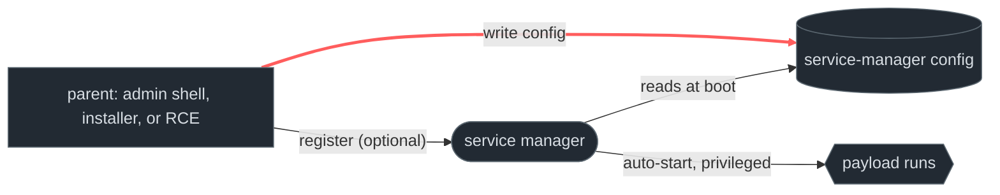
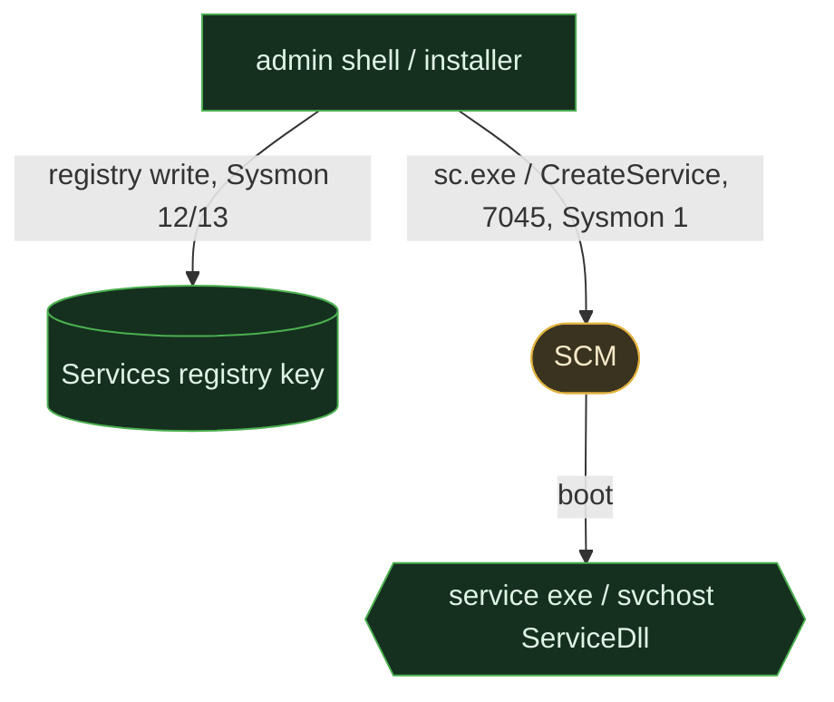
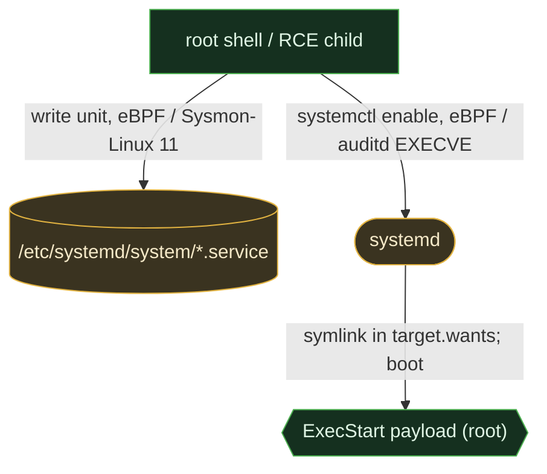
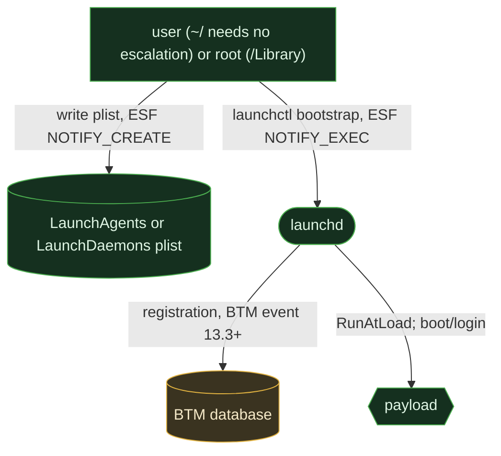

# Service & daemon persistence

<div class="chapter-meta"><div class="attack-techniques"><span class="chapter-meta-label">ATT&amp;CK</span><a class="attack-badge" href="https://attack.mitre.org/techniques/T1543/001/"><span>Launch Agent</span><code>T1543.001</code></a><a class="attack-badge" href="https://attack.mitre.org/techniques/T1543/002/"><span>Systemd service</span><code>T1543.002</code></a><a class="attack-badge" href="https://attack.mitre.org/techniques/T1543/003/"><span>Windows service</span><code>T1543.003</code></a><a class="attack-badge" href="https://attack.mitre.org/techniques/T1543/004/"><span>Launch Daemon</span><code>T1543.004</code></a></div><div class="chapter-meta-details"><span><b>Tactic</b> Persistence</span><span><b>Chokepoint</b> service-manager configuration write</span></div></div>

The highest-value persistence: a service/daemon typically runs **privileged** (SYSTEM/root)
and **at boot**, restarted automatically if killed. Every OS ships an init/service manager
that exists to do exactly this, attackers just register with it.

## 1. The behavior & invariant

The attacker hands the OS's service manager a unit to run on its own, forever. Registration
has **two observable moments**: (a) the manager's **config is written** (a registry key, a
unit file, a plist), and (b) the **manager is told to load it** (`sc.exe`, `systemctl`,
`launchctl`).

> **Invariant:** the config must exist where the manager looks for it. The attacker can skip
> the *manager tool* (edit the registry directly, drop a plist and wait for reboot, symlink a
> unit by hand), but the **config write is unavoidable**. That makes the config write, not
> the manager command, the durable chokepoint.

## 2. Threats that use it

<div class="threat-use-grid">
<article class="threat-use-card os-windows"><span class="threat-use-chip">WINDOWS</span><h3>Emotet, TrickBot, FIN7</h3><p><strong>What happens:</strong> Some register a new service. FIN7 and Carbanak alter an existing service directly in the registry.</p><p><strong>Detect here:</strong> Watch the durable service configuration, not only <code>sc.exe</code> or service-install events.</p><p class="threat-use-source"><a href="https://www.elastic.co/security-labs/emotet-back-for-business">Source</a></p></article>
<article class="threat-use-card os-linux"><span class="threat-use-chip">LINUX</span><h3>LemonDuck and Kinsing</h3><p><strong>What happens:</strong> Root-running systemd units mimic a system service and restart the miner after failure.</p><p><strong>Detect here:</strong> New unit files, especially with <code>Restart=always</code>, are a cleaner lead than the miner process name.</p><p class="threat-use-source"><a href="https://attack.mitre.org/software/S0949/">Source</a></p></article>
<article class="threat-use-card os-macos"><span class="threat-use-chip">MACOS</span><h3>AMOS and Silver Sparrow</h3><p><strong>What happens:</strong> LaunchAgents or LaunchDaemons run a payload at login or load.</p><p><strong>Detect here:</strong> The plist write names the payload and survives reboots. That is more useful than waiting for the next launch.</p><p class="threat-use-source"><a href="https://redcanary.com/blog/threat-intelligence/atomic-odyssey-poseidon-stealers/">Source</a></p></article>
</div>

## 3. The behavioral graph & the cut



The red edge, **write config**, is the cut. The "register" edge is the *loud* path most
defenders watch, but it's optional: skip it and the manager still picks the unit up at boot.
Detect the durable artifact (the config write), not just the tool.

## 4. Per-OS realization & telemetry overlay

### Windows

SCM reads `HKLM\SYSTEM\CurrentControlSet\Services\<name>`, `ImagePath`, `Start=2`, and for
svchost-hosted services a `Parameters\ServiceDll`. Created via `sc.exe` / `New-Service` /
`CreateService`, **or by writing the registry directly**.



```admonish abstract title="Safeguard pressure: Windows"
**Enabled/hot.** Service creation needs only local admin (widespread), and the SIEM-tier
install event (**System 7045**) fires *only* via `sc.exe`/`CreateService`, **direct registry
edits and service-hijacks evade it** (FIN7's trick), leaving just Sysmon EID 13. Security
4697 needs the *Audit Security System Extension* subcategory, **off by default**. **Displaces
to:** Run keys, Scheduled Tasks, WMI subscriptions when service creation is monitored. The
SIEM tier also has **no native DLL-load event**, so svchost `ServiceDll` injection is EDR-only.
```

### Linux

A `.service` unit in `/etc/systemd/system/` (system) or `~/.config/systemd/user/` (per-user,
**no root needed**) with `ExecStart=` and `Restart=always`; `systemctl enable` symlinks it
into `*.target.wants/`.



```admonish abstract title="Safeguard pressure: Linux"
**Enabled + a structural blind spot.** No unit-file signing; `/etc/systemd/system/` is
root-writable and unit files **aren't hashed by the package manager**, so there's no baseline.
Crucially there is **no Windows-7045 equivalent**, "a service was installed" is just a file
write plus a `systemctl` exec, and **`auditd` is off by default** (needs install on
Ubuntu/Debian; installed-but-not-enabled on RHEL). EDR-tier (eBPF/Sysmon-for-Linux) sees the
write; the SIEM tier is dark unless `auditd` was explicitly deployed. No displacement, post-root,
systemd is the path of least resistance.
```

### macOS

`launchd` loads plists from `/Library/LaunchDaemons` (root), `/Library/LaunchAgents`, and
**`~/Library/LaunchAgents` (user-writable, no escalation)**, keys `ProgramArguments`,
`RunAtLoad`, `KeepAlive`. macOS 13 added **Background Task Management (BTM)**, which records
new launch/login items and fires an ESF event when one registers.



```admonish abstract title="Safeguard pressure: macOS"
**SIP suppresses the system path; user path wide open.** SIP protects
`/System/Library/Launch*` but **not** `/Library` or `~/Library`, and `~/Library/LaunchAgents`
needs **no privilege at all**, the lowest bar of the three OSes. BTM is genuine progress (a
registration *event* where macOS had none), but it shipped **buggy, broken in 13.0-13.0.1,
fixed in 13.3, and has documented bypasses**, so treat it as **supplementary**: filesystem
monitoring of the plist directories (ESF `NOTIFY_CREATE`) remains primary. The **unified log
(SIEM tier) has no clean plist-write event**, detection is ESF-only at scale.
```

## 5. Visibility delta

| Graph element |  Windows |  Linux: EDR / SIEM |  macOS: EDR / SIEM |
|---|---|---|---|
| **config write** (the cut) | Sysmon 12/13 ✅ / event-log ❌ | eBPF, Sysmon-Linux ✅ / auditd ⚠️ off-by-default | ESF `NOTIFY_CREATE` ✅ / unified log ❌ |
| manager invocation | 7045 ⚠️ (only via sc/API) | `systemctl` exec, eBPF ✅ / auditd ⚠️ | ESF `NOTIFY_EXEC` ✅ / unified log ❌ |
| dedicated "installed" event | ⚠️ 7045 (evadable) | ❌ **none exists** | ⚠️ BTM (13.3+, reliability-caveated) |
| payload DLL/lib load | Sysmon 7 ✅ (off by default, needs `<ImageLoad>`) / event-log ❌ | eBPF ✅ | ESF `NOTIFY_MMAP` ✅ |

Three-way asymmetry, the Part II throughline: **Windows has an install event but it's evadable;
Linux has none; macOS recently grew one but it's shaky.** And on every OS the *durable* signal, the config write, is strong at the EDR tier and weak-to-absent at the SIEM tier off-Windows.

## 6. Detect the cut

### Windows, service install + direct-registry-edit complement

```yaml
title: Windows Service Installed (anomalous ImagePath)
status: experimental   # unverified: SCM path (7045) not yet captured
logsource: { product: windows, service: system }
detection:
  selection: { EventID: 7045 }
  suspicious:
    ImagePath|contains: ['\\Users\\', '\\Temp\\', '\\ProgramData\\', 'powershell', 'cmd /c', 'rundll32']
  condition: selection and suspicious
falsepositives: [legitimate software/driver installers]
level: medium
```

```yaml
title: Windows Service ImagePath Direct Registry Edit (7045-evading complement)
status: test   # validated against a direct registry update: EID 13 fired
               # on direct New-ItemProperty to \Services\*\ImagePath (no SCM/7045); baseline clean.
               # FIRED: TargetObject=HKLM\System\CurrentControlSet\Services\LabNoOpSvc01\ImagePath
               #        Image=C:\Windows\System32\WindowsPowerShell\v1.0\powershell.exe
               #        Details="C:\Windows\TEMP\lab-captures-67722\noop_svc01.cmd"
logsource: { product: windows, category: registry_set }   # Sysmon EID 13
detection:
  selection:
    TargetObject|contains: '\Services\'
    TargetObject|endswith:
      - '\ImagePath'
      - '\ServiceDll'
  filter_scm:
    Image|endswith: '\services.exe'   # SCM writes are accompanied by 7045, exclude them here
  condition: selection and not filter_scm
falsepositives: [legitimate service update tools writing ImagePath directly]
level: high
```

### Linux, unit-file write + systemctl (auditd)

```yaml
title: Linux systemd Unit Created in System Path
status: test
logsource: { product: linux, service: auditd }   # requires an auditd watch on the unit dirs
detection:
  file_write:
    type: PATH
    name|startswith: ['/etc/systemd/system/', '/usr/lib/systemd/system/', '/run/systemd/system/']
    name|endswith: '.service'   # reconciled vs capture: anchor the unit-file write, not target.wants symlinks
    nametype: ['CREATE', 'NORMAL']   # reconciled vs capture: captured nametype=CREATE; NORMAL covers overwrite-in-place
  watch_key:
    key: 'svc_unit'   # reconciled vs capture: the -w /etc/systemd/system/ -p wa watch tags records key=svc_unit
  condition: file_write and watch_key
falsepositives: [package installs (dpkg/rpm), config management (Ansible/Salt)]
level: medium
# Pair with: product: linux, category: process_creation, Image endswith '/systemctl',
# CommandLine contains 'enable'. NOTE: auditd is off by default, this rule is blind until deployed.
```

```admonish success title="Confirmed emulation: event excerpt and rule match"
~~~
type=SYSCALL  ... syscall=openat success=yes exe="/usr/bin/install" comm="install" key="svc_unit"
type=PATH msg=audit(...:7695): item=1 name="/etc/systemd/system/svc01-art-lab-8417.service" nametype=CREATE mode=file,644 ouid=root ogid=root
~~~

**Rule match:** the created unit lands in a systemd configuration directory. That durable write is the detection opportunity.

Observed on Debian 12 with auditd and bpftrace. The benign baseline did not trigger the rule.
```

### macOS, plist creation in launchd directories

```yaml
title: macOS LaunchAgent/Daemon Plist Created
status: experimental
logsource: { product: macos, category: file_event }   # ESF NOTIFY_CREATE
detection:
  selection:
    TargetFilename|endswith: '.plist'
    TargetFilename|contains: ['/Library/LaunchDaemons/', '/Library/LaunchAgents/', '/LaunchAgents/']
  condition: selection
falsepositives: [app installs and updaters that register helpers]
level: medium
# Higher-fidelity complement: the BTM event (ES_EVENT_TYPE_NOTIFY_BTM_LAUNCH_ITEM_ADD).
# SigmaHQ has no native BTM logsource yet, map via an ESF pipeline (CoreSigma / sigma-esf).
```

## 7. Reproduce it yourself

ART: T1543.003 (Windows), T1543.002 (Linux), T1543.001 (macOS). Manual equivalents (lab only):

```admonish example title="Manual repro (lab only)"
~~~powershell
# Windows
sc.exe create evilsvc binPath= "C:\Windows\Temp\p.exe" start= auto
~~~
~~~sh
# Linux
printf '[Service]\nExecStart=/tmp/p\n[Install]\nWantedBy=multi-user.target\n' | sudo tee /etc/systemd/system/evil.service
sudo systemctl daemon-reload && sudo systemctl enable --now evil.service
# macOS (user-level, no sudo needed)
cat > ~/Library/LaunchAgents/com.evil.demo.plist <<'EOF'
<plist version="1.0"><dict><key>Label</key><string>com.evil.demo</string>
<key>ProgramArguments</key><array><string>/bin/echo</string><string>hi</string></array>
<key>RunAtLoad</key><true/></dict></plist>
EOF
launchctl bootstrap gui/$(id -u) ~/Library/LaunchAgents/com.evil.demo.plist
~~~
```

## 8. False positives & pitfalls

Legitimate software registers services/daemons/agents *constantly*, updaters (Google,
Microsoft, Adobe), drivers, backup/EDR agents, MDM. The bare registration is noise.

```admonish tip title="Noise → signal"
Gate the config-write on context: **non-package-manager** unit files (Linux), **anomalous
parent** (a service born from an `nginx`/`bash`/web-RCE child, not an installer), **payload
path** in user-writable/temp locations, **signer** (unsigned/ad-hoc on macOS; non-Microsoft
`ServiceDll` outside System32), and **name mimicry** of real system services. The strongest
single pivot is parent lineage: installers spawn services; web shells shouldn't.
```
