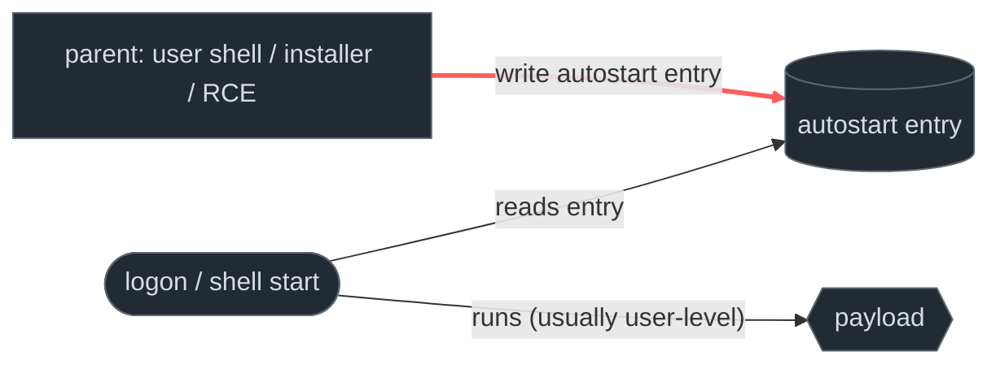
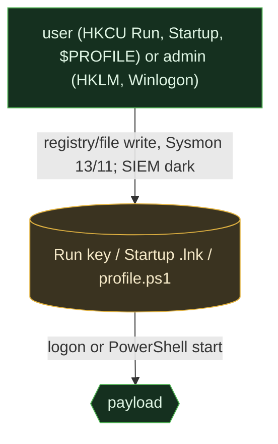
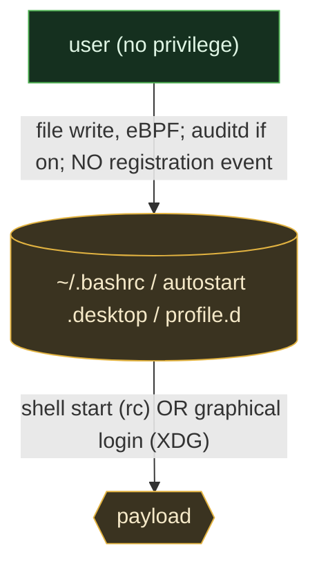
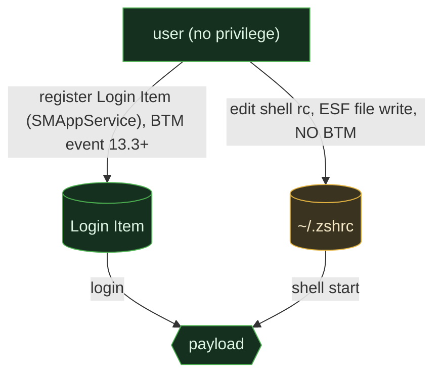

# Login & shell hooks

<div class="chapter-meta"><div class="attack-techniques"><span class="chapter-meta-label">ATT&amp;CK</span><a class="attack-badge" href="https://attack.mitre.org/techniques/T1547/001/"><span>Run keys / Startup</span><code>T1547.001</code></a><a class="attack-badge" href="https://attack.mitre.org/techniques/T1547/013/"><span>XDG autostart</span><code>T1547.013</code></a><a class="attack-badge" href="https://attack.mitre.org/techniques/T1547/015/"><span>Login Items</span><code>T1547.015</code></a><a class="attack-badge" href="https://attack.mitre.org/techniques/T1546/004/"><span>Unix shell config</span><code>T1546.004</code></a></div><div class="chapter-meta-details"><span><b>Tactic</b> Persistence</span><span><b>Chokepoint</b> autostart entry write</span></div></div>

The **lowest-friction** persistence: an entry that fires at logon or shell start, almost
always **user-level, no privilege, no service manager, no scheduler**. Just a file or
registry write that a logon/shell-init routine reads. That low bar makes it ubiquitous, and
it makes the chapter a story about one thing: **can you see the write?**

## 1. The behavior & invariant

The attacker drops an auto-run entry where a logon or shell-startup routine will read it.
Unlike services and scheduled tasks, there is usually **no manager step at all**, no
`systemctl`, no `schtasks`, no `launchctl`. The write *is* the registration.

> **Invariant:** the entry must land where the logon/shell-init reads it (a registry Run
> value, a shell rc file, a desktop-autostart entry, a Login Item). The write is the whole
> chokepoint, and on most paths it is the *only* observable moment.

## 2. Threats that use it

<div class="threat-use-grid">
<article class="threat-use-card os-windows"><span class="threat-use-chip">WINDOWS</span><h3>Emotet, FIN7, Qbot</h3><p><strong>What happens:</strong> A Run key or Startup shortcut launches code at user sign-in. FIN7 writes the registry value directly.</p><p><strong>Detect here:</strong> Registry and Startup-folder writes matter more than the utility used to create them.</p><p class="threat-use-source"><a href="https://attack.mitre.org/techniques/T1547/001/">Source</a></p></article>
<article class="threat-use-card os-linux"><span class="threat-use-chip">LINUX</span><h3>Linux Rabbit and Kinsing</h3><p><strong>What happens:</strong> A shell profile, autostart desktop entry, or <code>/etc/profile.d</code> script runs at login or shell start.</p><p><strong>Detect here:</strong> These are plain file writes. File integrity coverage is often the only registration record.</p><p class="threat-use-source"><a href="https://attack.mitre.org/techniques/T1546/004/">Source</a></p></article>
<article class="threat-use-card os-macos"><span class="threat-use-chip">MACOS</span><h3>Green Lambert and Adload</h3><p><strong>What happens:</strong> The malware changes a shell startup file or adds a Login Item. Adload can use both.</p><p><strong>Detect here:</strong> Find the changed startup artifact first. It explains what will come back after a cleanup.</p><p class="threat-use-source"><a href="https://theevilbit.github.io/beyond/">Source</a></p></article>
</div>

## 3. The behavioral graph & the cut



The cut is the **write** (red). There's no manager edge to also watch, which sounds easier
but is worse: the write is frequently the *single* signal, and on the file-based paths it's a
plain file write with no registration event anywhere.

## 4. Per-OS realization & telemetry overlay

### Windows

Registry **Run/RunOnce** (`HKCU` = no admin, `HKLM` = admin), the **Startup folder**,
**Winlogon** `Userinit`/`Shell` (admin), and the **PowerShell `$PROFILE`** (user, runs on
every PowerShell start).



```admonish abstract title="Safeguard pressure: Windows"
**Enabled, under-observed.** `HKCU\...\Run`, the per-user Startup folder, and `$PROFILE` need
**no admin** and no safeguard suppresses them. The SIEM tier is **dark**: there is no native
event-log entry for a Run-key write, 4657 needs the off-by-default Audit Registry subcategory
and doesn't reliably fire for HKCU. So this is **EDR-only** (Sysmon 13 registry / 11 file).
The profile *load* isn't logged at all (ScriptBlock logging, off by default, catches execution
if enabled). FIN7's direct Run-key edit exploits exactly this gap.
```

### Linux

Shell rc (`~/.bashrc`, `~/.zshrc`, `~/.profile`, `/etc/profile.d/*.sh`), **XDG autostart**
(`~/.config/autostart/*.desktop`), `/etc/rc.local`, MOTD scripts.



```admonish abstract title="Safeguard pressure: Linux"
**Pure file write, zero registration signal, `auditd` off by default**, the deepest SIEM
blind spot in the whole part. The home directory is a trusted design affordance, not a
security boundary; nothing suppresses the write. A trap unique to this chapter: **rc and XDG
cover different triggers**, `~/.bashrc` fires for shells (incl. SSH) but not graphical login;
`~/.config/autostart` fires for the desktop session but not SSH, so attackers often plant
*both*, and a defender watching one misses the other.
```

### macOS

The instructive case, **split visibility within one OS**. Login Items registered via the
modern Service Management API (`SMAppService`, macOS 13+) are tracked by **BTM** and fire its
ESF event. Shell rc (`~/.zshrc`, `~/.zprofile`) is a **pure file write with no BTM event**.



```admonish abstract title="Safeguard pressure: macOS"
**Two paths, two visibilities.** The Login-Item path now has a registration event (BTM), so
attackers favor the **shell-rc path, which BTM never sees** (only ESF file events do). SIP
doesn't protect `~`; no privilege needed; TCC doesn't gate shell startup, so an `~/.zshrc`
hook can call `launchctl`/`defaults` with no consent prompt. Legacy `LSSharedFileList` Login
Items have *no* event at all. Unified log (SIEM tier) is dark for both paths.
```

```admonish abstract title="The one tri-OS thread: shell/interpreter profiles"
Most of this chapter is 1-of-3 (Run keys are Windows-only, XDG is Linux-only, Login Items are
macOS-only). The exception that *is* tri-OS: **the interpreter profile.** PowerShell `$PROFILE`
(Windows) is the direct analog of `~/.bashrc` / `~/.zshrc` (Linux/macOS), code that auto-runs
every time that interpreter starts. On all three, the **modification is a file write** (the
shared, durable signal); execution-time logging differs (PowerShell ScriptBlock on Windows;
nothing equivalent on Unix). Watch the profile *files*, that's the one detection that ports.
```

## 5. Visibility delta

| Graph element |  Windows |  Linux: EDR / SIEM |  macOS: EDR / SIEM |
|---|---|---|---|
| **autostart write** (the cut) | Sysmon 13/11 ✅ / event-log ❌ | eBPF ✅ / auditd ⚠️ off | ESF write ✅ / unified log ❌ |
| **registration event** | ❌ none native | ❌ none exists | ⚠️ BTM, **Login Items only, not shell-rc** |
| shell/interpreter profile | `$PROFILE` write (Sysmon 11) ✅ / load ❌ | rc write (eBPF/auditd) / source ❌ | rc write (ESF) / source ❌ |
| privilege required | none (HKCU/Startup/$PROFILE) | none | none |

The throughline: this is the persistence with the **weakest registration signal on every
OS**, Windows and Linux have none native, macOS has one that covers only half its own
surface. The config write is all you get, and off-Windows the SIEM tier can't even see that.

## 6. Detect the cut

### Windows, Run key / Winlogon / profile write

```yaml
title: Windows Logon Autostart Modified (Run key / Winlogon / profile)
status: test   # validated against a Run-key write: EID 13 fired on
               # HKU\.DEFAULT\Software\Microsoft\Windows\CurrentVersion\Run write by reg.exe; baseline clean.
               # FIRED: TargetObject=HKU\.DEFAULT\Software\Microsoft\Windows\CurrentVersion\Run\login03-runkey-ART
               #        Image=C:\Windows\system32\reg.exe  Details=C:\DoesNotExist\login03-runkey-test.exe
logsource: { product: windows, category: registry_set }   # Sysmon EID 13
detection:
  selection:
    TargetObject|contains:
      - '\Software\Microsoft\Windows\CurrentVersion\Run'
      - '\CurrentVersion\Winlogon\Userinit'
      - '\CurrentVersion\Winlogon\Shell'
  condition: selection
falsepositives: [legitimate installers and app auto-launch entries]
level: medium
# Complement (file path): product: windows, category: file_event, TargetFilename in the
# Startup folder, or endswith 'Microsoft.PowerShell_profile.ps1'.
```

### Linux, shell rc / XDG autostart write

```yaml
title: Linux Shell RC or XDG Autostart Modified
status: test                                       # reconciled vs capture, fired on /root/.bashrc append, baseline clean
logsource: { product: linux, category: file_event }   # eBPF openat/vfs_write, the arm that actually fired; auditd arm did NOT corroborate (see NOTE)
detection:
  rc_write:                                        # reconciled vs capture, match the openat the bpftrace sensor emitted, not an auditd PATH record
    TargetFilename|contains:                       # reconciled vs capture, was `type: PATH` + `name|contains`; the eBPF event carries the path as the opened/written file, not an auditd PATH-record `name=`
      - '/.bashrc'
      - '/.bash_profile'
      - '/.zshrc'
      - '/.profile'
      - '/etc/profile.d/'
      - '/.config/autostart/'
  condition: rc_write
falsepositives: [dotfile managers, package post-install, legitimate desktop apps]
level: medium
# Captured event: the rule fired on `comm=bash` opening `/root/.bashrc`
# with openat flags=02101 (O_WRONLY|O_CREAT|O_APPEND), the in-place rc-append write. The EDR-tier eBPF
# openat/vfs_write sensor (bpftrace file-modify.bt; Tetragon file-modify) is the PORTABLE signal and is what
# matched here, so the rule's logsource is now file_event, not auditd.
# AUDITD ARM (honest gap): auditd did NOT corroborate this run. `-w <path> -p wa` does NOT expand `~`/globs,
# so a per-user `~/.bashrc` is only covered when an explicit watch exists for that exact path; this run hit
# /root/.bashrc as root with no such watch, so no auditd PATH record was emitted. To get the auditd arm you
# must add an explicit per-user/per-path watch (or `-F dir=/home -F perm=wa`, lab-only). When present, an
# in-place modify is nametype=NORMAL (not CREATE), so an append is a WRITE, a creation-oriented sensor
# (Sysmon-for-Linux FileCreate EID 11, ESF NOTIFY_CREATE) does NOT fire on it.
# New-file cases (a dropped `~/.config/autostart/*.desktop`) DO emit CREATE and stay catchable via
# file_event / ESF NOTIFY_CREATE.
```

```admonish success title="Confirmed emulation: event excerpt and rule match"
EDR-tier eBPF sensor (bpftrace `file-modify.bt`), the rc-append write:

~~~text
comm=bash  syscall=openat  path=/root/.bashrc  flags=02101 (O_WRONLY|O_CREAT|O_APPEND)  key=rc-append
~~~

**Rule match:** the target is a shell startup file and the open flags show an append. A create-only sensor would miss this in-place change.

`flags=02101` = `O_WRONLY|O_CREAT|O_APPEND`, the append-to-existing-rc write, the in-place
modify a CREATE-only sensor would miss. `auditd` produced **no** corroborating PATH record: no
`-w` watch covered `/root/.bashrc` (watches don't expand `~`/globs), so the eBPF arm was the
sole signal, exactly why the rule's portable arm is `file_event`, not `auditd`.

Observed on Debian 12 with auditd and bpftrace. The benign baseline did not trigger the rule.
```

### macOS, shell rc write + Login Item registration

```yaml
title: macOS Shell RC Modified
status: experimental
logsource: { product: macos, category: file_event }   # ESF NOTIFY_WRITE/CREATE
detection:
  selection:
    TargetFilename|endswith: ['/.zshrc', '/.zprofile', '/.bash_profile']
  condition: selection
falsepositives: [dotfile managers, dev-tool installers (rbenv, nvm, conda)]
level: medium
# Login Items are higher-fidelity via the BTM event (NOTIFY_BTM_LAUNCH_ITEM_ADD) through an
# ESF pipeline, but shell-rc bypasses BTM, so the file-event rule above is the only catch there.
```

## 7. Reproduce it yourself

ART: T1547.001 (Windows), T1547.013/T1546.004 (Linux), T1547.015/T1546.004 (macOS). Manual:

```admonish example title="Manual repro (lab only)"
~~~powershell
# Windows, HKCU Run key (no admin) + PowerShell profile
reg add "HKCU\Software\Microsoft\Windows\CurrentVersion\Run" /v Demo /d "C:\Windows\Temp\p.exe" /f
Add-Content $PROFILE 'Write-Host loaded'
~~~
~~~sh
# Linux, shell rc + XDG autostart (no privilege)
echo '/tmp/p &' >> ~/.bashrc
mkdir -p ~/.config/autostart && printf '[Desktop Entry]\nType=Application\nExec=/tmp/p\n' > ~/.config/autostart/demo.desktop
# macOS, shell rc (no privilege)
echo '/tmp/p &' >> ~/.zshrc
~~~
```

## 8. False positives & pitfalls

This is the *noisiest* persistence to detect: legitimate software writes Run keys and Login
Items on install, dev tooling appends to `~/.zshrc`/`$PROFILE` (nvm, conda, rbenv, Starship),
dotfile managers rewrite rc files wholesale, and desktop apps drop XDG autostart entries.

```admonish tip title="Noise → signal"
The entry's *existence* is noise; its **content and provenance** are the signal. Alert on
*what the entry runs* (interpreters with inline/encoded code, network fetches, payloads in
temp/hidden paths) and the **parent of the write** (a Run key or rc edit authored by a
web-RCE child or a freshly-dropped binary, not by an installer or the user's editor).
Append-to-existing-rc is stealthier than create, watch WRITE, not just CREATE.
```
