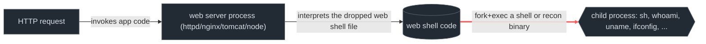

# Web shells & anomalous process lineage

> **ATT&CK:** T1505.003 (Server Software Component: Web Shell)  ·  **Tactic:** Persistence  ·
> **Chokepoint:** the web server process becoming the parent of a shell/recon child  ·
> **Status:** draft — capture pending. §6 reproduces an existing, widely-deployed SigmaHQ rule
> as prior art rather than a rule authored/validated in this project's lab; treat its `status:`
> field as upstream's, not ours.

```admonish note title="Scope note"
ATT&CK scopes T1505.003 across Windows, Linux, macOS, and network-appliance web servers. The
source material and the cited rule for this chapter are **Linux-only** (Apache/nginx/lighttpd/
Tomcat/Caddy/Node). A Windows (IIS) and macOS treatment is a real gap, not a claim that this
technique is Linux-specific — noted as future work, not backfilled here.
```

A web shell is attacker code dropped into (or injected into) a web application so the web
server itself executes it on request — no separate persistence mechanism needed, because the
web server was already going to run on boot and survive restarts. The server doesn't need to
be compromised at the OS level; the application layer is enough.

## 1. The behavior & invariant

The web shell's entire value is that it looks like part of the application: a `.php`/`.jsp`/
`.aspx` file sitting alongside legitimate ones, invoked over HTTP like any other request. That
disguise is airtight at the *file* and *request* layer — nothing about a web shell's file
extension or the HTTP request that triggers it is inherently different from normal traffic.

> **Invariant:** whatever the web shell was written to do (recon, execute commands, pivot), it
> eventually needs to run **as a child process of the web server**, because the web server's
> interpreter (PHP-FPM, the JVM running Tomcat, Node) is what's executing the attacker's code
> in the first place. See [process lineage](../appendix/process-lineage.md) for how the kernel
> records that parent link and why it can't be forged the way argv/comm can — the web shell can
> disguise the file it lives in, but it cannot avoid being spawned by the process that's
> running it.

That's the chokepoint: **a legitimate web server binary essentially never has a shell,
recon tool, or system utility as a direct child.** `httpd`/`nginx`/`node` serve HTTP; they
don't call `whoami`. When they do, the parent→child edge itself is the detection — no
signature on the dropped file required.

## 2. Threats that use it

- **China Chopper** — one of the most widely deployed web shells in the wild; a tiny
  (~4KB) ASPX/PHP/JSP stub that accepts arbitrary code in a POST parameter, used across a
  broad range of intrusions against internet-facing servers precisely because it's disguised
  as an ordinary, tiny application file. Documented extensively in CISA/NSA joint guidance
  on web shell malware.
- **NSA/CISA Cybersecurity Information Sheet, "Detect and Prevent Web Shell Malware"
  (2020)** — the primary reference the cited SigmaHQ rule below builds on; explicitly
  recommends parent-child process anomaly detection (a web server spawning `cmd`/`sh` or
  recon utilities) as one of the highest-value web shell detections, precisely because it
  doesn't depend on recognizing any specific shell's code.
  ([media.defense.gov](https://media.defense.gov/2020/Jun/09/2002313081/-1/-1/0/CSI-DETECT-AND-PREVENT-WEB-SHELL-MALWARE-20200422.PDF))
- **Generic PHP/JSP/ASPX web shells** dropped via any file-upload or deserialization
  vulnerability in the hosted application — the delivery vector varies by app, but the
  post-compromise behavior (spawn a shell, run `whoami`/`uname`/`ifconfig` for recon) is
  convergent, which is exactly why a lineage-based rule generalizes across web-shell families
  instead of needing one signature per shell.
  ([Acunetix, "Web Shells 101"](https://www.acunetix.com/blog/articles/web-shells-101-using-php-introduction-web-shells-part-2/))

## 3. The behavioral graph & the cut



The red edge — **the web server process becoming a parent to a shell/recon child** — is the
cut. It's necessary because a web shell that only reads/writes files (no `exec()`) is far more
limited than one that can run arbitrary commands, and the moment it does, the OS's own
fork/exec bookkeeping records the web server as the parent, unconditionally — that link is not
something the web shell's own code, however well-obfuscated, can suppress (see [process
lineage](../appendix/process-lineage.md) §1).

## 4. Linux realization

Apache (`httpd`), nginx, lighttpd, Caddy, Node (`node`), and Java app servers (Tomcat,
historically WebSphere) are the parent processes in scope. Detection reads `ParentImage`/
`ParentCommandLine` from process-creation telemetry (`auditd` EXECVE + a PPID→exe lookup, or an
eBPF-backed sensor that already resolves parent identity — see the [telemetry
cheat-sheet](../appendix/telemetry-cheatsheet.md#process-execution)'s "Parent lineage" row: raw
`auditd` gives you `ppid` but requires a correlation step to resolve it to an image path,
whereas Sysmon-for-Linux/Tetragon-style sensors resolve it inline).

```admonish abstract title="Safeguard pressure — Linux"
**Observation gap, not a gate.** Nothing in the Linux exec path prevents a PHP-FPM worker or a
Node process from forking a shell — no default LSM policy constrains it (SELinux/AppArmor
*could*, via a domain policy that denies `sh`/`whoami`/etc. as legal children of the httpd
domain, but this is not commonly deployed for exactly this purpose). The gap is purely in
telemetry: `auditd`'s EXECVE record has the child's argv but only a bare `ppid` for the parent —
resolving that to `/usr/sbin/nginx` for the `ParentImage|endswith` match the rule below needs
requires either a live `/proc` lookup (race-prone — the parent may have already changed by the
time you look) or a sensor that resolves lineage at exec time (eBPF, eslogger-equivalent,
Sysmon-for-Linux).
```

## 5. Visibility delta

| Graph element | Linux — EDR tier | Linux — SIEM tier |
|---|---|---|
| web server exec (baseline) | eBPF `sched_process_exec` ✅ | `auditd` EXECVE ✅ |
| **parent→child link** (the cut) | resolved inline (Tetragon/Sysmon-Linux carry parent exe) ✅ | `auditd` gives raw `ppid` only — needs correlation ⚠️ |
| child identity (`whoami`/`sh`/etc.) | full argv ✅ | EXECVE `a0..aN` ✅ (can truncate) |

The gap is entirely in resolving *which binary* the numeric PPID points to at the SIEM tier —
the data to do it exists (every process's own EXECVE record has its exe path), it just isn't
joined for you the way an EDR-tier sensor joins it inline.

## 6. Detect the cut

```admonish info title="Prior art, not a project capture"
The rule below is reproduced from **SigmaHQ** (`rules/linux/process_creation/proc_creation_lnx_webshell_detection.yml`),
authored by **Florian Roth (Nextron Systems)** and **Nasreddine Bencherchali (Nextron Systems)**,
first published 2021-10-15, last verified against upstream **2026-07-02** (upstream `modified:
2022-12-28`, `status: test`). It is included here as the canonical worked example of a
lineage-anomaly rule, not as something this project's caplab has fired independently. Per
[methodology](../methodology.md), that distinction matters: SigmaHQ's own `status: test` reflects
*their* validation, not this book's.
```

```yaml
title: Linux Webshell Indicators
id: 818f7b24-0fba-4c49-a073-8b755573b9c7
status: test                                            # SigmaHQ upstream status, not this project's
logsource: { product: linux, category: process_creation }
detection:
    selection_general:
        ParentImage|endswith:
            - '/httpd'
            - '/lighttpd'
            - '/nginx'
            - '/apache2'
            - '/node'
            - '/caddy'
    selection_tomcat:
        ParentCommandLine|contains|all: ['/bin/java', 'tomcat']
    selection_websphere:  # ? just guessing — upstream's own annotation
        ParentCommandLine|contains|all: ['/bin/java', 'websphere']
    sub_processes:
        Image|endswith:
            - '/whoami'
            - '/ifconfig'
            - '/ip'
            - '/bin/uname'
            - '/bin/cat'
            - '/bin/crontab'
            - '/hostname'
            - '/iptables'
            - '/netstat'
            - '/pwd'
            - '/route'
    condition: 1 of selection_* and sub_processes
falsepositives: [Web applications that invoke Linux command line tools]
level: high
# Source: https://github.com/SigmaHQ/sigma/blob/master/rules/linux/process_creation/proc_creation_lnx_webshell_detection.yml
```

```admonish tip title="Why this generalizes across web-shell families"
The rule matches zero bytes of any specific web shell's code — it matches the **edge**
(web-server-parent → shell/recon-child), which is convergent across China Chopper, generic
PHP/JSP one-liners, and anything else that eventually needs to run a command. That's the same
principle as this book's other "detect the cut" rules: anchor on the behavior that's structurally
necessary, not on an artifact the attacker can trivially change.
```

## 7. Reproduce it yourself

[Atomic Red Team T1505.003](https://github.com/redcanaryco/atomic-red-team/blob/master/atomics/T1505.003/T1505.003.md)
covers web shell deployment atomics (dropping known shell files); pair with a manual step to
exercise the *lineage* the rule actually keys on, since dropping the file alone won't trigger it:

```admonish example title="Manual repro (lab only)"
~~~sh
# Simulate the child-process edge the rule detects, without needing a real vulnerable app:
# spawn a "web server" that then forks a recon binary, as a stand-in for a web shell's exec().
( exec -a /usr/sbin/nginx sh -c 'whoami' )
# Confirm the lineage that was actually recorded:
ps -eo pid,ppid,comm | grep whoami
~~~
Note the `exec -a` here is itself argv0 rewriting (the same primitive as
[process argument masquerading](../defense-evasion/01-process-argument-masquerading.md)) used
just to *fake the label* for this repro — the rule doesn't care what the parent is named, it
cares what the real PPID resolves to, so this repro only exercises the detection logic, not a
realistic bypass of it.
```

## 8. False positives & pitfalls

Legitimate web applications routinely shell out — health-check scripts, image processing
pipelines (`convert`, `ffmpeg` invoked by PHP/Node backends), deployment hooks. The upstream
rule's own `falsepositives` field says as much: "Web applications that invoke Linux command
line tools." The `sub_processes` list is deliberately narrow (recon/network/cron tools, not a
broad "any child") to keep that noise down, but any environment running admin dashboards or
IT-automation panels through a web front-end (cron editors, network config UIs) will need an
explicit allowlist by parent application, not a blanket exemption from the rule.

```admonish tip title="Noise → signal"
Baseline what your *specific* web application legitimately forks before deploying this — a
CMS plugin that shells out to `convert` for thumbnails is common and benign; the same CMS
process forking `ifconfig`, `crontab`, or `iptables` almost never is. Gate on **which children**
are anomalous for *your* stack, not just on "web server has a child."
```
