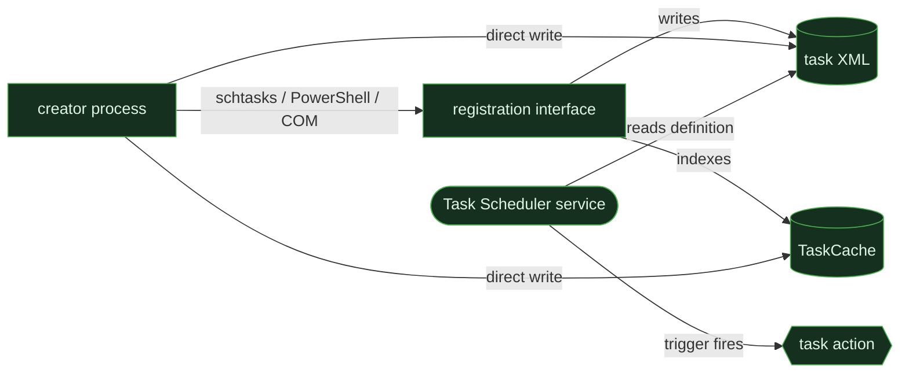

# Windows Task Scheduler

<div class="chapter-meta"><div class="attack-techniques"><span class="chapter-meta-label">ATT&amp;CK</span><a class="attack-badge" href="https://attack.mitre.org/techniques/T1053/005/"><span>Scheduled Task</span><code>T1053.005</code></a></div><div class="chapter-meta-details"><span><b>Family</b> <a href="../02-scheduled.md">Scheduled execution</a></span><span><b>Chokepoint</b> task-definition registration</span></div></div>

Windows Task Scheduler is one native implementation of the
[scheduled-execution invariant](../02-scheduled.md): a task definition must be registered
or placed where the scheduler can read it before Task Scheduler can launch its action.

This page goes deeper on Windows. Return to **Scheduled execution** when comparing the same
behavior with Linux `cron` or systemd timers and macOS `launchd` schedules.

## Native object model

<div class="dossier-brief">
  <div><strong>Definition</strong><span>Task XML under <code>System32\Tasks</code></span></div>
  <div><strong>Index</strong><span>Registry <code>TaskCache</code> entries</span></div>
  <div><strong>Broker</strong><span>Task Scheduler service</span></div>
  <div><strong>Action</strong><span>Command launched when a trigger fires</span></div>
</div>

A task can arrive through `schtasks.exe`, the PowerShell `ScheduledTasks` module, the Task
Scheduler COM interfaces, or direct writes to the task files and `TaskCache`. The first
three ask the scheduler to register the task. The last path changes the scheduler-owned
objects directly and can bypass process-name and registration-event assumptions.



## Observable moments

| Moment | Strongest evidence | What it proves | Important limit |
|---|---|---|---|
| creator runs | process creation for `schtasks.exe`, PowerShell, or a registering process | a known registration interface was invoked | direct COM or object writes may not expose a distinctive utility |
| task registered | Task Scheduler Operational 106; Security 4698 when audit policy is enabled | Task Scheduler accepted a task definition | 4698 does not provide every execution detail; direct injection may evade normal registration events |
| definition written | task XML file plus `TaskCache` registry changes | durable scheduler configuration changed | normal administration produces the same object writes |
| action starts | Task Scheduler Operational 200/201 plus process telemetry | a configured action was attempted or launched | the execution parent is scheduler infrastructure, not the original creator |

## Detection layers

Use multiple layers because no single event covers every registration path.

1. **Research:** inventory task creation and modification across the fleet. Retain task name,
   creator, principal, trigger, and action when the collector exposes them.
2. **Hunt:** prioritize tasks whose actions reference user-writable paths, interpreters,
   encoded or inline commands, network retrieval, or unusually frequent triggers.
3. **Analyst:** correlate the registration or object write with the creator lineage and the
   later task action. Treat a missing Event 106 beside direct `TaskCache` changes as useful
   evasion context, not as proof by itself.

```yaml
title: Windows Task Scheduler registration from a high-risk action
status: test
logsource:
  product: windows
  service: taskscheduler
detection:
  registration:
    EventID: 106
  condition: registration
falsepositives:
  - software deployment and maintenance tasks
  - administrative automation
level: medium
# Event 106 establishes registration presence. Join the TaskName to task XML,
# creator-process telemetry, and execution events before judging the action.
```

### Direct TaskCache complement

```yaml
title: Windows TaskCache registry modification
status: test
logsource:
  product: windows
  category: registry_set
detection:
  taskcache_write:
    TargetObject|contains:
      - '\Schedule\TaskCache\Tasks\'
      - '\Schedule\TaskCache\Tree\'
  condition: taskcache_write
falsepositives:
  - Task Scheduler writing its cache during legitimate registration
level: high
# Correlate with the matching task XML and registration events. A direct-write
# hypothesis becomes stronger when TaskCache and XML change without Event 106.
```

## Validated boundaries

The existing lab evidence confirms two complementary routes:

- A normal SYSTEM-context task registration produced process, task-file, and registration
  anchors, including Task Scheduler Operational Event 106.
- A direct `TaskCache` update produced registry and companion task-file evidence without the
  same Event 106 registration anchor.

That distinction is the important lesson: detecting only `schtasks.exe` or only Event 106
does not cover the Windows implementation of scheduled execution.

## Tuning questions

- Is the creator expected to register tasks on this host?
- Does the action resolve to a system-managed path or a user-writable location?
- Is the principal, trigger cadence, or action unusual for the device role?
- Do task XML, `TaskCache`, registration, and execution evidence agree on the same task?
- Did scheduler-owned objects change without the expected registration event?

## Reproduce safely

Use only an authorized, snapshot-bracketed Windows lab. The purpose is to regenerate the
registration, durable-object, and execution evidence—not to run a payload.

```powershell
schtasks /create /tn LabScheduledExecution /tr "cmd.exe /c exit 0" /sc once /st 23:59 /ru SYSTEM
schtasks /delete /tn LabScheduledExecution /f
```

Compare the resulting task name across process creation, Event 106 or 4698 when available,
the task XML, `TaskCache`, and Task Scheduler execution events. Record which evidence is
default-on and which depends on audit policy or an endpoint sensor.

---

[← Scheduled execution comparison](../02-scheduled.md)
