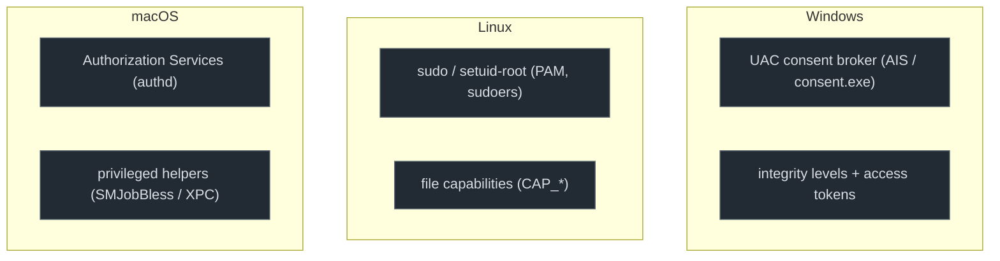

# Privilege and access graphs

Privilege escalation is the attacker crossing the user→privileged boundary *without* an
exploit, by invoking the legitimate elevation machinery every OS ships. This graph family
is **more divergent** than execution and persistence: the three OSes guard that boundary
with very different brokers, and that divergence is the lesson.

<strong>THREAT ROUTE</strong> Return to the outcome: <a href="../threats/02-ransomware.md">Ransomware</a>, where privilege and control-plane changes become early impact pivots.

## The one divergence to hold in your head

The cut is the same everywhere, **cross the privilege boundary through a sanctioned broker**, but each OS models privilege, and the broker, differently:

Linux elevation is a **numeric uid/euid + capability transition the kernel enforces at exec**.
Windows wraps elevation in a **consent broker that Microsoft explicitly says "is not a security
boundary,"** so its bypasses are abundant. macOS mediates through an **authorization-rights
database and entitlement-gated privileged helpers reached over XPC**, so the boundary is often
crossed *inside an IPC message* rather than at exec. Same cut, three different shapes.

## The telemetry throughline for this part

Here the per-OS *observability* pattern **flips**, but precisely: the flip is at the **SIEM tier
and for the consent/authorization act**. At the *EDR* tier all three can see the transition (Linux
eBPF `setuid`/`commit_creds`; macOS ESF `NOTIFY_SETUID`; Windows Sysmon `IntegrityLevel`).

- **Linux** is the only OS usable at *both* tiers for the `sudo` path, `sudo`/PAM in
  `auth.log`/journald, and the euid transition via auditd (`USER_CMD`, or a custom `uid!=euid`
  execve rule). Its off-exec blind path is **`cap_setuid` → in-process `setuid(0)`** (eBPF-only).
- **Windows** leaks the *least* at the consent instant: **UAC auto-elevate / COM bypasses**
  (fodhelper, computerdefaults, ICMLuaUtil) produce a High-integrity process with **no consent
  event**, the tell is the *preceding* HKCU registry hijack. Its off-exec blind path is **token
  theft (T1134)**. (4688 v2 *does* carry the integrity SID + elevation type, the gap is
  auditing-off and the missing consent record, not an absent field.)
- **macOS** is **best-instrumented for the authorization act at the EDR tier** (ESF `NOTIFY_SUDO`/
  `SU`/`AUTHENTICATION`) but **weakest at the SIEM tier** (OpenBSM deprecated and unreliable;
  unified log has no clean exec event). Those rich events are
  **userspace/discretionary**, an attacker's own `sudo` evades them, so the real cut is the
  kernel-mandatory **`NOTIFY_SETUID`**. Its off-exec blind path is the **privileged-helper XPC** message.

So this graph family's story is a **symmetric** one: each OS exposes the euid/integrity transition at the
EDR tier, and each has exactly **one off-exec elevation path its SIEM tier cannot see**, Windows
token theft, Linux `cap_setuid`, macOS XPC. "Rare on the SIEM tier" is a telemetry gap, not absence.

## Chapters

| Chapter | Behavior | Win · Linux · macOS |
|---|---|---|
| [Elevation mechanisms](01-elevation-mechanisms.md) | cross the boundary via a sanctioned broker | UAC / token elevation · setuid / sudo / capabilities · sudo / `AuthorizationExecuteWithPrivileges` |
| [Policy brokers (PolKit / AuthZ)](02-polkit-authz.md) | request a privileged action from a policy daemon | (UAC / AIS) · PolKit / D-Bus (`pkexec`) · Authorization Services + privileged helpers |
| [TCC & privileged helpers](03-tcc-helpers.md) | macOS consent + root-helper / XPC abuse | macOS only · TCC + SMJobBless / XPC |

The invariant across the part: **privilege escalation = crossing a boundary the OS guards with a
broker.** The detection question is always whether the *crossing itself*, not just the resulting
privileged action, leaves an event on *this* OS.
