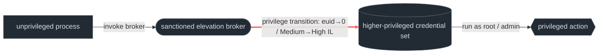
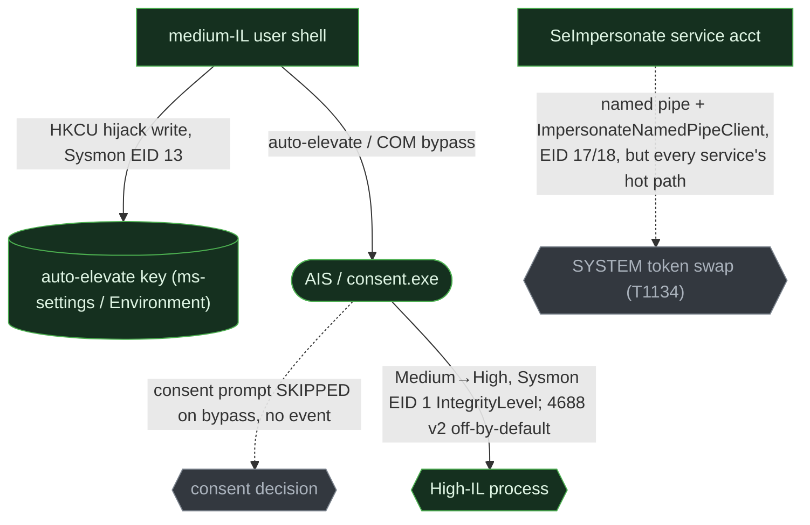
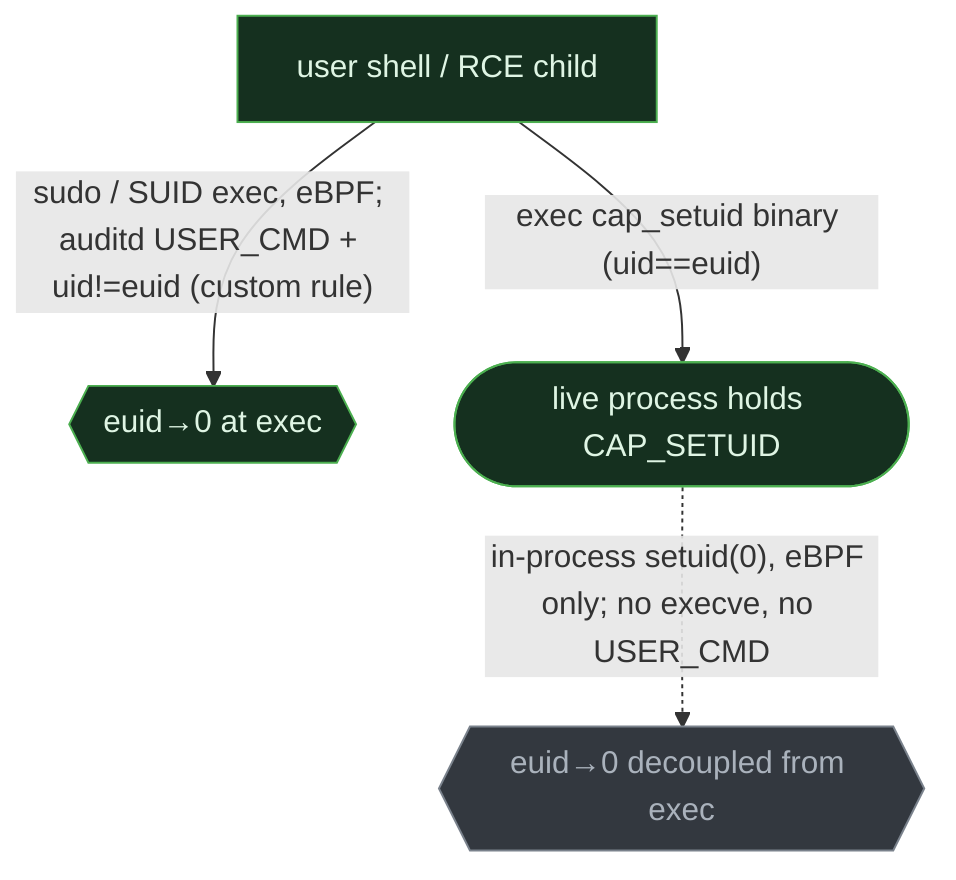
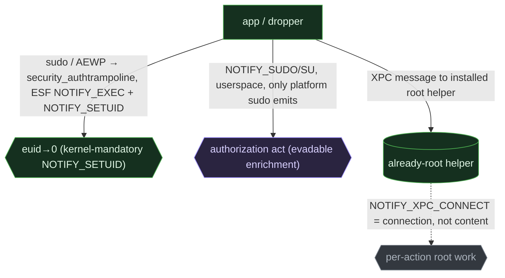

# Elevation mechanisms

<div class="chapter-meta"><div class="attack-techniques"><span class="chapter-meta-label">ATT&amp;CK</span><a class="attack-badge" href="https://attack.mitre.org/techniques/T1548/001/"><span>Setuid / Setgid</span><code>T1548.001</code></a><a class="attack-badge" href="https://attack.mitre.org/techniques/T1548/002/"><span>Bypass UAC</span><code>T1548.002</code></a><a class="attack-badge" href="https://attack.mitre.org/techniques/T1548/003/"><span>Sudo</span><code>T1548.003</code></a><a class="attack-badge" href="https://attack.mitre.org/techniques/T1548/004/"><span>Elevated prompt</span><code>T1548.004</code></a><a class="attack-badge" href="https://attack.mitre.org/techniques/T1134/"><span>Access tokens</span><code>T1134</code></a></div><div class="chapter-meta-details"><span><b>Tactic</b> Privilege escalation</span><span><b>Chokepoint</b> privilege transition through a sanctioned broker</span></div></div>

Privilege escalation without an exploit means invoking the OS's *own* elevation machinery. Every
OS ships a broker for legitimate elevation; the attacker borrows it. The transition is the same
idea everywhere, acquire a higher-privileged credential than your parent, but the broker, and
how much of the crossing you can see, diverge hard. This is also where the visibility pattern of
the earlier parts **inverts**.

## 1. The behavior & invariant

An attacker gains a higher-privileged identity than the process that launched it, through a
mechanism the OS sanctions, `sudo`, a setuid binary, UAC, an authorization prompt, not a memory
bug.

> **Invariant:** the process's credential must change, euid→0 on Unix, integrity Medium→High or a
> token swap on Windows, and a broker mediates that change. What varies, and decides detectability,
> is **where** the change lands: bound to an `exec` you can see (sudo, setuid, a UAC-spawned child),
> or **decoupled** from exec inside a live process or an IPC message you can't (Linux `cap_setuid`
> calling `setuid(0)`; a Windows token swap; a macOS XPC call to a root helper).

That exec-bound-vs-decoupled split is the whole chapter: each OS has one elevation path its
cheap (SIEM) tier cannot see.

## 2. Threats that use it

<div class="threat-use-grid">
<article class="threat-use-card os-windows"><span class="threat-use-chip">WINDOWS</span><h3>Glupteba and potato tools</h3><p><strong>What happens:</strong> Glupteba abuses an auto-elevated binary. Potato-family tooling turns a service account's impersonation right into a SYSTEM token.</p><p><strong>Detect here:</strong> Look for an unexpected integrity jump and the elevated child it enables. The original process name is often ordinary.</p><p class="threat-use-source"><a href="https://www.elastic.co/security-labs/exploring-windows-uac-bypasses-techniques-and-detection-strategies">Source</a></p></article>
<article class="threat-use-card os-linux"><span class="threat-use-chip">LINUX</span><h3>Shai-Hulud and SUID abuse</h3><p><strong>What happens:</strong> Passwordless <code>sudo</code> or an owner-root SUID binary starts a root shell.</p><p><strong>Detect here:</strong> The privilege transition matters more than the binary's reputation. Capture effective UID and the parent process.</p><p class="threat-use-source"><a href="https://attack.mitre.org/techniques/T1548/003/">Source</a></p></article>
<article class="threat-use-card os-macos"><span class="threat-use-chip">MACOS</span><h3>AMOS and MacSync</h3><p><strong>What happens:</strong> A fake password prompt persuades the user to authorize a privileged action.</p><p><strong>Detect here:</strong> Watch the script or app that launches the prompt and what executes after the credential is entered. The broker may record a valid approval.</p><p class="threat-use-source"><a href="https://research.checkpoint.com/">Source</a></p></article>
</div>

## 3. The behavioral graph & the cut



The red edge, **the privilege transition**, is the cut. The broker is the articulation point:
vary the setuid binary, the UAC target, the sudoers rule, and you still cross it. The detection
subtlety is that this edge is observable when it coincides with an `exec` (a new image starts
already-elevated) and goes dark when the credential flips inside a process already running or
inside an IPC message, which is exactly where each OS's blind path lives.

## 4. Per-OS realization & telemetry overlay

The cut is the same; the broker and the tier that can see it diverge. Watch the **off-exec
transition** node greyed in each overlay, that is the per-OS SIEM blind spot.

### Windows

Two paths cross the boundary. **(1) UAC integrity elevation:** the Application Information
Service (AIS) launches `consent.exe`; but a Microsoft-signed `autoElevate=true` binary
(`fodhelper`, `computerdefaults`, `sdclt`, `eventvwr`) elevates Medium→High **with no consent
prompt**, then resolves a command from a pre-staged HKCU hive, each binary keyed to its own ProgID:
`fodhelper`/`computerdefaults`→`…\ms-settings\shell\open\command` (empty `DelegateExecute`),
`eventvwr`→`…\mscfile\shell\open\command`, `sdclt`→`…\exefile\shell\runas\command\isolatedCommand`,
plus the env-var variant `HKCU\Environment\windir`. The COM variant (`ICMLuaUtil`/`CMSTPLUA` via the `dllhost` surrogate)
skips the registry entirely. **(2) Token manipulation (T1134):** a `SeImpersonate`-holding service
account coerces a SYSTEM service onto a named pipe, calls `ImpersonateNamedPipeClient`, then
`DuplicateTokenEx`→SYSTEM, no integrity prompt at all.



```admonish abstract title="Safeguard pressure: Windows"
**Enabled.** Microsoft's own position is that UAC same-desktop elevation is a **defense-in-depth /
convenience feature, explicitly *not* a serviced security boundary** (MSRC servicing criteria; the
2025 *Administrator Protection* is billed as the new boundary precisely because UAC wasn't), so
bypasses are public (UACMe catalogs dozens) and slow-patched. **Displaced to** token theft (T1134,
needs only `SeImpersonate`) when UAC is hardened (AlwaysNotify + a non-admin user). The bypass
elevation moment is genuinely **unobserved** at the SIEM tier, **no consent event is emitted**, while the durable HKCU hijack write is observed, but **EDR-only** (Sysmon EID 13).
```

### Linux

Three brokers, one euid→0 cut. **`sudo`** (setuid-root + PAM + sudoers; caches a successful auth
as a per-tty timestamp, `timestamp_type=tty` by default, so a second `sudo` skips the password).
The **setuid bit** (the kernel sets euid to the file *owner* at `execve`, the GTFOBins class).
And **file capabilities**: a binary with `cap_setuid` can call `setuid(0)` **in-process, without
exec'ing a new image**, the transition decoupled from exec, and the headline blind spot.



```admonish abstract title="Safeguard pressure: Linux"
**Enabled**, owner-root SUID binaries ship by default, GTFOBins keeps the abuse current, and there
is no consent broker to suppress it. The surface shrinks slowly (SUID→capabilities migration,
`nosuid` mounts, SELinux-enforcing on RHEL). **Displacements:** SELinux/`nosuid` → PolKit/`pkexec`
([ch. 2](02-polkit-authz.md)); the SUID→capabilities migration **moves the attacker into the
eBPF-only blind spot**; hardened sudoers → ride a cached timestamp or tamper sudoers. The common
**unobserved** case: `auditd` is **not installed by default on Ubuntu/Debian** (it *is* installed
and running by default on RHEL), so on much of the estate the SIEM tier is simply absent.
```

### macOS

Same euid→0, three brokers: **`sudo`** (plus Touch ID via `pam_tid` on 14+, so it can complete
with no password event); **`AuthorizationExecuteWithPrivileges`** (AEWP, deprecated since 10.7,
still live) which execs the setuid-root `/usr/libexec/security_authtrampoline` that **validates
nothing** about its target, so the attacker primitive is social-engineering the `SecurityAgent`
consent dialog (T1548.004); and the modern **SMJobBless/SMAppService privileged helper**, where the
crossing happens once at install and thereafter *inside each XPC message* to an already-root daemon
([ch. 2](02-polkit-authz.md)/[ch. 3](03-tcc-helpers.md)).



```admonish abstract title="Safeguard pressure: macOS"
**Cold as direct broker exploitation, hot as consent social-engineering**, the pressure displaced
the attacker from the broker to the **user**. AEWP is deprecated; SIP/Hardened Runtime/Gatekeeper
shut the other routes; none kills the goal, so attackers reroute to a **fake `SecurityAgent`/
`osascript` password dialog** (AMOS, Banshee), to **ClickFix `curl | osascript`** (MacSync), or to
**XPC-helper abuse** ([ch. 3](03-tcc-helpers.md)). Note the anchoring caveat: the rich
`NOTIFY_SUDO`/`SU` events are **userspace and discretionary**, only the platform `sudo`/`su` emit
them, so an attacker's own `sudo` evades them. The kernel-mandatory **`NOTIFY_SETUID`** is the real
cut; the XPC crossing is genuinely **unobserved** at the message level.
```

## 5. Visibility delta

{{#include _gen/01-elevation-mechanisms-visibility.md}}

The **inversion**, stated precisely: it holds **at the SIEM tier and for the consent/authorization
act**, not as a blanket "elevation moment." At the *EDR* tier all three see the transition (Linux
eBPF `setuid`/`commit_creds`; macOS ESF `NOTIFY_SETUID`; Windows Sysmon `IntegrityLevel` + the EID 13
pre-stage). The flip is that **macOS is best-instrumented for the authorization act at the EDR tier
but the weakest at the SIEM tier**, OpenBSM is deprecated and unreliable on recent macOS,
and the unified log has no clean exec event, whereas **Linux is the only OS usable at both tiers**
for the `sudo` path, and **Windows' SIEM sees the elevated *outcome* (4688) but never the consent**.
And each OS has exactly **one off-exec elevation path its SIEM tier cannot see**: Windows token
theft, Linux `cap_setuid` in-process `setuid(0)`, macOS the XPC-helper message. That symmetry is the
lesson.

## 6. Detect the cut

### Windows, UAC bypass via HKCU shell-hijack (auto-elevate registry variant)

```yaml
title: Windows UAC Bypass via HKCU Shell-Hijack
status: experimental
logsource: { product: windows, service: sysmon }     # EID 13 RegistryValue Set, no SIEM-tier equivalent
detection:
  hijack:
    EventID: 13
    TargetObject|contains:
      - '\Software\Classes\ms-settings\shell\open\command'
      - '\Software\Classes\mscfile\shell\open\command'
      - '\Software\Classes\exefile\shell\runas\command\isolatedCommand'
      - '\Environment\windir'
      - '\Environment\systemroot'
  condition: hijack
falsepositives: [rare legitimate per-user file-association changes]
level: high
# COM-moniker variant (no registry write): EID 1 ParentImage endswith \dllhost.exe with
# ParentCommandLine|contains '/Processid:{3E5FC7F9-9A51-4367-9063-A120244FBEC7}' (ICMLuaUtil/CMSTPLUA)
# spawning a High-IL child. SIEM fallback: 4688 v2 carries TokenElevationType=%%1937 AND a Mandatory
# Label SID (S-1-16-12288=High) under a Medium-IL parent, but Audit Process Creation is off by
# default and NO consent event ever fires on the bypass path (record the outcome, correlate the parent).
```

### Linux, privilege elevation at exec (`uid != euid`) + sudo

```yaml
title: Linux Privilege Elevation at exec (uid != euid) or sudo invocation
status: test                                          # validated in lab, fired on live capture 2026-06-26 (Wave-1)
logsource: { product: linux, service: auditd }       # needs the uid!=euid watch; auditd not installed by default on Ubuntu/Debian
detection:
  suid_exec:
    type: SYSCALL       # reconciled vs capture: the arming record is the SYSCALL line, not EXECVE, tag lands on SYSCALL
    key: 'privesc'      # reconciled vs capture: captured record carried key=privesc (uid=debian euid=root, comm=id)
                        # rule armed by: -a always,exit -F arch=b64 -S execve -C uid!=euid -k privesc
  sudo_cmd:
    type: USER_CMD      # reconciled vs capture: NOPASSWD sudo emitted USER_CMD (cmd=/usr/bin/id exe=/usr/bin/sudo res=success)
  condition: suid_exec or sudo_cmd
falsepositives: [legitimate setuid utilities (su, passwd, mount, ping), baseline by binary]
level: medium
# RULE ORDERING (auditd is first-match-wins), CRITICAL: the uid!=euid privesc rule MUST be loaded
# BEFORE any catch-all `-a always,exit -S execve -k exec` rule. auditd stops at the first matching
# exit rule, so a broad execve rule placed first tags the event key=exec and the -C uid!=euid rule
# never runs, key=privesc is never set and this Sigma selection silently misses its own event.
# Order specific (uid!=euid -k privesc) before generic (execve -k exec) in audit.rules.
#
# BLIND SPOT, no SIEM rule possible: the capability path. CONFIRMED this capture: an in-process
# setuid(0) by a cap_setuid binary (pid 9065, comm=capdrop: commit_creds euid->0, uid was 65534)
# produced NO auditd privesc record at all, it never crosses a uid!=euid execve and emits no
# USER_CMD. Only the eBPF sensor (kprobe:commit_creds) saw it. Detect ONLY at the eBPF/EDR tier
# (bpftrace commit_creds / Tetragon credentials-change / Elastic Defend event.action:uid_change to
# user.id 0 after a non-root exec that held CAP_SETUID). Document the gap, do not pretend a
# Sigma-vs-auditd rule covers it.
```

```admonish success title="Confirmed emulation: event excerpt and rule match"
~~~
# (1) sudo arm, NOPASSWD sudo, USER_CMD record (SIEM-tier anchor):
type=USER_CMD msg=audit(...) : pid=… uid=debian auid=debian cmd=/usr/bin/id exe=/usr/bin/sudo res=success

# (2) SUID uid!=euid arm, SYSCALL record tagged by the -C uid!=euid -k privesc rule (the cleaner SIEM anchor):
type=SYSCALL  comm="id" exe="/usr/bin/id" uid=debian euid=root key="privesc" success=yes
#   ^ timing note: in the gated Wave-1 run this specific SYSCALL record did not surface
#     (≈0.5s auditd-flush window); the cell PASSed on the sudo USER_CMD above. The uid!=euid
#     SYSCALL was captured in targeted testing this session and is the cleaner anchor of the two.

# (3) cap_setuid arm, bpftrace privesc-creds.bt, in-process setuid(0), NO execve (eBPF-ONLY cut):
pid=9065 comm=capdrop  commit_creds: euid 65534 -> 0   # auditd emitted NO privesc record for this, kprobe:commit_creds is the only sensor that sees it
~~~

**Rule match:** `sudo` ties the elevated command to its caller, the SUID arm exposes an effective-UID change, and the eBPF record proves the in-process path that has no exec event.

Observed on Debian 12 with auditd and bpftrace. The benign baseline did not trigger the rule.
```

### macOS, Elevated Execution with Prompt (AEWP trampoline)

```yaml
title: macOS Elevated Execution with Prompt (AEWP via security_authtrampoline)
status: experimental
logsource: { product: macos, category: process_creation }   # ESF NOTIFY_EXEC
detection:
  selection:
    Image: '/usr/libexec/security_authtrampoline'
  filter_trusted:
    ParentImage|endswith: ['/Installer', '/softwareupdated']   # benign installers/updaters use AEWP
  condition: selection and not filter_trusted
falsepositives: [legitimate app installers and updaters using AuthorizationExecuteWithPrivileges]
level: medium
# Anchor for the cut itself is ESF NOTIFY_SETUID/SETEUID (kernel-mandatory, macOS 12+), it fires on
# euid→0 regardless of broker. NOTIFY_SUDO/SU (macOS 14+) are richer but USERSPACE/discretionary
# (only the platform sudo/su emit them; an attacker's own sudo evades them), enrichment, not anchor.
```

## 7. Reproduce it yourself

Drive with [Atomic Red Team](https://atomicredteam.io): T1548.002 (Windows UAC), T1134 (token),
T1548.001/.003 (Linux setuid/sudo), T1548.004 (macOS AEWP). Manual equivalents (lab only):

```admonish example title="Manual repro (lab only)"
~~~sh
# Linux, SUID shell (T1548.001) and the eBPF-ONLY capability path
sudo install -m 4755 /bin/bash /tmp/rootbash && /tmp/rootbash -p -c id   # euid=0 at exec
sudo setcap cap_setuid+ep "$(command -v python3)"                         # then, in-process:
python3 -c 'import os; os.setuid(0); os.system("id")'                     # euid→0, no execve, no USER_CMD
~~~
~~~powershell
# Windows, fodhelper UAC bypass (T1548.002): stage the HKCU key, then launch the auto-elevate binary
New-Item "HKCU:\Software\Classes\ms-settings\shell\open\command" -Force | Out-Null
Set-ItemProperty "HKCU:\Software\Classes\ms-settings\shell\open\command" -Name "(default)" -Value "cmd.exe /c whoami > %TEMP%\u.txt"
Set-ItemProperty "HKCU:\Software\Classes\ms-settings\shell\open\command" -Name "DelegateExecute" -Value ""
Start-Process fodhelper.exe
# Windows, token theft (T1134, separate path): from a SeImpersonate context run PrintSpoofer/GodPotato
~~~
~~~sh
# macOS, AEWP path produces a /usr/libexec/security_authtrampoline exec; consent-SE path:
osascript -e 'display dialog "App needs to update. Enter password:" with hidden answer default answer ""'
~~~
```

Capture with the lab configs:
[`labs/linux/audit.rules`](https://github.com/iimp0ster/os-internals-de-guide/blob/main/labs/linux/audit.rules)
(add `-a always,exit -F arch=b64 -S execve -C uid!=euid -k privesc` and a `/etc/sudoers` watch),
[`labs/linux/bpftrace/`](https://github.com/iimp0ster/os-internals-de-guide/tree/main/labs/linux/bpftrace)
(a `setuid`/`commit_creds` trace, the only way to see the capability path),
[`labs/macos/eslogger-cmds.sh`](https://github.com/iimp0ster/os-internals-de-guide/blob/main/labs/macos/eslogger-cmds.sh)
(stream `setuid`, `sudo`, `exec`). On Windows, a Sysmon config logging EID 1/12/13/17/18.

## 8. False positives & pitfalls

Elevation is constant and overwhelmingly legitimate, admins run `sudo`, installers trigger UAC,
updaters call AEWP, and services impersonate clients all day. The bare transition is noise.

```admonish tip title="Noise → signal"
Gate the transition on context: **lineage** (a shell, Office child, or web-RCE descendant elevating, not `Installer.app`/`msiexec`/an updater), **signer** (unsigned/ad-hoc requestor on macOS;
non-Microsoft auto-elevate parent), the **pre-elevation artifact** (HKCU hijack write, `sudoers`
tamper, `chmod u+s`), and **rarity** (first-seen elevating binary). The strongest single pivot is
parent lineage: installers and admin tools elevate; web shells and document macros shouldn't.
Remember the per-OS blind path, Windows token theft, Linux `cap_setuid`, macOS XPC, needs the EDR
tier; a SIEM-only deployment will not see it, so don't read its silence as absence.
```
