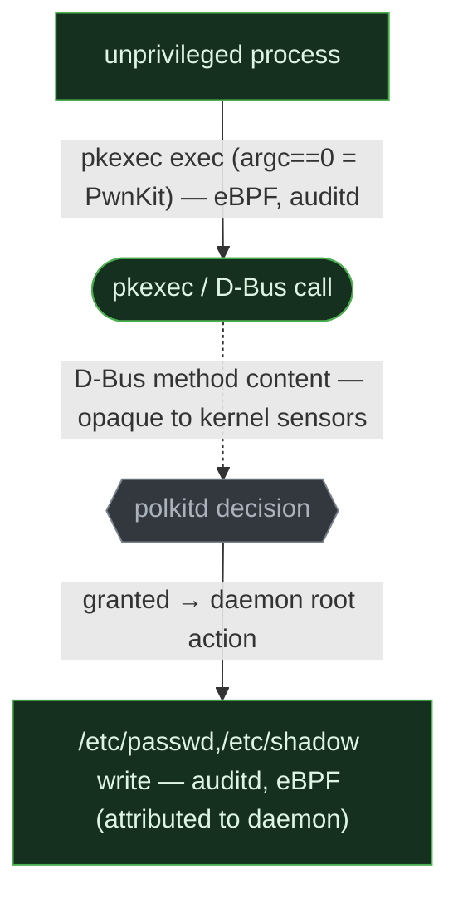
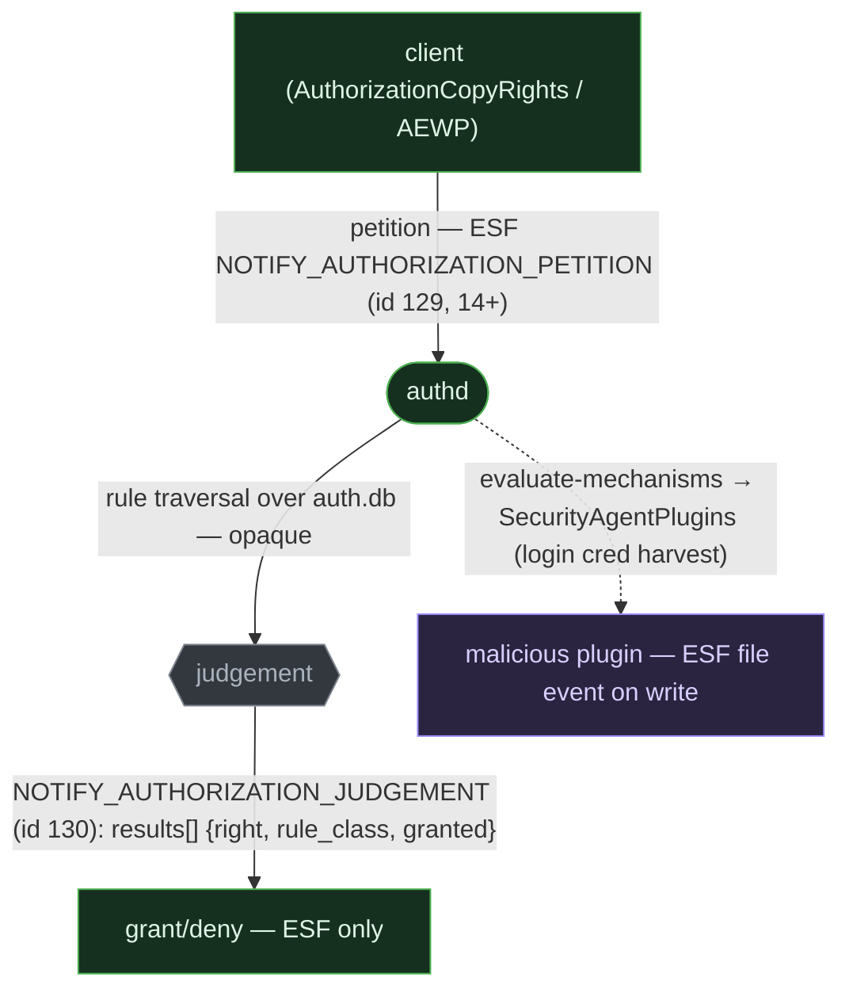
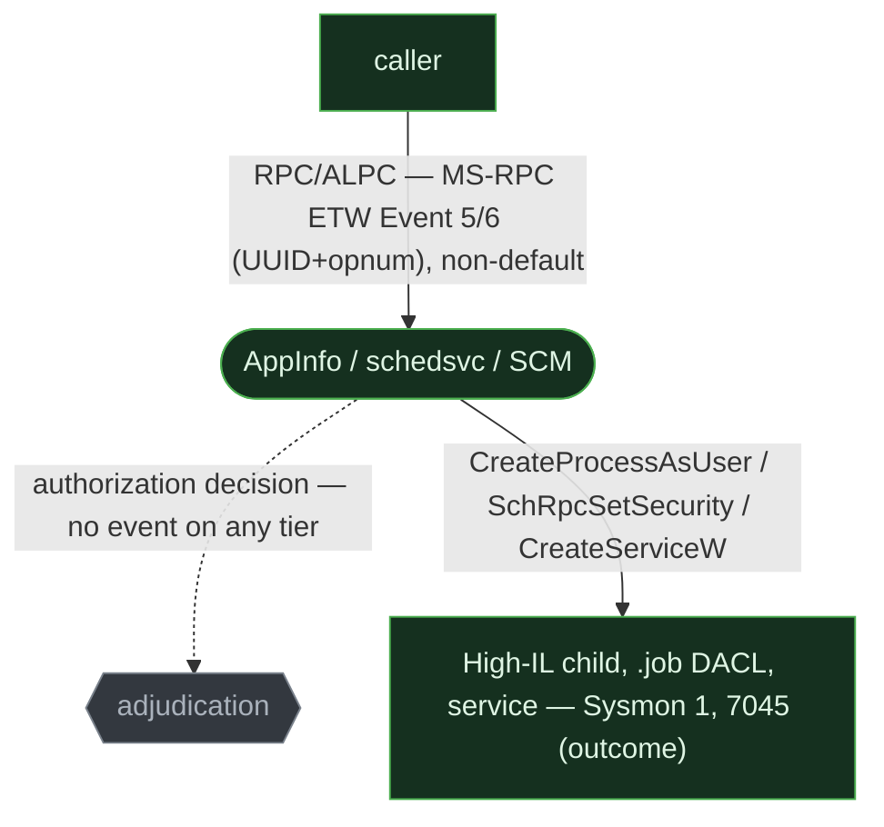

# Policy brokers (PolKit / Authorization Services)

> **ATT&CK:** T1548 (Abuse Elevation Control Mechanism) · T1068 (Exploitation for Privilege Escalation)  ·  **Tactic:** Privilege Escalation  ·  **Chokepoint:** a privileged daemon's authorization decision (+ the action it performs for the caller)  ·  **Status:** draft — section 6 Linux detections fired on live capture (2026-06-26, `status: test`); Windows & macOS `unverified:` pending their own captures

[Chapter 1](01-elevation-mechanisms.md) was *becoming* privileged — euid→0, a token swap, a UAC
elevation in your own process. This is the other shape: you stay unprivileged and **ask a
privileged daemon to act for you**, and a policy broker adjudicates yes/no. The privileged work
runs inside the daemon, so the attacker's own process may never change its credentials at all —
which is exactly what makes this cut hard to see.

## 1. The behavior & invariant

An unprivileged process petitions a privileged daemon (Linux `polkitd`, macOS `authd`, the
Windows AppInfo broker / an over-trusting RPC service) to perform a privileged action. The broker
decides, then performs the action **with its own privilege, on the caller's behalf**.

> **Invariant:** the privileged action is gated by the broker's **authorization decision** and
> performed by the daemon — so the durable cut is the *decision + the daemon's action*, not a
> credential change in the attacker's process. The observable edge is the **IPC request crossing
> into the daemon**; the decision itself is daemon-internal. (CVE-2021-3560 makes this concrete:
> the bypass leaves *no* attacker-side exec — only the daemon's own writes betray it.)

## 2. Threats that use it

- **Linux — PolKit.** **PwnKit (CVE-2021-4034)** corrupts the setuid-root `pkexec` *front-end*
  (argc==0 → out-of-bounds write re-introduces `GCONV_PATH` → attacker `.so` loaded as root) —
  it never reaches the broker decision. **CVE-2021-3560** is the broker decision *itself*: a race
  that makes `polkitd` treat a request as uid 0 and auto-authorize `accounts-daemon` into creating
  an admin user. ([Qualys](https://blog.qualys.com/vulnerabilities-threat-research/2022/01/25/pwnkit-local-privilege-escalation-vulnerability-discovered-in-polkits-pkexec-cve-2021-4034), [GitHub Security Lab](https://github.blog/security/vulnerability-research/privilege-escalation-polkit-root-on-linux-with-bug/))
- **macOS — Authorization Services.** Malicious **SecurityAgent plugins** wired into the
  `system.login.console` rule's mechanism chain harvest the plaintext login credential every login
  and survive password changes (T1556.003 — Pluggable Authentication Modules); AMOS petitions `system.privilege.admin` after
  a faked dialog. ([Xorrior](https://www.xorrior.com/persistent-credential-theft/), [Elastic](https://www.elastic.co/security-labs))
- **Windows — partial analog.** **PowerPool** weaponized **CVE-2018-8440**: the Task Scheduler
  ALPC endpoint's `SchRpcSetSecurity` set a file DACL *without impersonating the caller* → SYSTEM.
  **SCShell/PsExec** drive the Service Control Manager (`svcctl`) to create a service remotely.
  ([ESET](https://www.welivesecurity.com/2018/09/05/powerpool-malware-exploits-zero-day-vulnerability/), [Project Zero](https://googleprojectzero.blogspot.com/2019/12/calling-local-windows-rpc-servers-from.html))

## 3. The behavioral graph & the cut


The red edge — the **authorization decision** — is the cut. The *observable* edge is the petition
(`P → B`); the decision is daemon-internal computation with no syscall, exec, or file write at the
allow/deny instant. You see the request and the result, almost never the adjudication. Vary the
requesting binary, the action name, or the request flags and you still cross this edge.

## 4. Per-OS realization & telemetry overlay

Linux and macOS each ship a real, editable **rights namespace**; Windows has the
daemon-mediated-action *pattern* but no general policy engine — its column is partial by
architecture, not by sensor. Watch the greyed **decision** node: it is dark almost everywhere.

### Linux — PolKit

`polkitd` adjudicates D-Bus method calls against action rules (`/usr/share/polkit-1/actions/*.policy`,
JS overrides in `/etc/polkit-1/rules.d/`). `pkexec` is the setuid-root front-end (action
`org.freedesktop.policykit.exec`). Two abuse shapes diverge sharply in telemetry: PwnKit corrupts
the front-end (an `exec` you *can* see), while CVE-2021-3560 subverts the *decision* (no
attacker-side exec at all).



```admonish abstract title="Safeguard pressure — Linux"
**Enabled but narrowing.** Both headline CVEs are patched estate-wide (PwnKit Jan 2022;
CVE-2021-3560 Jun 2021) — genuinely **suppressed** on a current host; removing `pkexec`'s SUID bit
and SELinux-enforcing harden it further. **Displaced:** the goal (drive a root daemon) survives —
to the next `polkitd`/D-Bus auth bug (a recurring class), to policy-config weakening
(`rules.d`/`.pkla` set to `yes` as root persistence), and on the macOS arm to authd+XPC.
**Unobserved:** the `polkitd` decision is daemon-internal and the D-Bus method is opaque to
eBPF/auditd (only `dbus-monitor --system` eavesdrop decodes it) — and `auditd` is not installed by
default on Ubuntu/Debian. CVE-2021-3560's bypass moment is invisible on every tier; you catch it
only by the daemon's downstream `/etc/passwd` writes.
```

### macOS — Authorization Services

`authd` (root) evaluates the SQLite rights DB `/var/db/auth.db` (seeded from the SIP-protected
template `/System/Library/Security/authorization.plist`) for named rights — `system.privilege.admin`,
`system.login.console`. A right's rule class is `allow`/`deny`/`user`/`rule`, or
`evaluate-mechanisms`, which runs **SecurityAgent plugins** in sequence. The decision path *is* the
attack surface: drop a malicious plugin into `/Library/Security/SecurityAgentPlugins/`, wire it into
`system.login.console`, and it reads the plaintext credential at every login.



```admonish abstract title="Safeguard pressure — macOS"
**Honest broker exploitation is cold; consent social-engineering is hot.** SIP protects the
template and CoreServices plugins; auth.db tamper and plugin install both **require root already**
(post-compromise persistence, not initial escalation); SMJobBless/SMAppService pin code-signing.
**Displaced** to the *user*: the dominant macOS reality is faking the SecurityAgent dialog via
`osascript` (AMOS/Banshee), then petitioning `system.privilege.admin` legitimately — so a quiet
grant in `JUDGEMENT` is not the interesting event; the preceding fake-dialog lineage is.
**Unobserved:** the petition/judgement events are **ESF-only and macOS 14+** — on macOS 13/earlier
or any unified-log-only deployment the decision is invisible; even with ESF you get the endpoints,
not *why* `authd` granted.
```

### Windows — the partial analog

No general-purpose, editable rights database exists. The *pattern* appears in two shapes. **(A) UAC
AppInfo (AIS):** `ShellExecute(verb="runas")`/auto-elevate reach the AppInfo RPC interface
(`201ef99a-7fa0-444c-9399-19ba84f12a1a`, `RAiLaunchAdminProcess`), which adjudicates then calls
`CreateProcessAsUser` with the linked High-IL token — structurally the broker pattern, but it
adjudicates *only token elevation*, not an action namespace. *Administrator Protection* (2025/26) is
the new boundary, and bypass research already targets it (`RAiProcessRunOnce` + the shadow-admin
namespace — [Project Zero](https://googleprojectzero.blogspot.com/), Forshaw, Jan 2026). **(B)
Over-trusting privileged RPC/ALPC services** — `schedsvc` (CVE-2018-8440), the SCM (`svcctl`) — that
perform an action with *their* privilege instead of impersonating the caller.



```admonish abstract title="Safeguard pressure — Windows"
**Displaced, with a structural observation gap.** The trivial AppInfo abuses and the headline
over-trust holes are **suppressed** (CVE-2018-8440 patched 2018; Administrator Protection isolates
the admin token). **Displaced** to the auto-elevate/COM UAC bypasses and token theft of
[ch. 1](01-elevation-mechanisms.md), and to the *next* over-trust bug in some other SYSTEM RPC
service (the surface is every RPC server, not one broker). **Unobserved:** the broker's IPC request
and decision are dark at the SIEM tier by default — Security 5712 effectively never fires, Sysmon has
no RPC event, and the rich **Microsoft-Windows-RPC** ETW provider (Event 5/6 with InterfaceUuid +
opnum) is off-by-default, high-volume, and unhookable on PPL services.
```

## 5. Visibility delta

| Graph element | Linux — EDR / SIEM | macOS — EDR / SIEM | Windows — EDR / SIEM |
|---|---|---|---|
| IPC petition (request edge) | `pkexec` exec eBPF ✅ / auditd ⚠️ · D-Bus call ❌ opaque | ESF `NOTIFY_AUTHORIZATION_PETITION` ✅ (14+) / unified ❌ | MS-RPC ETW 5/6 ✅ (non-default) / 5712 ❌ dead |
| **authorization decision** (the cut) | ❌ daemon-internal (journald `polkitd` hint only) | ESF `JUDGEMENT` `results[]` ✅ (14+) / unified ❌ | ❌ no decision event on any tier |
| daemon's privileged action | side-effect writes — auditd, eBPF ✅ (attributed to daemon) | ESF file/exec ✅ / coarse | 4688 v2 / 7045 / 5145 ✅ (outcome, not request) |
| policy-config tamper | `/etc/polkit-1/rules.d` write ✅ | `auth.db` / `SecurityAgentPlugins` write — ESF ✅ | — no rights DB (architectural gap) |

The divergence: Linux and macOS both expose a real policy broker with an editable rights namespace,
but **only macOS emits a structured petition + judgement** (ESF, macOS 14+) — the lone OS that logs
the decision *endpoints*. Linux exposes the request edge yet never the decision; Windows has the
daemon-mediated-action pattern but **no policy engine and no decision event** — its column is partial
because the mechanism is absent, not because a sensor is missing.

## 6. Detect the cut

```admonish warning title="CAPTURE PENDING — Windows & macOS"
**Linux is captured & validated** (2026-06-26): the PwnKit rule fired on a real auditd event and
stayed clean against a legit `pkexec --version` baseline — see the *FIRED* admonition below it
(`status: test`). **Windows and macOS remain `unverified:`** — drafted from documented schemas, not
yet fired on a real captured event or cleared against a benign baseline (an installer's AppInfo
elevation, an MDM's SecurityAgent plugin). A rule without a real event is not done.
```

### Linux — PwnKit (pkexec) + the CVE-2021-3560 side-effect note

```yaml
title: Linux PolKit pkexec Abuse (PwnKit / argc==0 + GCONV_PATH)
status: test                                          # reconciled vs capture: fired on Wave-1 live event 2026-06-26
logsource: { product: linux, service: auditd }       # SigmaHQ: lnx_pwnkit_local_privilege_escalation
detection:
  pkexec_proc:
    type: SYSCALL
    # PwnKit invariant: pkexec exec'd with empty/zero argv. Key the program on the SYSCALL record's
    # comm/exe — captured as comm=pkexec exe=/usr/bin/pkexec key=privesc (a0 here is argv[0], which
    # the attacker has zeroed, so do NOT anchor on EXECVE a0 as the program name).
    comm: 'pkexec'
  # reconciled vs capture: auditd records argc==0 as argc=1 a0= (empty) on this kernel, not literal
  # argc=0 — match both. The benign baseline (pkexec --version) showed argc=2 a0=/usr/bin/pkexec
  # a1=--version and did NOT fire. The EXECVE-side anchor lives in the EXECVE record, co-present with
  # the SYSCALL record above for the same exec.
  empty_argv_zero:  { type: EXECVE, argc: '0' }
  empty_argv_one:   { type: EXECVE, argc: '1', a0: '' }   # argc=1 a0= (empty): the form auditd emits for argc==0
  condition: pkexec_proc and (empty_argv_zero or empty_argv_one)
falsepositives: [legitimate pkexec use — gate on empty argv (argc==0 / argc=1 a0=) + GCONV_PATH, not pkexec alone]
level: high
# Higher fidelity (EDR/eBPF): file event with path containing 'GCONV_PATH' (Elastic Defend
# file.path : "/*GCONV_PATH*"). CVE-2021-3560 (the BROKER decision bypass) leaves NO attacker exec —
# it is NOT expressible as one Sigma rule; author against its daemon side effects instead:
# auditd PATH watch on /etc/passwd + /etc/shadow (accounts-daemon CreateUser), plus a config-write
# watch on /etc/polkit-1/rules.d/ for the 'set action to yes' persistence variant.
```

```admonish success title="FIRED — captured live event"
~~~
# pkexec exploit exec — fired (key=privesc)
type=SYSCALL  msg=audit(...:8262): arch=c000003e syscall=59 success=yes comm="pkexec" exe="/usr/bin/pkexec" key="privesc"
type=EXECVE   msg=audit(...:8262): argc=1 a0=                      # argc==0 surfaced as argc=1 a0= (empty) — matched empty_argv_one

# benign baseline — did NOT fire
type=EXECVE   msg=audit(...): argc=2 a0="/usr/bin/pkexec" a1="--version"
~~~

Captured 2026-06-26 · Debian 12 (bookworm), kernel 6.1.0-40-amd64 · auditd 3.0.9 + bpftrace · caplab Wave-1 (labs/linux/run-captures.sh) · benign baseline ran clean (rule did NOT fire on it).
```

### macOS — Authorization decision + SecurityAgent-plugin tamper

```yaml
title: macOS Authorization-Services Abuse (plugin write / admin petition)
status: experimental
logsource: { product: macos, category: file_event }   # ESF NOTIFY_CREATE/WRITE
detection:
  plugin_or_db:
    TargetFilename|contains:
      - '/Library/Security/SecurityAgentPlugins/'
      - '/var/db/auth.db'
  condition: plugin_or_db
falsepositives: [MDM / endpoint-security vendors that ship legitimate SecurityAgent plugins]
level: medium
# Decision-tier complement (ESF pipeline, macOS 14+ ONLY — no SIEM fallback): NOTIFY_AUTHORIZATION_
# JUDGEMENT where results[].right_name in (system.privilege.admin, system.login.console) AND
# results[].granted == true, gated on an unsigned / ad-hoc instigator or a non-installer lineage.
```

### Windows — broker IPC edge (RPC interface + opnum)

```yaml
title: Windows Privileged-RPC Over-Trust (schedsvc / SCM interface call)
status: experimental
logsource: { product: rpc_firewall, category: application }   # RPCFW EventID 3 (or MS-RPC ETW 5/6)
detection:
  sched_or_scm:
    InterfaceUuid:
      - '86d35949-83c9-4044-b424-db363231fd0c'   # ITaskSchedulerService (MS-TSCH) — REMOTE SchRpc surface
      - '367abb81-9844-35f1-ad32-98f038001003'   # MS-SCMR (svcctl) — remote SCM service-create
  condition: sched_or_scm
falsepositives: [management tools, patch agents, legit remote admin — baseline source hosts]
level: medium
# Scope note: these UUIDs are the REMOTE RPC surfaces (over-trust class). CVE-2018-8440 (PowerPool)
# is the distinct LOCAL ALPC SchRpcSetSecurity path — a different transport/endpoint, not this rule.
# There is no native, reliable SIEM-tier RPC event (Security 5712 "never occurs"). The decision is
# never logged. SIEM fallback is the OUTCOME only: 4688 v2 (High-IL child of svchost hosting Appinfo;
# TokenElevationType=%%1937 + Mandatory-Label S-1-16-12288), 5145 (\svcctl pipe) + 4674, 7045.
```

## 7. Reproduce it yourself

Technique IDs: T1548 (broker abuse — PolKit/AuthZ), T1068 (PwnKit exploitation), T1543.003 / T1569.002
(SCM service create via `svcctl`), T1556.003 (macOS SecurityAgent plugin). ART coverage for these
brokers is thin; drive manually in a lab and verify any test IDs against the atomics folder.

```admonish example title="Manual repro (lab only)"
~~~sh
# Linux — inspect/weaken the broker (lab; PwnKit itself needs an unpatched pkexec container)
pkexec --version; ls -l /usr/bin/pkexec               # SUID-root front-end
sudo sh -c 'echo "polkit.addRule(function(a,s){return polkit.Result.YES;});" > /etc/polkit-1/rules.d/49-test.rules'  # weakening artifact
# macOS — read a right's rule, list mechanism plugins (the decision path)
security authorizationdb read system.privilege.admin
ls /Library/Security/SecurityAgentPlugins/ /System/Library/CoreServices/SecurityAgentPlugins/
~~~
~~~powershell
# Windows — drive the SCM broker (lab); capture the RPC edge with an ETW session or RPC Firewall
sc.exe \\TARGET create demo binPath= "cmd /c whoami"    # MS-SCMR CreateServiceW over \pipe\svcctl
~~~
```

Capture with [`labs/linux/audit.rules`](https://github.com/iimp0ster/os-internals-de-guide/blob/main/labs/linux/audit.rules)
(watch `/usr/bin/pkexec`, `/etc/polkit-1/rules.d/`, `/etc/passwd`, `/etc/shadow`),
[`labs/linux/bpftrace/`](https://github.com/iimp0ster/os-internals-de-guide/tree/main/labs/linux/bpftrace)
(full `argv[]` + `GCONV_PATH` file write), and
[`labs/macos/eslogger-cmds.sh`](https://github.com/iimp0ster/os-internals-de-guide/blob/main/labs/macos/eslogger-cmds.sh)
(stream `authorization_petition`, `authorization_judgement`, file events on `auth.db`). On Windows,
a dedicated Microsoft-Windows-RPC ETW session or RPC Firewall for the interface/opnum edge.

## 8. False positives & pitfalls

These brokers exist to be used: `pkexec`/`sudo` are routine admin tools, SecurityAgent plugins ship
with legitimate MDM and security software, AppInfo elevates every installer, and the SCM creates
services for every management agent. The bare petition is noise.

```admonish tip title="Noise → signal"
Gate on context: **lineage** (a web-RCE descendant or `osascript`-spawned process driving the broker,
not an installer/management agent), **signer** (unsigned/ad-hoc requestor on macOS; non-Microsoft
caller into AppInfo), **config tamper** (a `rules.d`/`.pkla` set to `yes`, an `auth.db` rule
downgraded, a SecurityAgent plugin from a non-vendor path), and the **PwnKit invariant** (`argc==0` +
`GCONV_PATH`, not "pkexec ran"). Remember the decision itself is unlogged on every OS — you are
correlating the request edge with the daemon's downstream action, never reading an "authorized" event.
```
