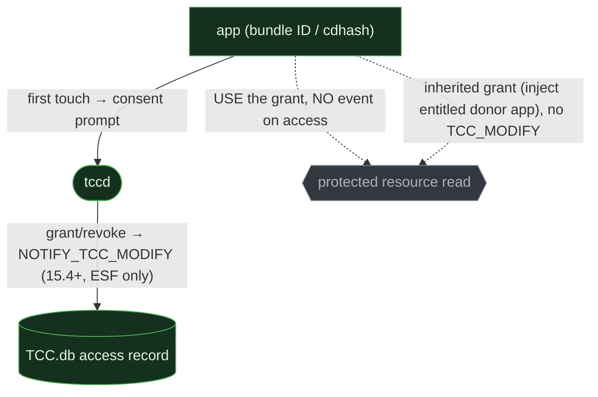
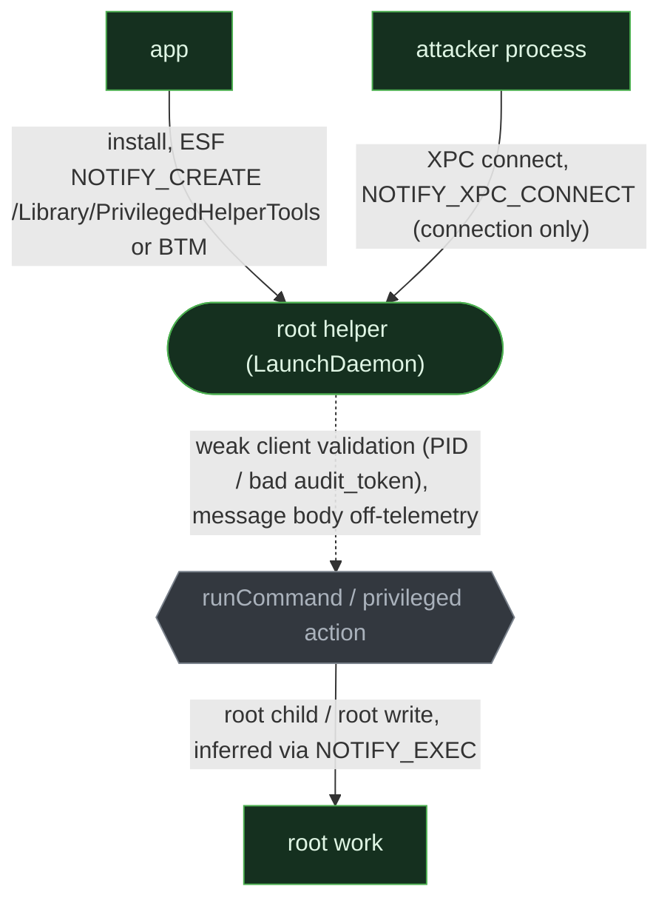

# TCC & privileged helpers (macOS)

<div class="chapter-meta"><div class="attack-techniques"><span class="chapter-meta-label">ATT&amp;CK</span><a class="attack-badge" href="https://attack.mitre.org/techniques/T1548/006/"><span>TCC</span><code>T1548.006</code></a><a class="attack-badge" href="https://attack.mitre.org/techniques/T1559/"><span>Inter-process communication</span><code>T1559</code></a><a class="attack-badge" href="https://attack.mitre.org/techniques/T1204/"><span>User execution</span><code>T1204</code></a></div><div class="chapter-meta-details"><span><b>Tactic</b> Privilege escalation / Defense evasion / Credential access</span><span><b>Chokepoint</b> mediator confers a capability</span></div></div>

The **1-of-3 chapter**. macOS gates capability in a way Windows and Linux do not: not only by
privilege ([ch. 1](01-elevation-mechanisms.md)) or by petitioning a policy daemon
([ch. 2](02-polkit-authz.md)), but by a **consent or trust grant keyed to an app's identity**. Two
threads live here, **TCC** (the per-app consent gate) and **privileged-helper / XPC** abuse, and
they have *different* cross-OS shapes, which is itself the lesson: TCC's columns are genuinely empty;
the helper/XPC thread is a macOS *instance* of the cross-OS broker pattern.

## 1. The behavior & invariant

An attacker gains a capability not by becoming root, but by obtaining or subverting a **grant**, TCC
writes a per-app consent record (camera, files, Automation, Screen Recording…), or a root helper
*accepts* a caller's XPC message and acts on it.

> **Invariant:** a mediator (`tccd`, or a privileged helper) confers capability based on a
> consent/trust decision keyed to **app identity** (code-signing identity), not on the caller's own
> privilege. The cut is the moment capability is conferred. Because identity, not privilege, is the
> key, the attacks are *identity games*: borrow an entitled app's grant, spoof the prompt, or spoof
> the XPC caller.

## 2. Threats that use it

<div class="threat-use-grid">
<article class="threat-use-card os-macos"><span class="threat-use-chip">MACOS</span><h3>XCSSET and powerdir</h3><p><strong>What happens:</strong> XCSSET borrows a permitted app's access. Other bugs replace TCC records or spoof consent.</p><p><strong>Detect here:</strong> Compare the app identity that holds the grant with the process actually accessing the protected resource.</p><p class="threat-use-source"><a href="https://www.jamf.com/blog/zero-day-tcc-bypass-discovered-in-xcsset-malware/">Source</a></p></article>
<article class="threat-use-card os-macos"><span class="threat-use-chip">MACOS</span><h3>AMOS and Banshee</h3><p><strong>What happens:</strong> A fake <code>SecurityAgent</code> or password dialog gets the user to approve access.</p><p><strong>Detect here:</strong> The TCC record may be legitimate. Investigate the script or app that triggered the approval and what it does next.</p><p class="threat-use-source"><a href="https://research.checkpoint.com/">Source</a></p></article>
<article class="threat-use-card os-macos"><span class="threat-use-chip">MACOS</span><h3>Unsafe XPC helpers</h3><p><strong>What happens:</strong> A privileged helper trusts a client identity or request it should reject.</p><p><strong>Detect here:</strong> Pair an unusual XPC client with the root action. The helper's normal name does not make the request normal.</p><p class="threat-use-source"><a href="https://sector7.computest.nl/post/2023-10-xpc-audit-token-spoofing/">Source</a></p></article>
</div>

## 3. The behavioral graph & the cut


The red edge, **conferring capability on an identity**, is the cut: the articulation point every
variant must traverse, which is why it is the detection anchor. Every variant bends the identity check: inherit an entitled app's grant, social-engineer the human into granting, plant a
substitute consent record, or spoof the XPC caller a root helper trusts. The mediator decides based
on *who is asking*, so detection lives in *whether that identity is what it claims*.

## 4. Per-OS realization & telemetry overlay

macOS is the only populated column for TCC; for the helper thread, Windows and Linux have their own
broker-trust bugs (→ [ch. 2](02-polkit-authz.md)). The greyed nodes, *access* (no event) and the
*XPC message body*, are the macOS blind spots.

### macOS, thread A: TCC

`tccd` mediates every request, backed by two SQLite databases. Crucially their **write** protection
differs: the **system** db (`/Library/Application Support/com.apple.TCC/TCC.db`) is SIP-protected
(write needs a SIP bypass or the `com.apple.private.tcc.manager` / `com.apple.rootless.storage.TCC`
entitlements), while the **user** db (`~/Library/Application Support/com.apple.TCC/TCC.db`) is **not
SIP-protected**, any process holding Full Disk Access can write it with SIP fully on. Both are
read-gated by FDA. That asymmetry is why path-redirection bypasses (CVE-2020-9934 $HOME poisoning →
`tccd` read an attacker-planted user db) worked without disabling SIP.



```admonish abstract title="Safeguard pressure: macOS TCC"
**A strong default-on gate; failures split three ways.** **Suppressed:** silent no-consent theft on
a SIP-on, patched Mac is genuinely rare, the bypass CVEs are patched and the system db can't be
written. **Displaced** to the *user*: consent social-engineering (fake `osascript` dialogs,
TCC-clickjacking) and abuse of already-entitled apps (Finder's implicit FDA via Automation;
donor-app injection), go detect the `osascript` lineage and anomalous Automation grants, not a db
write. **Unobserved:** `NOTIFY_TCC_MODIFY` is **macOS 15.4+ only** and fires on **grant/revoke
only, never on access**, never for an already-entitled binary (XCSSET-style inheritance is
invisible), and its instigator often resolves to the parent (Terminal). The SIEM tier's only signal
is a `com.apple.TCC` unified-log line that is debug-level, unstructured, and purged in ~1-1.7h.
```

### macOS, thread B: privileged helpers / XPC

A helper installs as a root LaunchDaemon, SMJobBless (deprecated 13.0) → `/Library/PrivilegedHelperTools/`,
or SMAppService (13+) *inside the app bundle*. The install is gated by a mutual code-requirement
handshake (`SMPrivilegedExecutables` / `SMAuthorizedClients`), but that pins the **install**, not
each runtime XPC message. The helper must authenticate **every** connection, and the canonical LPE is
getting that wrong: no validation (Pearcleaner, Plugin Alliance), PID validation (defeated by
PID-reuse via `posix_spawn(POSIX_SPAWN_SETEXEC)`), or `audit_token` checked *outside* the event
handler (the `libxpc` race, CVE-2023-32405).



```admonish abstract title="Safeguard pressure: macOS helpers"
**Install suppressed; runtime displaced; message unobserved.** The SMJobBless/SMAppService
code-requirement handshake genuinely **suppresses** install-time helper hijack. So pressure moves
**off the install and onto the per-message trust decision the pinning doesn't cover**, third-party
helpers that validate the caller by PID or not at all (the live 2025 Pearcleaner/Plugin-Alliance
class), or the `audit_token` timing bug. **Unobserved (the headline):** ESF `NOTIFY_XPC_CONNECT`
reports the connection but **never the selector, arguments, or command string**, the privilege
crossing happens *inside* the message; you infer it only from the root child the helper spawns. The
correct fix, `audit_token` synchronously in-handler → `SecCodeCheckValidity` against a pinned
requirement, is invisible to detection either way.
```

### Windows & Linux, the empty column (TCC) vs the not-empty one (helpers)

**TCC has no clean analog, the genuinely empty column.** macOS uniquely makes a per-app,
user-consent gate **mandatory and universal** (keyed to code-signing identity, enforced over *every*
app). The partial analogs are split and incomplete: **Linux** `xdg-desktop-portal` (consent prompts,
but Flatpak/Snap-sandboxed apps only, native binaries bypass it) plus SELinux/AppArmor (MAC,
admin-authored, *not* consent); **Windows** app-privacy toggles (per-app, but enforced only for
packaged/AppContainer apps), classic Win32 apps get only a **single coarse, all-or-nothing
"Let desktop apps access your camera/microphone" toggle** under `CapabilityAccessManager\ConsentStore\…\NonPackaged`
(camsvc), and Microsoft documents that desktop apps "might still… access" even when it's off
([Microsoft](https://support.microsoft.com/windows/windows-camera-microphone-and-privacy-a83257bc-e990-d54a-d212-b5e41beba857), [freedesktop](https://flatpak.github.io/xdg-desktop-portal/)).
Neither OS has a gate that is *both* per-app-consent and universal, the empty cells are
**architectural absence** (they gate by uid/integrity/ACL + MAC), not a sensor gap.

```admonish abstract title="Safeguard pressure: Windows / Linux"
For **TCC**, mark these cells **"no analogous mechanism,"** not "gap to fill", a Win32 app or a
Linux native binary reading the webcam is unobserved *as a consent event* because no consent gate
exists to emit one. For the **helper/XPC** thread the column is **not** empty: broker-trusts-its-client
LPE exists as Windows privileged RPC/COM impersonation and Linux D-Bus/PolKit caller-validation bugs, covered in [ch. 2](02-polkit-authz.md). The macOS SMJobBless + `audit_token` specifics are a macOS
*instance* of that cross-OS pattern, not a surface the others lack.
```

## 5. Visibility delta

| Graph element |  macOS: EDR / SIEM |  Windows |  Linux |
|---|---|---|---|
| **TCC consent grant** (the cut) | ESF `NOTIFY_TCC_MODIFY` ✅ (15.4+, grant/revoke only) / unified-log debug ⚠️ ephemeral | no analog (privacy toggle: packaged apps only) | no analog (portals: sandbox only) |
| TCC *access* (use of grant) | ❌ no event (never fires on access) | n/a | n/a |
| inherited / bypass grant | ❌ (XCSSET, entitled-process: no `TCC_MODIFY`) | n/a | n/a |
| TCC.db at rest | ESF file ⚠️ (system db SIP-locked; user db FDA-readable) / dark | n/a | n/a |
| helper install | ESF `NOTIFY_CREATE` / BTM ✅ / unified ❌ | RPC/COM broker, see [ch. 2](02-polkit-authz.md) | D-Bus/PolKit, see [ch. 2](02-polkit-authz.md) |
| **helper XPC message** (the act) | ❌ `NOTIFY_XPC_CONNECT` = connection only, never content | (ch. 2) | (ch. 2) |

Two macOS blind spots define the chapter: TCC fires on the *grant*, never the *access*, so a bypass
that reads data without a grant (CVE-2025-43530) leaves nothing, and the XPC layer shows the
*connection*, never the *message*, so the privileged act itself is off-telemetry on every tier. The
empty Windows/Linux TCC cells are a real finding; the helper cells point to ch. 2, not to absence.

## 6. Detect the cut

### macOS, TCC grant by a suspicious identity (15.4+) + the pre-15.4 consent-SE complement

```yaml
title: macOS TCC Grant to Suspicious Identity / Fake Consent Dialog
status: experimental
logsource: { product: macos }   # ESF NOTIFY_TCC_MODIFY, custom ESF pipeline (no native Sigma TCC category), macOS 15.4+
detection:
  high_value:
    EventType: 'tcc_modify'
    service:
      - 'kTCCServiceSystemPolicyAllFiles'   # Full Disk Access
      - 'kTCCServiceAppleEvents'            # Automation
      - 'kTCCServiceAccessibility'
      - 'kTCCServiceScreenCapture'
  suspicious_identity:
    identity_type: 'Executable Path'        # unsigned / ad-hoc, not a notarized Bundle ID
  condition: high_value and suspicious_identity
falsepositives: [legitimate first-use grants, gate on identity, instigator lineage, signer]
level: medium
# macOS 15.4+ ONLY; no SIEM fallback (com.apple.TCC unified-log is debug-level + ~1h retention).
# TCC_MODIFY does NOT fire on access, nor for already-entitled binaries (XCSSET inheritance is
# invisible), and its instigator often resolves to the parent (Terminal/osascript).
# Pre-15.4 + dominant case, fake consent (NOTIFY_EXEC): Image endswith '/osascript' and
# CommandLine contains 'display dialog' + 'hidden answer' + 'password'.
# Direct-DB-write bypass complement: a substitute-record attack (sqlite3 INSERT into the user TCC.db,
# or a planted db via $HOME poisoning) BYPASSES tccd, so it emits NO tcc_modify, only an ESF
# NOTIFY_WRITE on the db file. Add: category file_event, TargetFilename endswith
# 'com.apple.TCC/TCC.db' by a non-tccd writer (user db is FDA-writable with SIP on; system db needs SIP off).
```

### macOS, privileged-helper install from an untrusted writer

```yaml
title: macOS Privileged Helper Installed by Untrusted Process
status: experimental
logsource: { product: macos, category: file_event }   # ESF NOTIFY_CREATE/WRITE
detection:
  helper_drop:
    TargetFilename|startswith: '/Library/PrivilegedHelperTools/'
  daemon_plist:
    TargetFilename|startswith: '/Library/LaunchDaemons/'
    TargetFilename|endswith: '.plist'
  condition: helper_drop or daemon_plist
falsepositives: [legitimate app installers/updaters that ship a privileged helper]
level: medium
# Gate on the writer's signer (unsigned / non-allowlisted TeamID) and lineage (not Installer/an
# updater). SMAppService (13+) keeps the helper INSIDE the app bundle, no /Library write, so add
# the BTM complement (NOTIFY_BTM_LAUNCH_ITEM_ADD). NO rule can express the XPC abuse itself: the
# message selector/arguments are off-telemetry (NOTIFY_XPC_CONNECT is connection-only), state the gap.
```

## 7. Reproduce it yourself

Technique IDs: T1548.006 (TCC manipulation), T1204 (consent social-engineering), T1559 (helper/XPC
IPC). ART macOS TCC/helper coverage is thin; drive manually on real Apple hardware (per
[methodology](../methodology.md), the macOS arm needs an entitled host).

```admonish example title="Manual repro (lab only)"
~~~sh
# TCC, reset a grant, read the user db (needs Full Disk Access for the reading process)
tccutil reset ScreenCapture
sqlite3 ~/"Library/Application Support/com.apple.TCC/TCC.db" 'select service,client,auth_value from access;'
# Consent social-engineering (the dominant pattern), fake password/permission dialog
osascript -e 'display dialog "App wants to make changes. Enter password:" with hidden answer default answer ""'
# Privileged helper, install a benign SMJobBless helper and watch NOTIFY_CREATE / BTM / XPC_CONNECT
~~~
```

Capture with [`labs/macos/eslogger-cmds.sh`](https://github.com/iimp0ster/os-internals-de-guide/blob/main/labs/macos/eslogger-cmds.sh)
(stream `tcc_modify`, `btm_launch_item_add`, `xpc_connect`, `create`, `exec`), and mine the SIEM
floor with `log stream --debug --predicate 'subsystem == "com.apple.TCC"'` to see (and then lose)
the `Update Access Record:` lines. There is no Windows/Linux repro for the TCC thread, that is the
finding.

## 8. False positives & pitfalls

TCC grants happen constantly (every app's legitimate first use), and privileged helpers ship with
huge numbers of normal apps (updaters, VPNs, backup, peripheral drivers). The grant and the install
are *noise*; the abuse is an identity mismatch.

```admonish tip title="Noise → signal"
Gate on identity and intent: **who is asking** (instigator signer + lineage, an `osascript`/Terminal
chain or an unsigned binary driving the prompt; a non-vendor, unsigned process writing the helper),
**identity_type** (`Executable Path` rather than a notarized Bundle ID), **service sensitivity** (FDA,
Automation-to-Finder, Accessibility, Screen Recording), and for helpers the **downstream root child**.
The hard truth of the macOS column: the dominant attack records a *legitimate* grant after duping the
user, so the signal is the requesting process's lineage and signer, not the write itself; and the
XPC act and the empty Win/Linux TCC columns are simply not observable, by design and by architecture.
```
