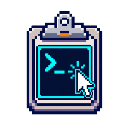

# Threat walkthroughs

A walkthrough starts with a threat, shows its telemetry on each relevant OS, and links to the
reusable detection graphs.

## Applicability contract

Every OS has one state. A blank column is not an answer.

  

    
    <strong>WINDOWS</strong>process · service · token
  

  

    
    <strong>LINUX</strong>exec · unit · BPF
  

  

    
    <strong>macOS</strong>ESF · signer · TCC
  

| State | Use it when | Required explanation |
|---|---|---|
| **Applicable** | The threat is materially observed or the behavior is normal for that OS. | Name the operating context and the best initial telemetry. |
| **Constrained** | The threat can occur, but safeguards, ecosystem, or attacker economics change the path. | Name the constraint and the displaced or altered path. |
| **No native analogue** | The behavior depends on a subsystem the OS does not implement. | Name the missing subsystem and the nearest, non-equivalent behavior. |
| **Telemetry blind** | The behavior exists, but the stated collection tier cannot observe the needed edge. | Name the blind edge and the collector that would close it, if any. |
| **Unknown** | Evidence is not good enough to claim presence or absence. | State the evidence gap; do not infer safety. |

Applicability describes the threat and mechanism. Visibility describes the sensor. A threat
can apply while the selected telemetry cannot see it.

## Choose a threat walkthrough

  <a class="threat-dossier-card" role="listitem" href="05-clickfix.html"><strong>CLICKFIX</strong>Browser lure → user-driven execution</a>
  <a class="threat-dossier-card" role="listitem" href="01-cryptomining.html"><strong>CRYPTOMINING</strong>Execution → sustained workload</a>
  <a class="threat-dossier-card" role="listitem" href="02-ransomware.html"><strong>RANSOMWARE</strong>Control disruption → data impact</a>
  <a class="threat-dossier-card" role="listitem" href="03-infostealers.html"><strong>INFOSTEALERS</strong>User context → reusable secrets</a>
  <a class="threat-dossier-card" role="listitem" href="04-linux-passive-backdoors.html"><strong>LINUX PASSIVE BACKDOORS</strong>Hidden listener → identity contradiction</a>

