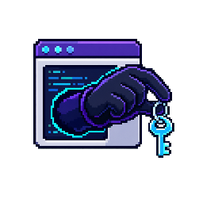

# Infostealers: the same objective, different secret stores

<div class="threat-sprite-hero" role="note"><div><strong>THREAT WALKTHROUGH · INFOSTEALERS</strong><span>Anchor on suspicious user-context access to reusable secrets and staging paths.</span></div></div>

<div class="dossier-brief" role="note"><div><strong>EVIDENCE</strong><span class="status-chip source">macOS branch source-backed</span></div><div><strong>DETECTION</strong><span class="status-chip draft">candidate rules experimental</span></div><div><strong>NEXT</strong><span><a href="infostealers/01-attack-flow-and-detection.md">attack flow → rules</a></span></div></div>

> **Defender TL;DR:** suspicious browser, credential-store, wallet, or cloud-credential
> access following a user-facing installer or script host. **First graph:** [interpreter exec](../execution/01-script-exec.md).

> **Threat-specific route:** [source evidence, secret-store access, and detection opportunities](infostealers/01-attack-flow-and-detection.md).

The stable objective is collection of reusable credentials and data. The important
cross-OS correction is that “infostealer” does not mean the same thing everywhere: Windows
and macOS commonly expose a user endpoint/browser/keychain story, while Linux frequently
means harvesting server-side credentials and cloud secrets.

## Applicability at a glance

| OS | State | What changes the investigation |
|---|---|---|
|  Windows | **Applicable** | Browser, wallet, token, and local credential collection usually follows user-context execution. |
|  Linux | **Applicable, different form** | Prioritize SSH keys, cloud credentials, service configuration, environment secrets, and orchestration credentials rather than assuming a browser-stealer market. |
|  macOS | **Applicable** | User-context execution, browser data, Keychain access, and consent/automation abuse are central; signer and TCC context are unusually valuable. |

## Minimal data sources

Process creation alone gives you a lead. Add data-store access before calling it a stealer.

| OS | Collect | This lets you establish |
|---|---|---|
|  Windows | User-context process lineage plus browser, wallet, or credential-store access | An untrusted process reached protected user data. |
|  Linux | Process execution plus access to SSH, cloud, container, or application-secret paths | A service or developer path accessed reusable server credentials. |
|  macOS | ESF exec with signer and parent, plus protected-store access | An untrusted lineage reached browser, Keychain, or wallet data. |

## The telemetry story

### Windows

```text
user-facing delivery
  → script host or native process (Sysmon EID 1 / Security 4688)
  → browser/credential-store access or child tooling (EDR file/process telemetry)
  → staging and outbound transfer (file + network telemetry)
```

Start with the process tree and its signer, then ask which protected user-data stores it
touched. The [interpreter](../execution/01-script-exec.md), [loader](../execution/02-native-exec-loader.md),
and [autostart](../persistence/03-login-shell-hooks.md) graphs cover common reusable
edges; the data-store access requires your EDR's Windows-specific schema.

### Linux

```text
compromised service, developer tool, or supply-chain process
  → shell/runtime execution (eBPF exec / auditd EXECVE)
  → access to SSH, cloud, container, or application secrets (file/open telemetry)
  → outbound use or staging (network + process lineage)
```

Do not label this column “not applicable” merely because it lacks the same browser
stealer brands. The data is different and the parent context is often a server process or
automation identity. If your SIEM has only auditd process creation and no file/open or
network join, mark secret-store access as **Telemetry blind** rather than claiming it was
not attempted.

### macOS

```text
untrusted application, script, or social-engineering parent
  → process / osascript execution (ESF NOTIFY_EXEC)
  → browser or Keychain-related access; possible consent/automation branch
  → staging and outbound transfer (endpoint file/network telemetry)
```

macOS adds a significant identity dimension: ESF execution events can carry signing
information, and TCC/AppleEvents can change which user data a process can reach. The
[TCC and privileged helpers](../privilege-escalation/03-tcc-helpers.md) graph is not a
Windows/Linux equivalent; it explains the macOS-only mediator and its visibility gaps.

## Why the paths differ

The objective, reusable access, is cross-platform. The protected store, delivery path, and
useful telemetry are not. That is why the walkthrough is threat-first but does not force a
single, misleading “browser-stealer” graph onto Linux.

## Go deeper

- [Interpreter exec](../execution/01-script-exec.md)
- [Native execution and the loader](../execution/02-native-exec-loader.md)
- [Login and shell hooks](../persistence/03-login-shell-hooks.md)
- [TCC and privileged helpers (macOS)](../privilege-escalation/03-tcc-helpers.md)
- [Threat coverage matrix](../appendix/threat-coverage-matrix.md)
