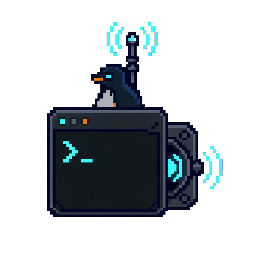

# Linux passive backdoors: when process identity becomes the hunt

<div class="threat-sprite-hero" role="note"><div><strong>THREAT WALKTHROUGH · LINUX PASSIVE BACKDOORS</strong><span>Anchor on the contradiction between creation-time exec evidence and a later process identity.</span></div></div>

<div class="dossier-brief" role="note"><div><strong>EVIDENCE</strong><span class="status-chip source">BPFDoor behavior source-backed</span></div><div><strong>DETECTION</strong><span class="status-chip draft">stateful host correlation</span></div><div><strong>NEXT</strong><span><a href="linux-passive-backdoors/01-attack-flow-and-detection.md">attack flow → rules</a></span></div></div>

> **Defender TL;DR:** a daemon-like process that has an implausible parent, executable,
> memory map, or creation record. **First graph:** [process argument masquerading](../defense-evasion/01-process-argument-masquerading.md).

> **Threat-specific route:** [BPFDoor evidence, passive activation, and detection opportunities](linux-passive-backdoors/01-attack-flow-and-detection.md).

This walkthrough is deliberately not forced into a three-OS comparison. Its core behavior is
the Linux `/proc` process-identity problem: a process can make later reads of its command
line appear benign while creation-time telemetry preserves a different record. BPFDoor is
the motivating real-world example in the linked graph chapter.

<div class="os-focus-callout" role="note">
  
  <div><strong>LINUX-SPECIFIC SIGNAL</strong><br><span>Creation-time exec evidence can contradict a later <code>/proc</code> identity.</span></div>
</div>

## Applicability at a glance

| OS | State | Why |
|---|---|---|
|  Linux | **Applicable** | `/proc/<pid>/cmdline` and related process-display fields expose user-memory-backed state that can diverge from creation-time telemetry. Linux daemon naming conventions make the disguise operationally useful. |
|  Windows | **No native analogue** | Windows has process masquerading and tree-breaking techniques, but it does not expose this specific `/proc` argv-versus-`execve` contradiction. Investigate Windows process creation, image path, token, and handle telemetry on their own terms. |
|  macOS | **No native analogue** | macOS has different process inspection and code-signing surfaces; the Linux `/proc` command-line memory model and bracketed kernel-worker convention do not transfer. Treat a macOS process-identity case as a distinct graph, not as a missing BPFDoor event. |

## Minimal data sources

You need two observations of the same process: creation time and live state.

| OS | Collect | This lets you establish |
|---|---|---|
|  Linux | eBPF exec or auditd `EXECVE`, plus live `/proc` or EDR process inventory with PID and start time | The process later reports an identity that conflicts with its creation record. |
|  Windows | No equivalent minimal set | Windows process masquerading is a separate investigation. It cannot prove the Linux `/proc` contradiction. |
|  macOS | No equivalent minimal set | macOS process inspection does not expose the same user-writable argv model. |

## The telemetry story

### Linux

```text
process creation
  → creation-time argv captured (auditd EXECVE or eBPF exec)
  → process changes its displayed identity or re-execs with a fabricated argv
  → later /proc or ps view disagrees with the creation record
```

The detection is a contradiction, not a signature. Preserve the creation event, then
compare it with a later live-process observation using PID **and process start time** so
PID reuse does not create a false match. A bracketed kernel-worker-style name is especially
high signal when it has a userspace parent, a resolvable executable, or memory mappings.

### Windows and macOS: why no page of equivalent events exists

The two non-Linux columns are intentionally short. The absence is architectural, not an
unwritten telemetry overlay. A guide that presented a Windows or macOS “equivalent” would
teach a false invariant and obscure their own, different process-identity signals.

## Go deeper

- [Process argument masquerading](../defense-evasion/01-process-argument-masquerading.md)
- [Linux process lineage](../appendix/process-lineage.md)
- [Threat coverage matrix](../appendix/threat-coverage-matrix.md)
