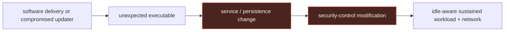

# Cryptomining: source evidence, attack flow, and detection opportunities

> **Scope:** this page grounds the [cryptomining walkthrough](../01-cryptomining.md) in a
> Windows supply-chain case. It does not claim that the same artifact or delivery method
> occurred on Linux or macOS.

## Report evidence → normalized behavior

The Threat Intel Console links **GoMiner-B** to the [Sophos Hola Browser
report](https://news.sophos.com/en-us/2026/06/04/you-do-surprise-me-exe-an-unexpected-executable-in-hola-browser/).
The report describes an undeclared, idle-aware miner delivered through a compromised software
distribution path. Its useful detection lesson is the sequence, not the sample hash or its
specific installed name.

| Report observation | Normalized behavior | Defender evidence |
|---|---|---|
| A bundled executable was not a declared component of the delivered software. | Installer or updater lineage produces an unexpected executable. | Process lineage, signer/publisher, package inventory, and file origin. |
| The program established a service and modified endpoint protections. | User-facing software delivery creates durable service persistence and immediately weakens a control. | Service-install events, process lineage, security-product configuration telemetry. |
| Mining was idle-aware. | CPU alone is an unreliable trigger; execution and persistence precede the resource spike. | Process start, service state, network connections, and performance data. |

## Defanged procedure excerpt

The [Sophos report](https://news.sophos.com/en-us/2026/06/04/you-do-surprise-me-exe-an-unexpected-executable-in-hola-browser/)
described `me.exe` copying itself into the Hola installation path, registering the idle-aware
`hola_monitor_svc` service, and adding a Defender exclusion. The report does not
publish a reusable payload or exclusion target.

```text
<compromised updater>
  -> copy me.exe to C:\Program Files\Hola\HolaMonitorService.exe
  -> register hola_monitor_svc for that executable
  -> add Defender exclusion for <redacted path or process>
```

**Rule mapping:** installer or updater parent, service-control child, new service binary path,
and a nearby protection-control change.



The first durable detection opportunity is the **delivery-to-persistence transition**. A miner can pause when
the user is active and can change its process name; it must still arrange execution and
generate a workload through an observable OS object.

## Telemetry by OS

| OS | First anchor | Persistence/control evidence | What this source does and does not establish |
|---|---|---|---|
|  Windows | Sysmon EID 1 or Security 4688 for installer/updater descendants. | SCM service creation, Defender/EDR configuration events, Sysmon EID 3. | **Source-backed:** the GoMiner-B Windows chain. |
|  Linux | eBPF exec/auditd `EXECVE` for web-server, container-runtime, or scheduled-parent descendants. | systemd unit/timer or cron write; container and cloud audit logs. | **Not established by this report:** use this as an OS-specific hunting model, not GoMiner attribution. |
|  macOS | ESF `NOTIFY_EXEC` plus signer and installer provenance. | LaunchAgent/Daemon write and network telemetry. | **Not established by this report:** user-installed or trojanized software is a distinct branch. |

## Candidate detection: installer lineage followed by service persistence

The source does not prove that every new service is mining. The detector should surface a
high-risk sequence for triage: an installer/updater child creates a service and a security
control change occurs nearby. This needs stateful EDR or SIEM correlation; portable Sigma is
only suitable for its individual process edge.

```yaml
title: Windows Installer or Updater Spawning Service Control Utility
id: d1d58e7a-c78f-46fc-bb1b-82f2cf08d5c3
status: experimental
description: Detects installer or updater processes launching service-control tooling, a detection opportunity for supply-chain delivered persistence.
references:
  - https://news.sophos.com/en-us/2026/06/04/you-do-surprise-me-exe-an-unexpected-executable-in-hola-browser/
tags:
  - attack.persistence
  - attack.t1543.003
logsource:
  product: windows
  category: process_creation
detection:
  selection_parent:
    ParentImage|endswith:
      - '\\msiexec.exe'
      - '\\setup.exe'
      - '\\update.exe'
  selection_child:
    Image|endswith:
      - '\\sc.exe'
      - '\\powershell.exe'
  condition: selection_parent and selection_child
falsepositives:
  - legitimate installers and enterprise software updaters
level: medium
```

**Triage:** retain the installer origin, code-signing information, new service binary path,
account, service-start state, contemporaneous protection changes, outbound destinations, and
resource timeline. Escalate on the correlation; do not escalate merely because CPU rose.
