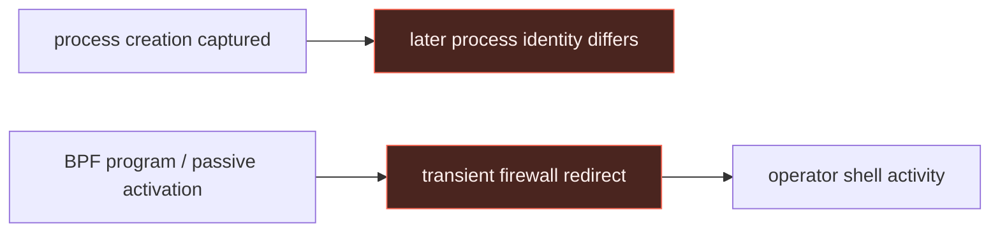

# Linux passive backdoors: BPFDoor evidence, activation, and detection opportunities

> **Scope:** this page grounds the [Linux passive-backdoor walkthrough](../04-linux-passive-backdoors.md)
> in the Threat Intel Console's **Backdoor.Linux.BPFDOOR** entity and [Trend Micro's
> controller analysis](https://www.trendmicro.com/en_us/research/25/d/bpfdoor-hidden-controller.html).
> It intentionally has no Windows or macOS rule.

## Report evidence → normalized behavior

Trend Micro describes BPFDoor activation that occurs through a kernel BPF filter before
ordinary netfilter handling, with controller-directed shell behavior, transient firewall
redirects, anti-forensic shell-history suppression, and process-name masquerading. The
durable detection opportunity is **contradictory host state**, not a magic-byte signature.

| Report observation | Normalized behavior | Telemetry to retain | Detection opportunity |
|---|---|---|---|
| A process hides behind an altered name. | Later process-display identity conflicts with creation-time identity. | eBPF exec or auditd `EXECVE`, PID, start time, live `/proc` observation. | Creation-versus-live contradiction. |
| Activation can bypass normal firewall handling. | No listening socket does not disprove a passive network trigger. | BPF program inventory, socket state, packet/network sensor context. | BPF state on a host with implausible process lineage. |
| Firewall redirect rules may be installed and quickly removed. | Short-lived configuration mutations mediate shell access. | `iptables`/nftables command and audit events, configuration snapshots. | Add→redirect→remove sequence. |



## Defanged procedure excerpt

Trend Micro describes a process that waits behind a classic-BPF socket filter, receives a
defanged network trigger, installs a short-lived firewall redirect, and exposes shell access.
The trigger values, password material, and redirect port range are intentionally omitted.

```text
<masqueraded process>
  -> classic-BPF socket filter waits for <defanged network trigger>
  -> temporary firewall redirect to <redacted local port>
  -> shell activity
  -> redirect removed
```

**Rule mapping:** creation-time process record versus later live identity, unexpected BPF state,
and add -> redirect -> remove firewall activity. Do not treat a missing listener as clearance.

## Why this is a stateful detector, not portable Sigma

The main BPFDoor signal compares two observations separated in time and must include a PID
start-time guard to prevent PID reuse. A single process-creation event cannot prove that a
later `/proc` command line is fabricated. Treat this as an EDR/eBPF correlation requirement:

```text
creation event (PID + start time + original argv + executable)
  ↔ periodic live process observation (PID + start time + cmdline + executable + maps)
  → alert only when identity differs and userspace evidence contradicts the disguise
```

For the firewall branch, retain short-lived command and configuration events; if your
environment does not collect them, label that branch **Telemetry blind**. A no-listener
result from `ss` is triage context, not clearance.

## Candidate collection query boundary

There is no safe universal Sigma rule for the magic activation packet: it requires packet
payload inspection and the report notes that values can be operator-configurable. The guide
therefore avoids copying payload bytes or port values. A defensible detection should combine
host provenance (unexpected BPF state and process lineage) with a network sensor capable of
content-aware validation.

## Applicability boundary

Windows and macOS process masquerading deserve their own native telemetry graphs, but the
Linux `/proc` identity contradiction and BPF/netfilter interaction do not transfer. Their
absence here is intentional, not missing content to fill with a superficial equivalent.
