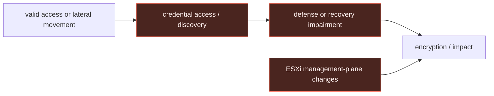

# Ransomware: source evidence, attack flow, and detection opportunities

> **Scope:** the [ransomware walkthrough](../02-ransomware.md) becomes concrete here through
> the Threat Intel Console's **Akira** entity and its primary [CISA advisory](https://www.cisa.gov/news-events/cybersecurity-advisories/aa24-109a).
> Candidate rules are `experimental`, analyst-authored, and not deployment-ready coverage.

## Report evidence → normalized behavior

The Console connects Akira to credential access, discovery, lateral movement, defense
evasion, recovery inhibition, Windows encryption, and Linux/ESXi hypervisor activity. The
best early detector is not a ransom note or an extension: it is a high-consequence sequence
that crosses OS control boundaries.

| Report observation | Normalized behavior | Telemetry to retain | Detection opportunity |
|---|---|---|---|
| Akira procedures include LSASS dumping through a Windows system library. | A signed proxy process performs a memory-dump action against LSASS. | Process command line; process-access events; service lineage. | Credential access before impact. |
| The source chain includes recovery inhibition and encryptor execution. | An unrecognized privileged process is followed by recovery-impact activity. | Process, WMI/PowerShell, file and backup telemetry. | Process-to-recovery correlation. |
| Linux/ESXi activity can use the hypervisor control plane and VM lifecycle changes. | Management-plane changes create the execution environment for impact. | vCenter/ESXi task, datastore mount, VM power-state, and auth events. | Control-plane sequence, not generic Linux auditd. |



## Defanged procedure excerpt

The Akira procedure uses `rundll32.exe` to invoke the `MiniDump` export in `comsvcs.dll` after
resolving the LSASS process ID. The report showed `FP4.docx` as a misleading dump extension.
The process ID remains a placeholder, so the excerpt is not runnable.

```text
rundll32.exe C:\Windows\System32\comsvcs.dll, MiniDump <lsass-process-id> C:\Windows\Temp\FP4.docx full
```

**Rule mapping:** `rundll32.exe` + `comsvcs.dll` + `MiniDump` in the command line. Pair it with
process-access telemetry for the target process and service lineage for the wrapper.

## Windows: source-backed early opportunity

The Console's Akira walkthrough identifies the LSASS MiniDump path as a repeatable choke point.
The rule below detects the process-creation form; pair it with process-access telemetry to
cover tools that do not use the same proxy execution.

```yaml
title: Windows Rundll32 Comsvcs MiniDump of LSASS
id: 865b3d44-32a5-4c45-a2e9-2ce84a6514e0
status: experimental
description: Detects rundll32 invoking the comsvcs MiniDump export against LSASS, an Akira-linked credential-access procedure with broader ransomware relevance.
references:
  - https://www.cisa.gov/news-events/cybersecurity-advisories/aa24-109a
tags:
  - attack.credential_access
  - attack.t1003
logsource:
  product: windows
  category: process_creation
detection:
  selection_image:
    Image|endswith: '\\rundll32.exe'
  selection_command:
    CommandLine|contains|all:
      - 'comsvcs.dll'
      - 'MiniDump'
      - 'lsass'
  condition: selection_image and selection_command
falsepositives:
  - none expected in ordinary endpoint administration; verify any approved forensic workflow
level: high
```

**Triage:** preserve the parent/service context, target process ID, dump path, subsequent
authentication activity, and any recovery-control changes. Do not call this proof of Akira;
it is a strong credential-access event that can precede many ransomware deployments.

## Linux/ESXi: keep the control plane separate

The Console specifically marks Akira's ESXi/hypervisor branch as a control-plane choke point.
The guide does not yet model vCenter or ESXi audit schemas, so there is deliberately **no
portable Sigma rule** here. Instead, detect the stateful sequence below in the platform that
owns the telemetry:

```text
unusual administrator or service principal
  → new/repurposed VM or datastore mount
  → multiple VM power-state changes in a short window
  → bulk datastore modification or encryption impact
```

Calling a Linux `auditd` event an ESXi equivalent would hide this gap. The right engineering
work is to ingest hypervisor task, authentication, datastore, and VM lifecycle events, then
correlate them by actor and time window.

## macOS: constrained, not a copied Windows rule

The Akira evidence does not establish a macOS branch. On macOS, retain ESF process and file
telemetry, signer identity, and broad file-impact signals, but do not port LSASS, VSS, or
ESXi logic into a macOS rule. That would be false equivalence, not cross-platform coverage.
